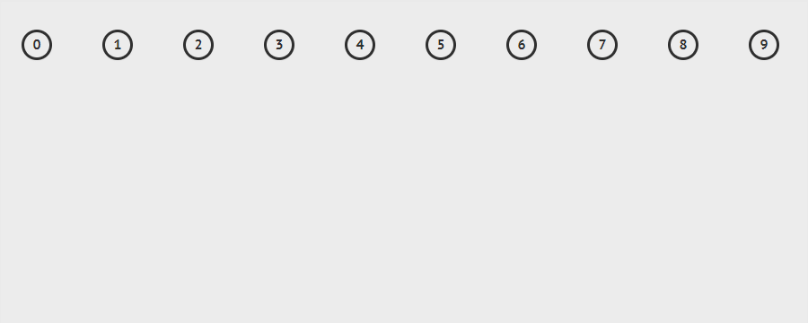
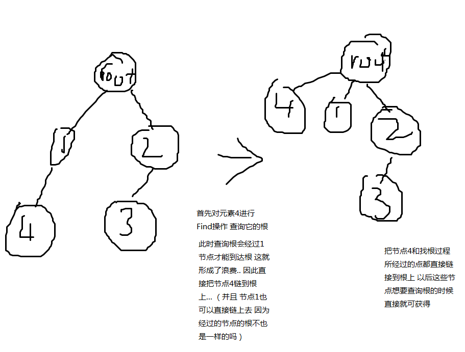
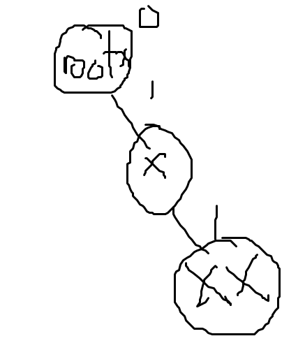

# 并查集学习总结

并查集在好早之前就想学了.. 虽然是一种比较简单的数据结构 但是由于各种事情加摸鱼拖到了暑假现在.. 在这几天的学习和做题练习对并查集有了初步的了解. 于是来写点东西总结一下...


## 并查集是什么

> 引用wiki：并查集是一种树型的数据结构. 用于处理一些不交集的合并以及查询问题.有一个**联合-查找算法**（**union-find algorithm**）定义了两个用于此数据结构的操作：
>
> - Find：确定元素属于哪一个子集。它可以被用来确定两个元素是否属于同一子集。
> - Union：将两个子集合并成同一个集合。


简单的说 假设有两堆数字分别为A和B堆.. 使用Find可以找出某个数字它是属于哪一个堆的 使用Union 可以把A堆和B堆的数字合并起来. 


而集合的表示是通过树来存储的.  如下面的图 表示的是一些数字不停的合并成集合


 

因为是树，所以某些元素和某些元素合并起来以后. 可以认为元素与元素之间是有某种关系的. 父-子关系 或者 某个节点和根的关系....


## 并查集的操作

并查集的大致操作上面已经说出来. 现在详细说一下每个操作的实现过程.. 假设father数组用来存储每个元素的父亲节点.

首先father数组的初始化 把每个元素初始化成自己 也就是

```cpp
for(int i = 1;i <= n;i ++)
{
    father[i] = i;
}
```

因为最开始每个元素都是单个 可以看作是单个集合/树... 所以他们的父亲节点只能是他们自己(也就是根) 


### Find

Find就是找出某个元素所属的集合是什么  如何能够知道一个集合的几个元素是在一个集合的呢..  很简单, 只要找出他们的根是不是一样就知道是不是在一个集合了... (因为如果是在一个集合, 那么他们肯定在同一颗树)..    想要找出根那么只要不停的找他的父节点的父节点的父节点.....直到没有父节点（也就是父节点是自己）的时候 那个元素就是根了

```cpp
int find(int x)
{
    if(father[x] == x) // 如果父节点表示为自己 说明自己是根
    {
        return x;
    }
    else
    {
        return find(x); // 通过递归 不停的往上找根元素
    }
}
```


### Union

Union是把两个集合合并成一个集合.. 因为一个集合是通过一棵树来表示.. 想要把这两个集合合并起来就相当于把一棵树接在另外一棵树上..

那么要怎么做到把一棵树接到另外一棵树呢..  假设我们要把B树接在A树上.. 那么只要把B树的根节点的父亲节点改成A树的根节点就行了.. 也就是B树的根节点变成A树根节点的子节点.. 原B树的节点只要通过不断的往上寻找就能找到A树的根节点了...

```cpp
void Union(int x,int y)
{
    int rootx = find(x), rooty = find(y); //找出x和y元素所在的集合的根
    
    if(rootx == rooty)
    {
        return ; // 如果他们的根都是一样的 说明是在同一个集合中 直接跳出
    }
    
    father[rooty] = rootx; // 让y的根节点的父节点指向x的根节点
}
```


## 并查集的优化


### 按秩合并

按秩合并是用在Union操作上的 是指树的合并总是把小的树连接到大的树上.. *（这里有一个疑点 在wiki上秩是被认为树的深度 而我看了别人的博客 还有别人的说法 说是在数据结构书上写 秩是被认为树的高度）*因为影响查询根节点的运行时间是树的深度（不停的往上找父节点） 在最坏的情况下 树组成一条链的时候 查询的最坏时间复杂度会变成O（n）...  而小的树添加到大树的根上并不会增加它们的秩.. 当他们的秩都相等的时候. 被连接上的树的秩会加1   使用按秩合并后能够让最坏的运行时间改善为O（logn）


```cpp
// 用rank数组记录每个集合的秩 默认初始化为0
void Union(int x,int y)
{
    int rootx = find(x), rooty = find(y);
    
    if(rootx == rooty)
    {
        return ; 
    }
    
    if(rank[rootx] < rank[rooty]) // rooty的秩 比 rootx的大
    {
        father[rootx] = rooty; // 把rootx连到rooty上
    }
    else
    {
        father[rooty] = rootx; // 反之亦然
        if(rank[rootx] == rank[rooty])
        {
            rank[rootx] ++; // 因为是把rooty连到rootx上 所以rootx ++
        }
    }
}
```


### 路径压缩

考虑一下每次节点想要找到根节点是不是要经过多次递归/循环才能找到.. 这些在某些场合下是无意义的时间消耗... 那么要怎么样才能把这些查询根节点过程所浪费时间给优化掉呢


实际上，第一次查询根节点所经过的链是不可避免的. 但是在找到根节点以后, 直接把该节点连接到根节点上.. 那么下次查询该节点的根所花费的时间会是O(1)..  我们对所有节点都进行这样的操作，把他们都直接连接到根节点上...  事实上这样直接改变树的形态并不会影响查并... 因为始终都是在一棵树上.. 除非某些题目需要用到节点和父节点的信息等等 就不应该使用路径压缩了..




```cpp
int find(int x)
{
    if(father[x] == x)
    {
        return x;
    }
    else
    {
        return father[x] = find(father[x]); // 通过不断的递归寻找根节点 最后更新到父节点上
        // 并且递归中的点都会把父节点更新为根
    }
}
```


同时使用这两种优化方法的时候 能够把每次操作的平均时间降低为 $O(\alpha (n))$ $\alpha(n)$是$n = f(x) = A(x,x)$的反函数，其中$A$是急速增加的阿克曼函数. 因为$\alpha(n)$是其的反函数，故$\alpha(n)$在$n$十分巨大的时候还是小于5.. 因此，平均运行时间是一个极小的常数。 


但是要注意 使用路径压缩会损失很多信息，在一些题目不一定用的上..


### ~~启发式合并~~

启发式合并和按秩合并很像 并且用在可持续化上？ 好高深 现在这两个还是比较乱 等以后再详细搞清楚 


## 带权并查集

带权并查集就是在原并查集的基础上，可对每一个元素赋一个值.. 这个值可以表达为该节点跟他父亲节点的关系等等用途..  在合并和路径压缩的时候，需要同时改变这个值. 使其变为该节点跟根的关系..  ~~可以理解为某个节点的值传到根上~~


## POJ 1182 食物链（例题）

#### Description

动物王国中有三类动物A,B,C，这三类动物的食物链构成了有趣的环形。A吃B， B吃C，C吃A。  现有N个动物，以1－N编号。每个动物都是A,B,C中的一种，但是我们并不知道它到底是哪一种。  有人用两种说法对这N个动物所构成的食物链关系进行描述：  第一种说法是"1 X Y"，表示X和Y是同类。  第二种说法是"2 X Y"，表示X吃Y。  此人对N个动物，用上述两种说法，一句接一句地说出K句话，这K句话有的是真的，有的是假的。当一句话满足下列三条之一时，这句话就是假话，否则就是真话。  1）	当前的话与前面的某些真的话冲突，就是假话；  2）	当前的话中X或Y比N大，就是假话；  3）	当前的话表示X吃X，就是假话。  你的任务是根据给定的N（1 <= N <= 50,000）和K句话（0 <= K <= 100,000），输出假话的总数。  


#### Input

第一行是两个整数N和K，以一个空格分隔。  以下K行每行是三个正整数 D，X，Y，两数之间用一个空格隔开，其中D表示说法的种类。  若D=1，则表示X和Y是同类。  若D=2，则表示X吃Y。 


#### Output

只有一个整数，表示假话的数目。 


#### Sample Input

```
100 7
1 101 1 
2 1 2
2 2 3 
2 3 3 
1 1 3 
2 3 1 
1 5 5
```

#### Sample Output

```
3
```


### 题意

大概就是 动物分成3种集合 A B C， 他们可以吃对方 A->B B->C C->A.. 然后给出一些描述，其中有些是正确 有些错误的.. 让你统计出错误的描述有多少. 而其中描述错误可能跟数据范围有关，也可能是因为跟之前正确的描述冲突了所以才错误了... 例如如果之前先给出了 1吃2  然后又给了一条2吃1 这不就冲突了吗...


然后回过来看描述.. 题目说了描述有两种

1 X Y  也就是D等于1的时候表示为第一种 X 和 Y是同类的

2 X Y  也就是D等于2的时候表示为第二种 X 吃 Y  也就是X和Y不同种 可能是A和B 也可能是B和C 或者C和A这3种情况


该题我能想到的方法有两种.. 一种是普通的并查集，一种是带权并查集


### 方法一


#### 思路

首先普通的并查集是维护同一组数组的.. 但是在这题中却出现了3种类型... 那么有什么办法能够同时维护3个种类呢..


假如有N个动物 并且此时只有一种动物A 那么我们的father数组只需要开到father[n]即可维护这些动物A.. 那么变成3种动物 我们把数组扩大成3倍是不是就能维护A B C 3类动物呢... 答案是可以的


我们可以设想，把数组 1-N的范围当成是A类  N+1-2N当成B类  2N+1-3N当成C类.. 然后直接按照题目的要求进行合并或查找就能完成任务了..


主要解释下处理描述的代码部分

```cpp
if(d == 1)
{
     //if(find(x) == find(y + n) || find(x) == find(y + 2*n))
     // 这样写两种即可代表下面6种 因为有x == y + n 即代表一定会x + n == y + 2*n 等
     // 因为union(x,y+n)的时候 另外两种也一起进行了 后者也是一样的道理
	if(find(x) == find(y + n) || find(x + n) == find(y + 2*n) || find(x + 2*n) == find(y) || find(x) == find(y + 2 * n) || find(x + n) == find(y) || find(x + 2*n) == find(y + n))
	{
		count ++;
	}
	else
	{
    	unio(x,y);
    	unio(x + n,y + n);
    	unio(x + 2*n,y + 2*n);
	}
}
```


d==1  说明X和Y是同类.

那么如果出现了这6种情况 那就代表跟这个描述冲突

如果x和y + n的根是一样的 那就说明X是A Y是B  他们不是同类 该描述错误

同理的会有 当X是B Y是C   当X是C Y是A     这3种是捕猎的情况


还有3种就是被捕猎的情况

当X是A Y是C  当X是B Y是A 当X是C Y是B   这3种是被捕猎的情况 


只要出现这6种情况中的其中一种 就代表他们并不是同类 于是就代表该描述错误了

但是实际只需要写两条就行了 这两条分别代表捕猎和被捕猎的6种情况 （很容易理解 拿捕猎来说明 如果A->B发现 那么另外两种(B->C C->A)也会发生 因为是3种情况一起合并的）


```cpp
else
{
    //if(find(x) == find(y) || find(x) == find(y + 2*n))
    if(find(x) == find(y) || find(x + n) == find(y + n) || find(x + 2*n) == find(y + 2*n) || find(x) == find(y + 2*n) || find(x + n) == find(y) || find(x + 2*n) == find(y + n))
    {
        count ++;
    }
    else
    {
        unio(x,y + n);
        unio(x + n,y + 2 * n);
        unio(x + 2*n,y);
    }
}
```

至于到了d=2的时候  X吃Y  也是一样的

如果想要这条描述正确 那么就不能出现X和Y是同类 或者Y把X吃了


#### 完整代码

```cpp
#include <stdio.h>
using namespace std;
int read()
{
    char ch = getchar();
    int f = 1;
    int x = 0;
    while(ch < '0' || ch > '9'){if(ch == '-')f = 0;ch = getchar();}
    while(ch >= '0' && ch <= '9'){x = x * 10 + ch - '0';ch = getchar();}
    return f?x:x*-1;
}
int father[150010];
int rank[150010];
int find(int x)
{
    if(x == father[x])
    {
        return x;
    }
    else
    {
        return father[x] = find(father[x]);
    }
}
void unio(int x,int y)
{
    int rootx = find(x), rooty = find(y);

    if(rootx == rooty)
    {
        return ;
    }

    if(rank[rootx] < rank[rooty])
    {
        father[rootx] = rooty;
    }
    else
    {
        father[rooty] = rootx;
        if(rank[rootx] == rank[rooty])
        {
            rank[rootx] ++;
        }
    }
}
int main()
{
    int n = read(),k = read();
    int count = 0;

    for(int i = 1;i <= n * 3;i ++)
    {
        father[i] = i;
    }

    for(int i = 1;i <= k;i ++)
    {
        int d = read(),x = read(),y = read();

        // 不符合范围内 或者自己吃自己的 直接排除
        if(x <= 0 || x > n || y <= 0 || y > n)
        {
            count ++;
            continue;
        }
        if(d == 2 && x == y)
        {
            count ++;
            continue;
        }

        if(d == 1)
        {
            //if(find(x) == find(y + n) || find(x) == find(y + 2*n))
            // 这样写两种即可代表下面6种 因为有x == y + n 即代表一定会x + n == y + 2*n 等
            // 因为union(x,y+n)的时候 另外两种也一起进行了 后者也是一样的道理
            if(find(x) == find(y + n) || find(x + n) == find(y + 2*n) || find(x + 2*n) == find(y) || find(x) == find(y + 2 * n) || find(x + n) == find(y) || find(x + 2*n) == find(y + n))
            {
                count ++;
            }
            else
            {
                unio(x,y);
                unio(x + n,y + n);
                unio(x + 2*n,y + 2*n);
            }
        }
        else
        {
            //if(find(x) == find(y) || find(x) == find(y + 2*n))
            if(find(x) == find(y) || find(x + n) == find(y + n) || find(x + 2*n) == find(y + 2*n) || find(x) == find(y + 2*n) || find(x + n) == find(y) || find(x + 2*n) == find(y + n))
            {
                count ++;
            }
            else
            {
                unio(x,y + n);
                unio(x + n,y + 2 * n);
                unio(x + 2*n,y);
            }
        }
    }
    printf("%d",count);

    return 0;
}
```


### 方法二


#### 思路

上面的方法一虽然简单易懂，但是可以看出 题目的N范围仅为50000并且只分成3类. 如果N的范围扩大点，或者种类再分多一点.. 例如N为100000 种类有10种. 总不能开100000*10的数组了吧. 这时候就不能使用方法一了..  这就要用到**带权并查集**了


那么回到正题...  可以发现题目元素与元素之间有3种关系 我用3个数字来代表该动物与某个动物的关系

0 - 表示该动物X和某个动物Y是同类

1 - 表示该动物X吃某个动物Y 即是捕猎关系

2 - 表示该动物X 被某个动物Y吃 即是反捕猎关系

而这个值 就是所谓的权


这时候并查集的father数组可以改写成一个结构体数组了 里面有两个成员 分别是某个元素的父亲和它跟父亲的关系

```cpp
struct node
{
    int father; // 存放父亲节点
    int rel;	// 存放关系值 如上面3个所述
};
node ans[50001];

//初始化
for(int i = 1;i <= n;i ++)
{
    ans[i].father = i; // 父亲节点初始化成自己 无需多说了
    // ans[i].rel = 0; // 这一条代码可以省略 因为在声明的时候已经初始化成0了 为什么关系要初始化成0 因为自己跟自己是同类 所以是0
}
```


由于变成带权并查集了，那么在Find和Union的操作上又有什么改变呢.. 


##### Find函数的关系值改变

因为使用了路径压缩... 所以节点原本是和父节点的关系变成和根节点的关系了.. 所以rel值也要同时改变才行. 那么要怎么改变成跟根节点的关系值呢.. 可以当成向量的方式进行计算


假设现在有一个集合. 它的树是这样的



rootx的rel为0 (因为自己跟自己是同类)
x的rel为1 说明x吃rootx
xx的rel为1 说明xx吃x
那么如果路径压缩后 rel的值应该是要表达成xx和rootx的关系 应该为多少呢？

我们把x的rel值 理解成 rootx->x  这么一个向量   xx的rel值理解成x->xx

把他们两者加起来 中间的x抵消掉 就会得到rootx->xx  而此时的值为1+1 = 2  也就是说xx是被rootx吃 这么个反捕猎关系  稍微思考下会发现事实的确是如此 说明计算是正确的.


再举例一下 如果他们两个值都是2的时候呢 加起来得到4... 这时候就需要%3了(因为只有3种关系)  除余3得到余数1   思考下 的确是xx吃rootx


因此Find的代码变成这样

```cpp
int find(int x)
{
    if(x == ans[x].father)
    {
        return x;
    }
    else
    {
        // 简单例子 rootx->x->xx->xxx 那么要计算rootx->x + x->xx + xx->xxx = rootx->xxx
        // 错误写法 应该先递归找出根节点再计算 如果先计算 就会得到一个x->xx + xx->xxx
        //ans[x].relation = (ans[ans[x].father].relation + ans[x].relation) % 3;
        //ans[x].father = find(ans[x].father);
    
        int temp = ans[x].father; //路径压缩
        ans[x].father = find(temp);
        ans[x].relation = (ans[x].relation + ans[temp].relation) % 3; //关系域更新
        
        return ans[x].father;

    }
}
```

其中的注释是我在做题过程的一点意外... 那时候明白了这么个思路后开始写 但是发现结果不对... 最后发现错误因为在**计算关系值和更新父节点的顺序反了** 必须先更新父节点，因为这是一个递归的过程... 因为计算关系值的时候要用到当前父节点的关系值，而先递归更新父节点的过程会改变当前父节点的关系值.... 有点难说明白 例子可以看注释 


##### Union操作关系值的改变

说起来，使用带权并查集后.. 在1-N这个大小的集合中，对于3种动物应该怎么合并呢... 其实并不需要考虑太多.. 因为动物之间的关系已经是通过关系值来表示.. 合并只需要直接把它们合并成一个集合即可..

那么只要X和Y不是在一个集合里（树的根不一样），把它们合并起来就可以了.  也就是一棵树直接连接到另外一棵树上（当然你还可以使用按秩合并优化 ~~但是我写这个方法的时候并没有用上 所以后面的代码不会有~~）

``` cpp
int rootx = find(x), rooty = find(y);
if(rootx != rooty)
{
	ans[rooty].father = rootx;
    ans[rooty].relation = (ans[x].relation + d - 1 + 3 - ans[y].relation) % 3;
}
// 注意 后面还有else部分 但现在讲合并所以没打出来
```

如上所述 如果根不是一样的话，就进行合并...  和之前说的一样 如果想要把X树连到Y树 直接把X的根的父亲节点改为Y的根即可  而这里代码是把Y连到X上 其实都是一样... 主要看下面的关系值怎么计算出来的

由于是Y连到X上 所以这个rel值其实是表示为rootx->rooty的关系

那么想要得到**rootx->rooty**这个向量，可以通过什么来计算呢....  答案就是通过X和Y

可以知道 ans[x].rel  代表着 rootx->x  而ans[y].rel 代表着rooty->y...  而通过3 - (自己的rel) 即可让向量反过来(为什么 计算一下就知道了xD)  如果让 ans[x].rel - ans[y].rel 就会得到 rootx->x + y->rooty   已经看上去很接近了 就差一个x->y 即可计算出rootx->rooty

事实上x->y 这个关系 描述的时候已经给出来了.. 

如果d为1的时候 代表着x和y是同类 那么x->y 就应该为0 

如果d为2的时候 代表着x吃y 那么x->y就应该为1  

可以看出x->y 的值 是 d - 1

那么这时候已经可以算出合并后的rel值了


##### 剩下的else部分

```cpp
else
{
    if(d == 1 && ans[x].relation != ans[y].relation)
    {
        count ++;
    }
    else if(d == 2 && (3 - ans[x].relation + ans[y].relation) % 3 != 1)
    {
        count ++;
    }
}
```

上面说完 如果他们不是在一个集合的话 就进行合并操作... 那么如果是呢..  由于题目并没有给出查询啥的要求，那么就看看该描述有没有跟之前冲突好了...

 

###### 第一个if

如果d=1的时候 因为描述是说X和Y是同类 那么就看看他们跟根的关系是不是一直即可知道他们两个是不是同类了（因为他们的根都是一样！ 如果关系一样就代表同类）


###### 第二个if

如果d=2的时候 说明X吃Y  如果想说明这条描述是错误的 那就看看X->Y是不是1吧 

通过 X->rootx + rooty->Y 即可得到X->Y （因为根都是一样 所以rootx == rooty）

所以只需要把rootx->X 弄反变成X->root  再加上 ans[y].rel 即可


#### 完整代码

```cpp
#include <stdio.h>
using namespace std;
int read()
{
    char ch = getchar();
    int f = 1;
    int x = 0;
    while(ch < '0' || ch > '9'){if(ch == '-')f = 0;ch = getchar();}
    while(ch >= '0' && ch <= '9'){x = x * 10 + ch - '0';ch = getchar();}
    return f?x:x*-1;
}
struct node
{
    int father;
    int relation;
};
node ans[50001];
int find(int x)
{
    if(x == ans[x].father)
    {
        return x;
    }
    else
    {
        // 简单例子 rootx->x->xx->xxx 那么要计算rootx->x + x->xx + xx->xxx = rootx->xxx
        // 错误写法 应该先递归找出根节点再计算 如果先计算 就会得到一个x->xx + xx->xxx
        //ans[x].relation = (ans[ans[x].father].relation + ans[x].relation) % 3;
        //ans[x].father = find(ans[x].father);
    
        int temp = ans[x].father; //路径压缩
        ans[x].father = find(temp);
        ans[x].relation = (ans[x].relation + ans[temp].relation) % 3; //关系域更新
        
        return ans[x].father;

    }
}
int main()
{
    int n = read(),m = read();
    int count = 0;

    for(int i = 1;i <= n;i ++)
    {
        ans[i].father = i;
        ans[i].relation = 0; // 0 - 同类 1 - i吃根节点 2 - i被根节点吃
    }

    for(int i = 0;i < m;i ++)
    {
        int a = read(),b = read(),c = read();
        if(b <= 0 || b > n || c <= 0 || c > n)
        {
            count ++;
            continue;
        }
        if(a == 2 && b == c)
        {
            count ++;
            continue;
        }

        int rootx = find(b), rooty = find(c);
        if(rootx != rooty)
        {
            ans[rooty].father = rootx;
            ans[rooty].relation = (ans[b].relation + a - 1 + 3 - ans[c].relation) % 3;
        }
        else
        {
            if(a == 1 && ans[b].relation != ans[c].relation)
            {
                count ++;
            }
            else if(a == 2 && (3 - ans[b].relation + ans[c].relation) % 3 != 1)
            {
                count ++;
            }
        }
    }

    printf("%d",count);

    return 0;
}
```

 

## 结尾

感谢以下各位大佬的文章/视频 在我学习的过程提供了帮助

[POJ-1182 食物链](https://blog.csdn.net/niushuai666/article/details/6981689)

[UESTCACM 每周算法讲堂 并查集](https://www.bilibili.com/video/av7657321)

[并查集 - 维基百科](https://zh.wikipedia.org/wiki/%E5%B9%B6%E6%9F%A5%E9%9B%86)

还有很多... 十分感谢各位大佬！