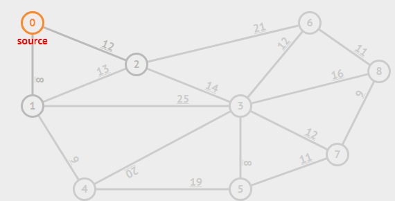
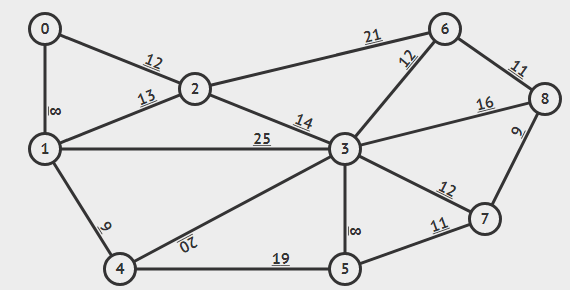

#  最小生成树学习总结


## 前言

今天学习的是最小生成树. 它包括两个算法. 分别是Prim和Kruskal算法. 其中Kruskal要用到之前学习的并查集知识. 两者都比较简单，学习起来应该比较轻松..


## Prim算法


### Prim原理

首先说明下prim是怎么个原理、怎么跑的.  prim是根据点来寻找最小生成树的 他和dijkstra很想，**从某个点出发 然后不断添加边**. 假设树T一开始只有起点0，通过不断的添加边. 使得树T包含所有的点，并且**任意两个点都互相连通**、其中的边不会造成环. 拿下面gif作为例子.




按照图中的例子，是从0这个点出发的. 那么就找出0点能走的边. 分别是0-1和0-2. 而他们的权值分别是8和12. 因为要找最小生成树. 所以要选最小的边走（0-1）. 那么这时候把点1加入到T树中.  **添加边的限制一：权值最小**

接下来重复最开始事情，只是这时候要包括上刚添加的点1. 寻找点0和点1能走的边. 分别是0-2， 1-3， 1-4 权值分别是12，25，9. 选取最小的1-4. 把点4加入到T树中.

寻找0，1，4能走的边. 分别是0-2，1-2，1-3，4-3，4-5. 权值分别是12，13，25，20，19. 选最小的0-2. 把点2加入到树T.

寻找0，1，4，2能走的边. 分别是2-6，2-3，1-2，1-3，4-3，4-5. 权值分别是21，14，13，25，20，19. **注意** 在这里 最小的是13权值的1-2. **但是这条边并不能选**  会发现如果选了这条边以后，012这3个点会造成回路. 而1-2这条边会造成这个回路的原因是因为0-1这条边. 也就是因为之前已经添加了点1. 如果把0-1删掉, 那么问题就没有了. 但是这时候就不是最小生成树了. 这也证明了prim寻找的树是最小生成树.  总结一下这一步骤：之所以1-2是当前阶段最小的边但不选. 是因为目的点1/2在之前已经添加到树T中了. **添加边的限制二：已经走过的点（也就是会造成回路）的边 不要**

那么上一步应该选哪条边了. 观察下次小的边2-3. 判断点3之前是否添加过. 没有 那么就选择这条边. 把点3添加到树T中.

接下来又是重复的步骤. 分别是1-3，4-3，4-5，2-6，3-6，3-8，3-7，3-5（没有上面的1-2因为已经知道不能选筛掉了）. 具体权值自己看(摸 xD. 发现3-5是最小的. 并且点5之前没有选取过. 点5加入！

分别是1-3，4-3，4-5，2-6，3-6，3-8，3-7，5-7.  5-7最小 点7没有选取过 加入

分别是1-3，4-3，4-5，2-6，3-6，3-8，3-7，7-8.  7-8最小 点8没有选取过 加入

分别是1-3，4-3，4-5，2-6，3-6，3-8，3-7，8-6.  8-6最小 点6没有选取过 加入

到这里以后会发现9个点全部加入到树T中，并且没有回路. 那么树T就是最小生成树了. 至于剩下的几条边，继续判断下去会发现起始点和目的点都已经添加过 不符合限制二. 全都排除就算法就算是进行完了.


总结一下流程. 任意选取一个点放进集合（树）T并出发. 寻找所有这个点能到达其他点的边. 然后选择权值最小的边，并把目的点加入到集合中. 继续寻找集合内的点能走的边. 注意不要形成回路即可.


### Prim的实现

过程可见比较简单，所以代码实现也很容易. 


#### 存储边/图

首先考虑如何把边(图)存起来. 这需要用到结构体和vector

```cpp
#include <stdio.h>
#include <vector>
using namespace std;
struct edge
{
    int to,dis; // to 代表这条边的目的点 dis代表权
    edge(int tt,int dd) : to(tt),dis(dd) {}; // 构造函数
    bool operator < (const edge &a) &  // 重载运算符 后面会解释
    {
        return dis > a.dis;
    }
}
vector<edge> G[n]; // 假设有N个点
```

使用二维数组存储边. 每个点存储着"它自己"能到其他点的边


我们假设读入的数据是这样的

```
4 5  // 表示有4个点 5条边
1 2 2
1 3 2
1 4 3
2 3 4
3 4 3
```

那么读入的过程是这样的

```cpp
for(int i = 0;i < m;i ++) // m代表边数
{
    int u,v,dis;
    scanf("%d %d %d",&u,&v,&dis); //u起点 v终点 dis权
    // 由于是双向边 存两次
    G[u].push_back(edge(v,dis)); //以u为起点v为终点的一条边存到u数组里
    G[v].push_back(edge(u,dis)); //以v为起点u为终点的一条边存到v数组里
}
```

把图存好以后 接下来就是核心部分了


#### 找边（点）前的准备工作

首先知道找边过程有一个限制. 就是不能找已经走过的点. 要解决这个问题，只需要开一个数组记录哪些点是否走过

```cpp
bool vis[n]; //默认初始化成false 代表没有走过
vis[1] = true; // 假设选点1作为出发点 所以直接把点1设为true
```

这个数组到最后还有一个作用. 那就是判断这个图是否有最小生成树. 如果prim执行完以后，数组中有某些点没有走过. 那代表没有最小生成树


解决掉第一个问题以后，考虑一下找到的边怎么存储. 在原理那里，写了一堆x-x，x-x，x-x等等. 那么这些边该怎么存放并且找出其中最小的呢.

观察下原理那一部分可以发现. 每次到达一个新的点以后，接下来可走的边会加上（这个点能到达其他点的边）

举例一下一开始只有0点的时候 边为0-1，0-2. 加入点1以后. 能走的边是在之前的基础上(0-2), 再加上点1能走的边(1-2，1-3，1-4) 也就是一共0-2，1-2，1-3，1-4.  （这里有点废话了qwq

因此使用队列这种东西存放边会比较方便. 不断的把新发现的边添加进去.


至于要找最小权的边.. 很明显 使用优先队列就可以. 那么队列最前面的一定是权值最小的边.

```cpp
//由于优先队列默认是把最大的放在最前 和需要的相反. 因此之前结构体内的重载运算符起作用了 为了让最小的放在最前
priority_queue<edge> pq;

for(int i = 0;i < G[1].size();i ++) // 把出发点能走的边放入队列中
{
    pq.push(G[1][i]);
}
```


#### 找边 或者说 找点！

由于优先队列的存在. 能直接获取最小权的边. 拿出来以后判断一下是否符合.

```cpp
int sum = 0; // 假设现在要求 最小生成树的权值 sum存放
while(pq.size()) // 直到队列没有边
{
    edge t = pq.top(); // 队列基本操作
    pq.pop(); 
    if(vis[t.to]) // 如果这条边的终点是已经走过的 直接跳过
    {
        continue;
    }
    vis[t.to] = true; // 把新发现的点设置为走过
    sum += t.dis; // 累计权值
    
    for(int i = 0;i < G[t.to].size();i ++)
    {
        pq.push(G[t.to][i]); // 把新点能走的边加到队列中
    }
}

return sum; // 把最小生成树权值和返回回去 到这prim就结束了
```


#### 完整代码

```cpp
#include <stdio.h>
#include <queue>
using namespace std;
struct edge
{
    int to;
    int dis;
    edge(int tt,int dd) : to(tt), dis(dd) {}
};
struct cmp
{
    bool operator () (edge a,edge b)
    {
        return a.dis > b.dis;
    }
};
vector<edge> e[5001];
bool visited[5001];
int n,m;
int prim(int s)
{
    int sum = 0;
    visited[s] = true;
    priority_queue<edge,vector<edge>,cmp> pq;

    for(int i = 0;i < e[s].size();i ++)
    {
        pq.push(e[s][i]);
    }

    while(pq.size())
    {
        edge t = pq.top();
        pq.pop();
        
        if(visited[t.to] == true)
        {
            continue;
        }
        sum += t.dis;
        visited[t.to] = true;
        
        for(int i = 0;i < e[t.to].size();i ++)
        {
            pq.push(e[t.to][i]);
        }
    }
    return sum;
}
int main()
{
    scanf("%d %d",&n,&m);

    for(int i = 0;i < m;i ++)
    {
        int u,v,dis;
	    scanf("%d %d %d",&u,&v,&dis);
        e[u].push_back(edge(v,dis));  
        e[v].push_back(edge(u,dis));
    }

    int sum = prim(1);

    for(int i = 1;i <= n;i ++)  // 如果有点是没访问过的 代表没有最小生成树
    {
        if(visited[i] == false)
        {
            sum = -1;
            break;
        }
    }
    printf("%d\n",sum);
    
    return 0;
}
```


### 关于优化orz

上述中的Prim其实是在普通的Prim上加入了二叉堆优化. 使得查找最短边的过程快了不少. 因此时间复杂度为: $O( \ (|V| + |E|)\ logV) = O(|E|log|V|)$

如果正常通过不断的搜索比较哪一个才是最小. 时间复杂度是$O(|V|^2)$

如果不使用二叉堆，使用斐波那契堆进行维护. 时间复杂度会降到$O(|E| + |V|log|V|)$ 

**因此可以发现 Prim适合稠密图**


## Kruskal算法


### Kruskal原理

kruskal算法. 首先说一下，prim是通过点来寻找出最小生成树的. 那么kruskal是跟prim相反，通过边来找出最小生成树的.  **不断的找出权值最小的边，并加入到树T里. 直到树T包含所有的点.**  继续拿之前的图作为例子讲解原理




首先所有边中，发现最短的是0-1，3-5 权值为8. 这时候选择0-1（其实3-5都可以）. 使用并查集，把0和1这两个点合并起来. 表示他们之间连通.

接下来继续找最短的，是3-5. 把3和5并起来

1-4和7-8 随便一个 先1-4 那就把1和4并起来. 由于之前0和1已经并起来. 所以0，1，4是同一个连通分量

接着选7-8 7，8并成一个连通分量.

5-7 把3，5和7，8并成一个连通分量

8-6 把6和（3，5，7，8）并起来

0-2和3-6和3-7都是12  先选择0-2吧 把2和（0，1，4）并起来

**接下来要注意了**  很明显3-6和3-7都不能选择 尽管他们现在是剩余里面最短的. 因为如果连起来了就会造成环. 至于为什么知道会是环. 使用并查集 会发现在之前3和7或者3和6就已经是一个连通分量. 如果再连就成环了.

下一个权值为13的1-2也是同理 通过并查集发现1和2同连通 不能选择

然后就选择14的2-3 没问题把（0，1，2，4）和（3，5，7，8，6）连起来.

剩下的2-6，1-3，4-3，4-5... 因为都不符合条件（**在之前已经是一个连通**） 所以排除掉. 那么到这里为止所有的边都选择完了. **最后检查一下所有的点是否都是同一个连通分量. 如果是 那么就说明图中有最小生成树，不是则没有**


### Kruskal的实现


#### 存储边/图

在Kruskal中，存储边的方式跟Prim有些不同. 因为不需要考虑每个点跟其他点的关系. 因此直接用一维数组存储所有边即可. 那么结构体就写成如下

```cpp
#include <stdio.h>
#include <algorithm>
using namespace std;
struct edge
{
    int from,to,dis; // from代表边的起点 to代表边的终点 dis代表边的权
    bool operator < (const edge &a)const // 该重载是用在sort函数中
    {
        return dis < a.dis;
    }
};
edge G[m]; // m代表边数
```

仅需要存储好边的信息即可.


我们假设读入的数据是这样的

```
4 5  // 表示有4个点 5条边
1 2 2
1 3 2
1 4 3
2 3 4
3 4 3
```

那么读入的过程是这样的

```cpp
scanf("%d %d",&n,&m);
for(int i = 0;i < m;i ++)
{
    scanf("%d %d %d",&G[i].from,&G[i].to,&G[i].dis);
}
```


#### 找边（真）前的准备工作

由于Kruskal算法需要的边是从小到大. 那么对边数组按照权从小到大排序一遍即可使用. 同时由于Kruskal要用到并查集. 但是这里讲的是最小生成树. 所以并查集的内容会被带过（就写个初始化水过去~

```cpp
for(int i = 1;i <= n;i ++) // n代表点数 初始化father数组 并查集
{
	father[i] = i;
}
sort(G,G + m);
```


#### 找边！

kruskal的核心代表比prim要简单很多. 只需要循环一遍边数组即可

```cpp
int sum = 0;
for(int i = 0;i < m;i ++)
{
    int u = G[i].from, v = G[i].to;
    if(find(u) == find(v)) // 如果发现起点和终点是同一连通分量 直接跳过
    {
        continue;
    }
    unionSet(u,v); //把u和v并成一个连通分量
    sum += G[i].dis;
}
return sum;
```


#### 完整代码

```cpp
#include <stdio.h>
#include <algorithm>
using namespace std;
int read()
{
    char ch = getchar();
    int f = 1;
    int x = 0;
    while(ch < '0' || ch > '9'){if(ch == '-')f = 0;ch = getchar();}
    while(ch >= '0' && ch <= '9'){x = x * 10 + ch - '0';ch = getchar();}
    return f?x:x*-1;
}
struct edge
{
    int from,to,dis;
    bool operator < (const edge &a)const
    {
        return dis < a.dis;
    }
};
edge e[200001];
int father[5001];
int rank1[5001];
int n,m,s;
int find(int x)
{
    if(father[x] == x)
    {
        return x;
    }
    else
    {
        return father[x] = find(father[x]);
    }
}
void unionSet(int x,int y)
{
    int rootx = find(x), rooty = find(y);
    if(rootx == rooty)
    {
        return ;
    }
    if(rank1[rootx] < rank1[rooty])
    {
        father[rootx] = rooty;
    }
    else
    {
        father[rooty] = rootx;
        if(rank1[rootx] == rank1[rooty])
        {
            rank1[rootx] ++;
        }
    }
}
int kruskal()
{
    int sum = 0;

    for(int i = 1;i <= n;i ++)
    {
        father[i] = i;
    }
    
    for(int i = 0;i < m;i ++)
    {
        int u = e[i].from, v = e[i].to;

        if(find(u) != find(v))
        {
            unionSet(u,v);
            sum += e[i].dis;
        }
        else
        {
            continue;
        }
    }
    return sum;
}
int main()
{
    n = read(),m = read();
    s = 1;

    for(int i = 0;i < m;i ++)
    {
        e[i].from = read(),e[i].to = read(),e[i].dis = read();
    }
    
    sort(e,e + m);

    int sum = kruskal();

    for(int i = 2;i <= n;i ++) // 检查每个点的根节点是否一样 也就是是否在一个连通分量（集合）
    {
        if(find(i) != find(1)) // 如果有不是的 那就说明没有最小生成树
        {
            sum = -1;
        }
    }
    
    if(sum == -1)
    {
        printf("orz\n"); // 没有orz
    }
    else
    {
        printf("%d\n",sum);
    }

    return 0;
}
```


### 关于优化QAQ

kruskal的优化并不像Prim那样有对过程进行优化的. 硬要说的话，kruskal使用优先队列会比使用排序快一点. 其余的优化就涉及到对并查集的优化（路径压缩， 按秩合并等）