# 概率论与数理统计学习总结

## 概率论的基本概念

### 概念

#### 互不相容

A ∩ B = Ø 的时候 表示A和B不相容 如果有了A 肯定不会有B （但是不代表A或者B一定有 和对立不一样）

若A和B互不相容（互斥） P（AB） =  0 ，所以A+B就可以直接P（A）+P（B） 

#### 对立

如果A∪B = S（样本空间）并且 A∩B = 空集那么表示A和B事件对立，两者必有其中一发生，并且其一发生后，另外一个必定不会发生.

互斥，不一定对立.. 例如运动员比赛拿金牌和银牌.. 这就是互斥的 如果拿了金，就不可能拿银.. 但是运动并不是一定拿金/银 也可能是铜或者没有..  所以这件事情是互斥/不对立

### 错题

---

已知事件A与B至少有一个发生时事件C发生，记a=P (A∪B), b=P(C)，则a与b一定有

- A.a>b
- B.a=b
- C.a<b
- D.a≤b

正确答案：D你错选为C

解释：这题已经错了好几次，之前详细弄清楚以后又忘了..  要清楚事件A和B至少有一件发生的概率是怎么算的  首先P（A∪B）代表着A和B之间有一件事情会发生 然后这并不代表全部 还有P（AB）A和B同时发生.  因此事件C的发生概率为b=P（C）=P（A∪B）+P（AB）... 所以已经可以确定a会小于b 但是题目并没有说清楚A和B到底相不相容 于是P（AB）可能会是为0 那么这时候a和b就相等了 所以a≤b

---

有甲乙两盒，每盒都有2个红球，3个白球，从甲盒中取一球放入乙盒，再从乙盒中采用不放回抽样取出2球，则取到两个球是一红一白的概率为14/25。

A. ×

B. √

正确答案：√

解释：这道题使用全概率公式即可算出.. 一开始想的太复杂了.  首先先分从甲盒抽出的情况.

2/5 是红球 3/5是白球 然后分别各自求出是红球和白球条件下一红一白（分先后顺序 所以要算红白和白红）的概率即可

$$ \frac{2}{5} * (\frac{3}{6}*\frac{3}{5} + \frac{3}{6} * \frac{3}{5}) + \frac{3}{5} * (\frac{4}{6}*\frac{2}{5} + \frac{2}{6} * \frac{4}{5}) $$ 算出得到$$\frac{84}{150}$$ 约分即可得到答案

也可以用逆事件求他们两白+两红的概率 再求逆即可

---

一盒中有3个红球，5个白球，采用不放回抽样取2个球，已知有一个是红球，则两个都是红球的概率为1/6。

A. ×

B. √

正确答案：√

解释：这题其实是条件概率的题目，一开始想到了全概率公式去了. 想着把几种抽红的概率加起来. 结果发现答案不正确.. 后来跟别人讨论过后发现是通过条件公式计算的.. 也就是

$$p(两个球都是红|有一个球是红) = \frac{A1A2(两次都是红)}{A1A2 + \overline{A1}A2 + \overline{A2}A1 (符合已知道有一个球是红色的所有条件) }$$

$$ \frac{A1A2}{A1A2 + A2A1 + \overline{A1}A2 + A1\overline{A2}}$$   错误 一开始想要按条件概率公式算的时候，错把两次都是红球也加上排序组合 导致多算一个双红的情况.. 在这道题目里其实已知的那个红 是第一次抽到还是第二次抽到 对于双红这个事件来说都不影响概率 而对于白红 是先红还是后红 因为会影响概率所以才计算两次

$$ \frac{A1A2}{A1A2 + \overline{A1}A2 + A1\overline{A2}}$$ 正确

该分式的分母还可以换成1 - （一个红都没 也就是双白）  因为双白的逆事件就是起码有一个红球

还可以使用排列组合的思路计算  

假设 事件A：一个是红球  事件B：两个都是红球

$P(B|A) = \frac{P(AB)}{P(A)} = \frac{\frac{C_3^2}{C_8^2}}{\frac{C_3^2*C_5^0 + C_3^1 * C_5^1}{C_8^2}} = \frac{3}{3 * 5 + 3} = \frac{1}{6}$

P(A) 从8个球中取两个，分别是从3个红球中取两个或者是从5个白球中取一个加上从3个白球中取一个

P(AB) 从3个红球中取两个

---

设A,B为随机事件，P(AB)>0，则一定有P(B∣A)>P(B).

A. √

B. ×

正确答案：B你选对了

解释：虽然这题当时做对了 但是后来看到讨论区有人求助这题. 回顾看题后发现不懂. 通过看别人的解释才明白这题 如果A是属于B 也就是在B内 那么P（B|A）=P（B）=1

---

A,B,C为相互独立的三个事件，若P(A)=P(B)=P(C)=0.3，则P(A︱B∪C)的值为

A.1/2

B.10/17

C.3/10

D.6/17

正确答案：C你选对了

解释：**这题后来做不出来了** 解这题其实并不需要计算 因为ABC相互独立互不影响 所以P（A|BUC）=P（A）=0.3 也就是无论什么条件都是等于自身 不受影响

---

## 随机变量及其分布

### 概念

#### 随机变量

随机变量X是用来映射为某一件事件

例如把硬币抛掷3次 样本空间S={正正正，正正反，正反正，正反反，反正正，反正反，反反正，反反反}.

假设随机事件A为"正面出现了一次" 那么A=｛正反反，反正反，反反正｝

此时 事件A可以表示成X = 1

随机变量分为**离散型随机变量**和**连续型随机变量**

#### 离散型随机变量

当随机变量X的取值是有限个或者可数个的时候，那么X就是**离散型随机变量**

例如 正数集合｛1，2，3，4.....｝ 虽然说正数很多 多到像是无限一样. 但是还是可以数的到.. 因此这个集合是离散型随机变量

而区间[0,1] 虽然只是0到1. 但是因为是区间. 其中的实数的是无限的 数不完的.

例如随便一个0.142321432423423423..... （随便按键盘所得的一个小数）

##### 概率分布律

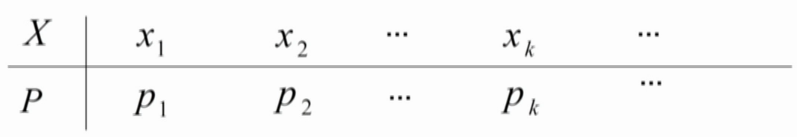

会是像图中这样的表格

X是指随机变量可能取得的值（有限） P代表得到该值的概率

**每个概率P必定>=0 所有$P_i$加起来为1**

##### 0-1分布

当X的概率分布律为这样的时候 也就是随机变量只能取0和1的时候 **称X服从参数p的0-1分布\两点分布 记作X~0-1(p) / X~B(1,p)**    （p是随机变量1的概率）

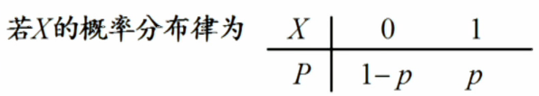

0-1分布也叫1重贝努利试验

##### 二项分布

当要进行多次0-1分布的试验的时候，这时候也叫做n重贝努利试验 或者说 若X的概率分布律为

$P(X = k) = C_{n}^{k}p^{k}(1 - p)^{n - k}, k = 0,1,...n$ 的时候. **其中n>=1,0 < p < 1, 就称X服从参数为n,p的二项分布 记为X~B(n,p)**  

所以0-1分布是最简单的二项分布

##### 泊松分布

当X的概率分布律符合

$P(X = k) = \frac{\lambda^{k}e^{-\lambda}}{k!}, k = 0,1,2,...$的时候

**其中$\lambda>0$，就称X服从参数为$\lambda$的泊松分布记为X~$\pi(\lambda)$或…X~P($\lambda$)**

当n很大的时候 而p很小的时候 （n > 10 p < 0.1）二项分布和泊松分布近似

$\lambda = np$

##### 几何分布

若X的概率分布律为

$P(X = k) = p(1 - p)^{k - 1}, k = 1,2,3,4....$

**其中0 < p < 1，称X服从参数为p的几何分布 记为X~Geom(p)**

几何分布就是在重复多次的贝努利试验中，当试验进行到某个结果终于出现的时候. 问到此时次数的概率分布律. 

例子: 一枚骰子，直到丢出6的时候结束. X表示第x次丢出6 此时随机变量X就符合几何分布.

丢出6的概率很明显是$\frac{1}{6}$  而不是6的概率就是$1 - \frac{1}{6} = \frac{5}{6}$

那么假设X = 3 表示当丢第3次的时候才出6

那么很明显前两次都不是6 到了第3次才是6  概率P也很明显是 $(\frac{5}{6})^2 * \frac{1}{6}$ 

#### 分布函数

对于离散型随机变量的概率分布律，当随机变量的个数，也就是那个可数集数量很多的时候. 使用概率分布图表示随机变量和概率的关系的时候就会变的很麻烦. 因此就有了分布函数.

**对于随机变量X，任意实数x. 称F(x) = P(X <= x)为X的概率分布函数，简称分布函数**

或者是 $F_X(x) = P(X <= x)$

根据定义可知. F（x）表示的是变量x之前的概率和 也就是$(-\infty,x]$的概率

由于是右闭区间，也就是F(x)是包含着x的. 在离散型随机变量中 某一点是有概率的（连续性的时候单点概率都为0）.  

因此若想要表达出概率$P(a < X <= b)$ 使用F(b) - F(a)即可

若想表达出概率$P(a <= X <= b)$ 则需要使用F(b) - F(a - 0).

这个 -0的意思 就是说比a这个位置少一点点.. 因此就不包含a了

因此$P(a <= X < b)$的概率也很容易想出 是F(b - 0) - F(a - 0).

##### 分布函数的性质

(1) $0 <= F(x) <= 1$

(2) F(x) 单调不减 可能会变多 也可能会不变 但一定不会变少

因为对于x1<x2 有0<=P(x1 < X <= x2) = F(x2) - F(x1)

(3)F($-\infty$) = 0, F(+$\infty$) = 1

(4)F(x)是右连续函数，即F(x + 0) = F(x)  **跟F(x - 0) 不一样**

#### 连续型随机变量

连续型随机变量，也就是说明函数是连续的. 跟离散型随机变量不同. 因为他的随机变量是不可数或不可列

**而连续型随机变量的分布函数里多了一个概率密度函数的概念**

对于随机变量X的分布函数F(x),若存在非负的函数f(x), 使得对于任意实数x有：

$F(x) = \int_{-\infty}^{x} f(t)dt$

则称X为连续型随机变量，其中f(x)为X的概率密度函数

##### 概率密度的性质

(1) f(x) >= 0

(2) $\int_{-\infty}^{+\infty}f(x)dx = 1$ 因为F($+\infty$) = 1

(3)  $P(x1 < X <= x2) = \int_{x1}^{x2}f(t)dt$$

因为在连续型函数里单点的概率为0 也就是任意的随机变量a P(X = a) = 0

所以在连续型随机变量中, 闭区间和开区间是一样的 所以会有

$P(x1 < X <= x2) = P(x1 < X < x2)$等等

(4) $F^{'}(x) = f(x)$

##### 均匀分布

当X的概率密度函数为 $f(x) =  \frac{1}{b - a}$ x$\in$ (a,b)  || $f(x) = 0$ otherwise(其他)

**并且a < b 就称X服从(a,b)上的均匀分布 记为X~U(a,b) or X~Unif(a,b)**

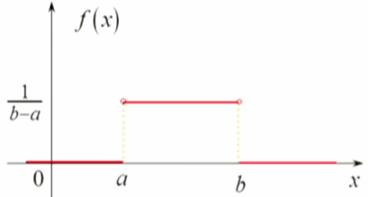

**均匀分布具有等可能性**

随机变量X在(a,b)中的子区间的概率只跟其区间的长度有关

即对于 a<k<k + l<b

$P(k < X < k + l) = \int_{k}^{k + l}\frac{1}{b - a}dt = \frac{l}{b - a}$

只跟l有关 也就是k到k+l这个区间 在a和b区间上的长度

##### 指数分布

若X的概率密度函数为 

$f(x) = \lambda e^{-\lambda x} $  $(x > 0)$

$f(x) = 0$  $(x <= 0)$

**并且$\lambda > 0$ 就称X服从参数为$\lambda$的指数分布 记为X~E($\lambda$) 或 X~Exp($\lambda$)**

而指数分布的分布函数可以通过上面的概率密度函数积分可得

$F(x) = 1 - e^{-\lambda x}$  (x > 0)

$F(x) = 0$  (x <= 0)

**指数分布具有无记忆性**

对于$t_0>0,t>0$

$P(X > t_0 + t | X > t_0) = \frac{P(X > t_0 + t, X > t_0)}{P(X > t_0)} = \frac{P(X > t_0 + t)}{P(X > t_0)} = \frac{1 - F(t_0 + t)}{1 - F(t_0)} = \frac{e^{-\lambda (t_0 + t)}}{e^{-\lambda t_0}} = e^{-\lambda t} = P(X > t)$

因为1 - F(t) = P(X > t) = $e^{-\lambda t}$ 跟上面最后化简是一样的. 所以即使是在条件概率下，概率只跟t有关 也就是无记忆性

例子：  设X服从参数为3的指数分布  $P(X < 3 | X > 2) = 1 - e^{-3}$正确吗

$P(X < 3 | X > 2) = \frac{P(2 < X < 3)}{P(X > 2)} = \frac{F(3) - F(2)}{1 - F(2)} = \frac{1 - e^{-9} - (1 - e^{-6})} {1 - (1 - e^{-6})} = \frac{e^{-6} - e^{-9}}{e^{-6}} = \frac{e^{-6}(1 - e^{-3})}{e^{-6}} = 1 - e^{-3}$

##### 正态分布

若X的概率密度函数为

$f(x) = \frac{1}{\sqrt{2\pi}\sigma}e^{-\frac{(x-\mu)^2}{2\sigma^2}}$  $-\infty < x < +\infty$

**其中 $-\infty < \mu < \infty, \sigma > 0$ 就称X服从参数为$\mu,\sigma$的正态分布（高斯分布）记为X~N($\mu,\sigma^2)$**

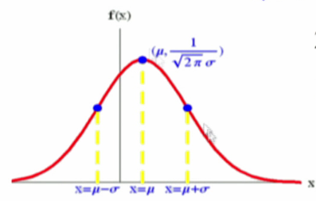

并且$\mu$参数影响对称轴位置 而$\sigma$参数影响函数形状 越大的时候越矮越胖 越小的时候越高越瘦

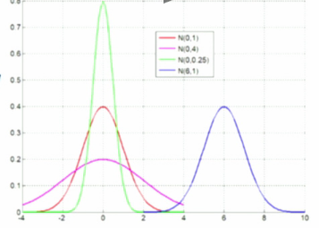

由于正态分布的概率密度过于复杂，正常计算不出来. 因此转成称标准正态分布参数（0，1）

通过标准正态分布函数表 $\Phi(x)$ 得出值 [http://en.wikipedia.org/wiki/Standard_normal_table](表) 

根据该证明可证明出公式 $F_x(a) = P(X <= a) = P(\frac{X - \mu}{\sigma} <= \frac{a - \mu}{\sigma}) = \Phi(\frac{a - \mu}{\sigma})$

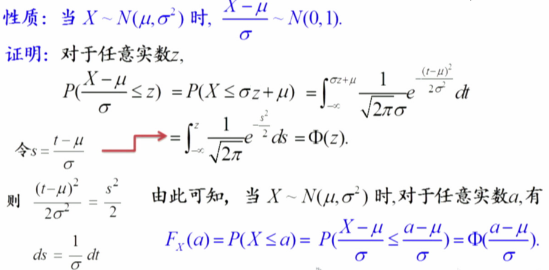

例题：设随机变量X~N(1, 4), 则P(X<0)的值为

A.0.8413

B.0.6915

C.0.3085

D.0.1587

可知$\mu = 1 \sigma = 2 (因为题目中的4是\sigma^2得的) a = 0$

要计算P(X < 0) = F(0) = $\frac{X - \mu}{\sigma} < \frac{a - \mu}{\sigma} = \Phi(\frac{0 - 1}{2}) = \Phi(-0.5) = 1 - \Phi(0.5)$ (因为对称)

查表可知结果为0.30854 所以答案是C

#### 随机变量函数的分布

已知随机变量X的分布，Y = g(x). 函数g(.) 已知 求Y的分布 问题

这种问题有多种解法 拿一个题目做例子

设随机变量X的概率密度函数为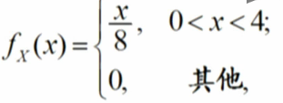

求$Y = X^2$的概率密度函数

解法一：通过X的概率密度函数可以知道 P(0 < x < 4) = 1. 根据x的范围g(x)函数 计算出Y的范围为P(0 < Y < 16) = 1

所以当 $ Y \notin (0,16) ， f_Y(y) = 0$ 

当$ Y \in (0,16)$ 时候 可以把Y转化称X的形式计算分布函数，然后求导即是概率密度函数

$F_Y(y) = P(Y <= y) = P(X^2 <= y) = P(-\sqrt{y} <= X <= \sqrt{y})$

因为X的范围是0,4. 所以上述式子可以转换成 $P(0 <= X <= \sqrt{y})$

使用X的概率密度公式计算

$\int_{0}^{\sqrt{y}} \frac{t}{8}dt = \frac{x^2}{16}|_{0}^{\sqrt{y}} = \frac{y}{16} - 0 = \frac{y}{16}$

$f_Y(y) = F_Y^{'}(y) = \frac{1}{16}$ 

所以Y在(0,16)的概率密度为$\frac{1}{16}$ 其他范围时概率密度为0

解法二： 回到上一个方法的这一步骤

$F_Y(y) = P(Y <= y) = P(X^2 <= y) = P(-\sqrt{y} <= X <= \sqrt{y})$

因X的范围可知 $P(X < -\sqrt{y}) = 0$  

$(-\sqrt{y} <= X <= \sqrt{y})$ 加上 $(X < -\sqrt{y})$ 这个范围  等价于 $X <= \sqrt{y}$  不难看出

于是乎上面的式子可以继续等于 $= F_X(\sqrt{y})$ 

$f_Y(y) = F_X^{'}(\sqrt{y}) = f_X(\sqrt{y})*\frac{1}{2\sqrt{y}} = \frac{\sqrt{y}}{8} * \frac{1}{2\sqrt{y}} = \frac{1}{16}$

当随机变量X和与Y的函数g(x)符合一定条件的时候 还可以通过公式计算Y的概率密度函数

**当随机变量$X~f_X(x)j, -\infty < x < +\infty, Y = g(X), g'(x) > 0 || g'(x) < 0 （是单调递增还是单调帝剑）$ 则Y具有概率密度为**

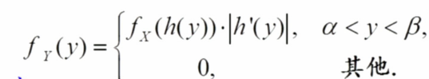

$(\alpha和\beta)$是Y的范围

h是g的反函数 也就是(h(y) = x) == ( y = g(x) )

$h^{'}(y)$ 需要带绝对值是因为单调递减的时候是一个负数 但是概率密度函数是要f(x)>=0的

而当随机变量X是正态分布的时候，还有另一种公式可计算

**当随机变量X~N($\mu,\sigma^2)$**,则有Y = aX + b  ==  Y~N($a\mu + b, a^2*\sigma^2)$

**关于第一个公式例题 请看错题5**

举一个关于公式2的题目做例子

设随机变量X~N(1, 4), 则2X-1~N(1, 15).

A. √

B. ×

根据题目可知随机变量X的参数 $\mu = 1，\sigma = 2$

因为Y = 2X - 1

所以a = 2 b = -1

通过公式可计算出Y的$\mu = 2 * 1 - 1 = 1,\sigma = 2^2 * 2^2 = 16$

所以应该是Y~N(1,16)  答案为B

### 错题

---

若随机变量X的取值为{…,-2, -1, 0, 1, 2, …},   则X是离散型随机变量. 

A.√

B.×

正确答案：√

解释：首先X的取值是离散的，其次我们要验证其分布是不是满足离散型随机变量分布律所要求的条件

首先每个值均在[0, 1]之间，其次我们求和

注意指数函数的泰勒展开(在原点): e^x=1+x+(1/2!)x^2+...(1/n!)x^n+...  因为正负对称，所以下面我们简化写

所以e^-1+...(1/k!)e^-1+...=e^-1\*(1+1+1/2!+...1/k!+...)=e^-1\*e^1=1，所以分布符合条件，综上X是随机变量

---

设随机变量X的分布函数 则 

A.√

B.×

正确答案：√

解释：因为分布函数F（x）= P（X <= x）..  所以P（2 < X <= 3）会是等于F（3） - F（2） （因为不需要2所以不需要F（2 - 0）） 然后把3和2代到分布函数所对应的式子进行计算得到$\frac{3 - 1}{3} - \frac{2 - 1}{3} = \frac{1}{3}$

---

设随机变量X的概率密度函数为F(x)是X的分布函数，则以下结果正确的是

- A.F(1.5)=0
- B.F(2.5)=0.25
- C.F(2.5)-F(0.5)=0.5
- D.F(2.8)=0.9

正确答案：D 你错选为A

解释：该题当初做的时候想着把每个范围的f(x)积分回去F(x). 但是因为该函数不是连续的，所以并不能直接求原来的F(x)并代入计算当作结果.. （分段积分） 

根据公式 $F（x）=  \int_{-\infty}^{x} f(t)dx$

只需要求出不同段的积分加起来即可.. ABC不详细计算 结果都是错的

D： $F(x) = P(X <= 2.8) = \int_{-\infty}^{2.8} f(t)dx = \int_{-\infty}^{0} f(x)dx + \int_{0}^{1} f(x)dx + \int_{1}^{2} f(x)dx + \int_{2}^{2.8} f(x)dx$

根据题目给出的范围可知 第1和第3部分都是为0 然后计算第2和第4部分

$\int_{0}^{1} f(x)dx = \int_{0}^{1} x dx = \frac{1}{2}x^2 |_0^1 = \frac{1}{2} - 0 = \frac{1}{2}$

$\int_{2}^{2.8} f(x)dx = \int_{2}^{2.8} 0.5dx = 0.5x|_2^{2.8} = 0.5*2.8 - 0.5*2 = 0.4$

然后加起来$\frac{1}{2} + 0.4 = 0.9$ 得出答案

---

设随机变量X~N(1, 4), 则P(X=1)=0.5.

- A. √
- B. ×

正确答案：B你错选为A

解释：连续型随机变量在单点处概率为0 

---

设随机变量X的概率密度函数为则 Y～U(0,1).

- A. √
- B. ×

解释：首先根据X的范围 计算出Y的范围.

由于$Y = e^{-X}$  (g(x) < 0) 单调递减.  所以当x > 0的时候 到了$+\infty$的时候Y的值为极限0 而x <= 0 同样道理Y的值会是1

所以Y的范围是(0,1)

使用上面的**公式1** 需要知道$h(y) , h^{'}(y)$

因为是反函数 并且 $Y = e^{-X}$

因为$Y = e^{-X} , lnY = -X$

所以$h(y) = -lnY$

求导得知$h^{'}(y) = -\frac{1}{y}$

使用公式 $f_Y(y) = f_X(h(y)) * |h^{'}(y)| = e^{-1 * -lny} * -\frac{1}{y} = e^{lny} * -\frac{1}{y} = y * \frac{1}{y} = 1 , y \in (0,1)$

而  $f_Y(y) = 0$  $y \in otherwise$

当$f_Y(y)$ 为1的时候 范围刚好是(0,1)  符合U均匀分布的概率密度函数$\frac{1}{b - a} = \frac{1}{1 - 0} = 1$ 

而在其他范围为0

所以随机变量Y~U(0,1)  题目答案为A

---

## 多维随机变量及其分布

### 概念

#### 二元随机变量

当Ｘ和Ｙ是定义在样本空间Ｓ上的随机变量，由它们构成的向量（Ｘ，Ｙ）叫做二维随机变量

####　二元离散型随机变量

当Ｘ，Ｙ随机变量是有限对/可列无限对 则(X,Y)是二元离散型随机变量

##### 二元离散型随机变量分布律

###### 联合概率分布律

设(X,Y)所有可能取值为$(x_i,y_i)$ 并且$P(X = x_i, Y = y_i) = P_{ij}$ i,j = 1,2....

这些取值和概率组合成二元离散型随机变量(X,Y)的联合概率分布律

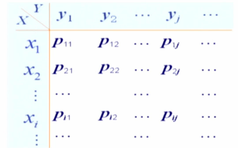

**性质**

1. 每个$P_{ij}$都是大于0
2. 所有$P_{ij}$加起来等于1
3. 求某个区域的概率等于把那个范围的$P_{ij}$加起来
4. $P(X,Y)$可以通过乘法公式算出来 即$P(X,Y) = P(X) * P(Y | X)$

###### 边际分布律

X或者Y的边际分布律就是某$x_i$或$y_i$的概率 而某$x_i$或$y_i$的概率等于所有$x_i$或$y_i$的事件加起来 也就是

$P(X = x_i) = P(X = x_i, \bigcup_{j = 1}^{\infty}(Y = y_j)) = \sum_{j = 1}^{\infty}P_{ij} = P_{i.} $ (注意当求x的时候 y位置有个圆点 反之亦然)

$P(Y = y_j) = P(\bigcup_{i = 1}^{\infty}(X = x_i), Y = y_j) = \sum_{i = 1}^{\infty}P_{ij} = P_{.j}$

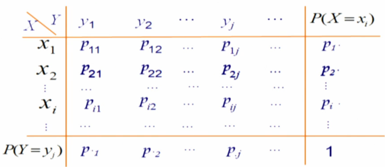

可以通过联合分布律求出边际分布律

某$x_i$的概率等于$x_i$的那一行的概率相加

而$y_i$是某一列的概率相加

他们每个概率叫做边际概率.

不同联合分布律 它们的边际分布律可能相同. 但是相同的边际分布律 它们的联合分布律不一定相同

也就是 边际分布律不能推出联合分布律 而联合分布律可以推出边际分布律

###### 条件分布律

条件分布律就是在某$x_i或y_i$条件下, $y_j或x_j$ j=0,1...的分布律

以$Y = y_j$为条件的x分布律 通过公式计算

$P(X = x_i | Y = Y_j) = \frac{P(X = x_i, Y = y_j)}{P(Y = y_j)} = \frac{P_{ij}}{P_{.j}}$  i = 0,1,2,3.....

拿下面例题说明

已知（*X*,*Y*）的联合分布律为:

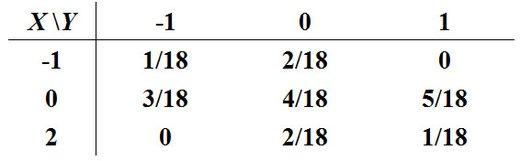

则*P*(*Y* ≤0|*X*=0)等于

A.1/3

B.1/6

C.7/12

D.7/18

首先计算P(X = 0)的概率, 很明显是把X=0的一行概率加起来等于12/18

然后计算当X=0时 Y<=0的概率. 是3/18 + 4/18 = 7/18

相除得到答案C 7/12

#### 二元随机变量分布函数

##### 联合分布函数

$F(x,y) = P(X <= x  \bigcup  Y <= y)$

**性质**

1.F(x,y)关于x,y单调不减

2.$F(-\infty,y) = F(x,-\infty) = F(-\infty,-\infty) = 0$

3.F(x,y)关于x,y右连续 即极限等于自己

4.$P(x_1<X<=x_2, y_1<Y<=Y_2) = F(x_2,y_2) - F(x_2,y_1) - F(x_1,y_2) + F(x_1,y_1)$

##### 边际分布函数

$F_X(x) = F(x,+\infty)$

$F_Y(y) = F(+\infty,y)$

拿F(x)举例 因为$F(x) = F(x,+\infty) = P(X <= x,Y <= +\infty)$

因为Y是覆盖正无穷之前. 相当于之前联合分布律表上某x的一整列. 所以就等于边际

##### 条件分布函数

若P(Y = y) > 0, 则在Y = y条件下,  X的条件分布函数为:

$F_{X|Y}(x|y) = P(X <= x | Y = y) = \frac{P(X <= x, Y = y)}{P(Y = y)}$

这个定义只满足Y是离散型随机变量. 因为连续型随机变量的话, 单点概率为0 那么就不能正确计算了.

如果是连续型随机变量. 需要用某一区间范围表示概率 若P(Y = y) = 0, 那么对于某一$t>0, P(y < Y <= y + t) > 0$.所以定义可以变成

$F_{X|Y}(x|y) = lim_{t->0^+} \frac{P(X <= x, y < Y <= y + t)}{P(y < Y <= y + t)}$

$F_{X|Y}(x|y) = P(X <= x | Y = y)$

#### 二元连续型随机变量

##### 二元连续型随机变量 联合概率密度函数

对于非负函数f(x,y), 对任意x,y有 $F(x,y) = \int_{-\infty}^{x}\int_{-\infty}^{y}f(u,v)dudv$

**称(X,Y)为二元连续型随机变量 并把f(x,y)称为二元随机变量(X,Y)的联合概率密度函数**

**跟一元的概率密度性质一样**

f(x,y) >= 0

$\int_{-\infty}^{+\infty}\int_{-\infty}^{+\infty}f(x,y)dxdy = 1$

**这个知识点重点在于如何进行二重积分**

##### 二元连续型随机变量 边际概率密度函数

之前的学习可知边际分布函数为$F_X(x) = F(x,+\infty)$

因为连续型随机变量的性质 分布函数可以写成一个非负函数的形式 也就是概率密度函数 再积分

所以对于x和y的边际概率密度函数, 使用联合概率密度函数f(x,y) 对其中一个随机变量从负无穷到正无穷积分即可得到

也就是有以下公式

$f_X(x) = \int_{-\infty}^{+\infty}f(x,y)dy$

$f_Y(y) = \int_{-\infty}^{+\infty}f(x,y)dx$

证明： $F_X(x) = F(x,+\infty) = P(X <= x,Y < +\infty) = \int_{-\infty}^{x}[\int_{-\infty}^{+\infty}f(u,y)dy]du = \int_{-\infty}^{x}f_X(u)du$

##### 二元连续型随机变量 条件概率密度函数

若对于固定的y, $f_Y(y) > 0$ 且$f_Y(y)$连续  **在Y = y的条件下 X的条件概率密度函数为**

$f_{X|Y}(x|y) = \frac{f(x,y)}{f(y)}$

例题：

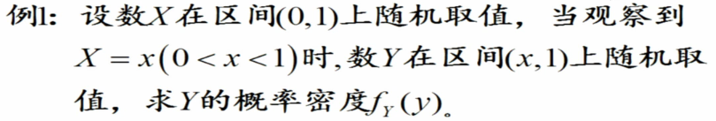 

通过第一句话可知X是服从均匀分布 直接计算出X的概率密度 在0到1范围$f_X(x)$是1. 因为Y在X=x(0<x<1)时候，Y在(x,1)上随机取值 （意思是这个也是均匀分布）. 那么计算出这个条件概率的概率密度函数为$f_{Y|X}(y|x) = \frac{1}{1 - x}$ $x < y < 1$ 

根据公式/乘法公式 计算出$f(x,y) = f_{X}(x) * f_{Y|X}(y|x) = \frac{1}{1 - x}$  然后对x积分正无穷得到$f_Y(y)$

因为x的范围是0到1 但是因为x还受限于y 所以积分实际有效范围为0到y

$\frac{1}{1-x}$ 积分回去为$-ln(1-x)$ 代入0到y 结果是 $f_Y(y) = -ln(1 - y) \ \  0 < y < 1$ **并在其他范围内为0** 

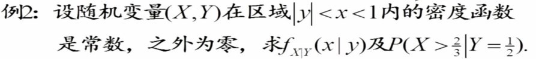

首先根据给出的条件 x,y在某个范围内的概率密度函数是常数. 根据这个条件和最大为1的性质计算出常数是多少

$\int_{-\infty}^{+\infty}dx\int_{-\infty}^{+\infty}f(x,y)dy = 1$

根据画图可知积分范围

所以 $\int_{0}^{1}dx\int_{-x}^{x}kdy = 1 = k\int_{0}^{1}2x\ dx = 1$   所以在|y| < x < 1内 f(x,y) = 1

因为要求$f_{X|Y}(x|y)$ 根据公式 现在知道了f(x,y)  还需要求f(y)  根据范围积分即得

$f_Y(y) = \int_{|y|}^{1}1dx = 1 - |y|$

因此$f_{X|Y}(x|y) = \frac{1}{1 - |y|}$

因为要求P(X > 2/3 | Y = 1/2)  如果只是求P(X > 2/3)的话  只需要知道f(x) 然后积分2/3-正无穷即可知道. 但是题目要求的是在Y=1/2的条件下. 因此需要用对应的条件概率密度来求. 把Y=1/2代入

$f_{X|Y}(x|\frac{1}{2}) = \frac{1}{1 - |\frac{1}{2}|} = 2 \ \ \ \  \frac{1}{2}<x<1$

积分求出答案

$P(X > \frac{2}{3} | Y = \frac{1}{2}) = f_{X|Y}(x > \frac{2}{3} | y = \frac{1}{2}) = \int_{\frac{2}{3}}^{1}2\ dx = 2 - \frac{4}{3}  = \frac{2}{3}$

##### 二元均匀分布

若随机变量x,y的概率密度在平面上一个有界区域D内是常数，并且其他地方取值为0. 那么就说随机变量x,y在D上服从均匀分布

$f(x,y) = \frac{1}{A} \ (x,y) \in D$

$f(x,y) = 0 \ \ otherwise$

其中A是区域D的面积. 可以通过画图看出来

**二元均匀分布的条件概率还是服从均匀分布**

##### 二元正态分布

若概率密度为

$f(x,y) = \frac{1}{2\pi\sigma_1\sigma_2\sqrt{1 - p^2}} * e^{\frac{-1}{2(1 - p^2)}[\frac{(x - \mu_1)^2}{\sigma_1^2} - 2p\frac{(x-\mu_1)(y - \mu_2)}{\sigma_1\sigma_2} + \frac{(y - \mu_2)^2}{\sigma_2^2}]}$

其中$\mu_1 \mu_2 \sigma_1 \sigma_2 大于0$  $-1 < p < 1$

称(X,Y)为服从以上5个参数的二元正态分布

记为(X,Y) ~ N$(\mu_1,\mu_2,\sigma_1^2,\sigma_2^2,p)$

他们的边际概率密度X,Y 分别是上面参数1,3 2,4组成的正态分布

$f_X(x) = \frac{1}{\sqrt{2\pi}\sigma_1}e^{-\frac{(x-\mu_1)^2}{2\sigma_1^2}}$  $-\infty < x < +\infty$

$f_Y(y) = \frac{1}{\sqrt{2\pi}\sigma_2}e^{-\frac{(y-\mu_2)^2}{2\sigma_2^2}}$  $-\infty < y < +\infty$

参数p是指X和Y的相关性 在后面会学到.

例题：

若(*X*,*Y*)服从二元正态分布，(*X*,*Y*)~*N*(1,0,1,1,0)，则以下结果错误的是

A.*X*~*N*(1,1)

B.*P*(*X*>1)=0.5

C.*X*~*N*(0,1)

D.*Y~ N*(0,1)

A选项 X的边际概率函数可以根据二元正态分布参数得出 二元正态分布参数的第1、3个参数就是X边际概率函数的$\mu,\sigma^2$ 所以A是对的

B选项 知道X的分布函数以后，只需要用以前一元正态分布求概率的方法计算即可. 根据公式P(X <= 1) = F(1) = P($\frac{X - \mu}{\sigma} <= \frac{a - u}{\sigma}$) = $\Phi(0)$

P(X > 1) = 1 - $\Phi(0)$ = 0.5

C选项和A选项冲突 所以C是错误的

D选项根据题目条件的第2、4参数得出Y~N(0,1). 对的

#### 随机变量的独立性

之前有这么一个概念，叫做事件独立性. 把A与B两个事件的独立性定义为P(AB) = P(A) * P(B). 对于随机变量也有独立性这一性质. 

设F(x,y)是二元随机变量(X,Y)的分布函数，$F_X(x)$是X的边际分布函数, $F_Y(y)$是Y的边际分布函数. 如果有$P(X <= x,Y <= y) = P(X <= x) * P(Y <= y)$

也就是 $F(x,y) = F_X(x) * F_Y(y)$

称随机变量X,Y**相互独立**

##### 离散型随机变量独立性

对于**一切**的i,j都成立$P_{ij} = P_{i.} * P_{.j}$ 即$P(X = x_i,Y = y_j) = P(X = x_i) * P(Y = y_j)$ 

**注意： 是一切的i,j 即使某些取值在分布律中概率为0也要考虑上**

##### 连续型随机变量独立性

用密度函数判断. 对于在平面的点**几乎处处**成立

如果在概率密度函数**不为0的范围**内 **一切**x,y符合 $f(x,y) = f_X(x)*f_Y(y)$

说明X和Y相互独立.

**注意：如果问有一点(x,y)能使$f_X(x)*f_Y(y) != f(x,y)$ 这个条件并不能确定X和Y一定不独立 因为没有说明x,y的范围**

###### 二元正态分布独立性

对于X与Y的独立性的充要条件是参数p为0

#### n元随机变量

n元随机变量性质类似于二元随机变量.

### 错题

设*X*与*Y*是同分布的随机变量，P(X=1)=0.3, P(X=2)=0.7, P(X=2,Y=2)=0.6，则P(X=1,Y=2)的值为

A.0.21

B.0.3

C.0.4

D.0.1

正确答案：D 没有选择正确答案

解释：这题重点弄明白**同分布**的概念 根据老师的解释

同分布是指X，Y服从相同的**分布律**.  即这里P(Y=1)=0.3 P(Y=2)=0.7   注(根据题目可知X的分布律X=1,2)

一般情况下，同分布的随机变量取值不一定相同 (除非有另外的附加条件，比如一些相关性条件等等)。比如尽管X, Y服从相同的分布，但X<=1的时候Y不一定有Y<=1，只能说P(X<=1)=P(Y<=1)。

若知道Y的分布律后 即可简单计算出P(X=1,Y=2)为0.1

----

设(X,Y)的联合概率密度为则P(X=Y)的值为

A.0

B.0.5

C.1

D.前三个都不对

正确答案：A 你选了C

解释：P(X=Y)时, 很明显这是一个单点. 连续型随机变量单点概率为0 而不应该积分计算.

---

已知(X,Y)的概率密度在单位圆内是一个常数，圆外为零，则这个常数为

A.1

B.0.5

C.

D.

正确答案：C 你选了D

解释：这题还是不太明白. 根据老师的解释. 该题不需要积分求解 根据几何概型的定义. 如果固定区域上的概率密度是一个常数，区域外密度为0，那么区域上的概率密度就是该区域测度的倒数，具体到本题里就是面积值的倒数。 

---

设(X,Y)的概率密度为则Y的边际概率密度计算公式为

A.fdfd

B.

C.

D.

正确答案：C你错选为A

解释：因为要求$f_Y(y)$ 所以需要对X积分 这时候就要用到x的范围了. 所以x的范围是解题的关键. 因为x要同时满足两个条件，所以不是仅仅0到1这么简单. y的范围开方可知 x还需要满足 $\sqrt{y} < x$  因为x的范围应该是

$\sqrt{y} < x < 1$

---

设(X,Y)的概率密度为X的边际概率密度为

Y的边际概率密度为则以下结果正确的是

A.

B.

C.

D.

正确答案：C你错选为A

解释：跟上题一样 A选项错在x的范围不对 x的范围要符合两个要求 计算可知x的范围是 $\sqrt{y}<x<1$

C选项 因为确认了y是0.25 代入可知范围是0.5 < x < 1

---

设二元随机变量(X,Y)的概率密度为f(x,y),则条件概率密度是x,y的二元函数.

A.

B.

正确答案：A你错选为B

解释：因为条件概率密度函数中跟x和y有关（即使表达式里只有y或x 但是范围中若有另一者 那也有关）. 如果y确定的话 那就会是一元函数

---

(*X*,*Y*)在区域*D*={(*x*,*y*):0<*x*<*y*<2}内均匀分布，则*P*(*X*+*Y*>2)的值为

A.1

B.0.75

C.0.5

D.0.25

正确答案：C

解释：画图即可知道 x+y<=2的范围刚好是一个底高为2的三角形，而整个图形为2*2的正方形 占了一半所以为0.5

---

(*X*,*Y*)在区域*D*={(*x*,*y*):0<*x*<*y*<2}内均匀分布，则在*D*内的概率密度值*f*(*x*,*y*)为

A.0

B.0.5

C.1

D.2

正确答案：B你没选择任何选项

解释：二元均匀分布的概率密度函数公式为 1/A (x,y属于某个范围D) 这个A为D的面积. 在这个题目中, 0<x<y<2的图形为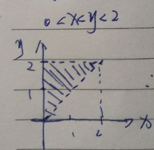 阴影面积为2*2/2 = 2 所以概率密度为1/2

---

若(X1,Y1)~N(1,0,1,1,0), (X2,Y2)~N(1,0,1,1,0,5), 则以下结果正确的是

A. X1与Y1分布相同

B. （X1,Y1）与（X2,Y2）分布相同

C. X1与X2分布相同，但Y1与Y2分布不同

D. X1与X2分布相同， Y1与Y2分布也相同

正确答案：D你错选为A 

解释：根据题目条件可知 X1~N(1,1) Y1~N(0,1) 所以A错误  B选项 虽然两者前4个参数一样，但因为p参数不一样所以不相同 错误. C选项 同样可知X2~N(1,1) Y2~N(0,1) 对比刚刚的X1,Y1 所以知道X1与X2相同分布 Y1和Y2也是相同分布 答案为D

---

设二元连续型随机变量(*X*,*Y*)的概率密度为f(x,y)，若平面上存在一点，使，则随机变量*X*与*Y*一定不独立.

A. √

B. ×

正确答案：B你错选为A

**类题** 设随机变量(*X, Y)*的分布函数为F(x,y)，若对平面的某一点， 有, 则随机变量*X*与*Y*不独立.

A. √

B. ×

正确答案：A你选对了

解释：**此解释为第一题** 之所以f(x0,y0) 不等于 $f_X(x_0) f_Y(y_0)$ 但不一定不独立. 因为$x_0和y_0$的取值如果在概率密度为0的面积上 也就是那个otherwise范围上. 那么就会不相等. 但是这并不意味着不独立. 而如果用分布函数F. 因为F是表示一段范围的概率. 

换种说法. 用F表示也就是独立性的换一种写法. 等同于 $P(X <= x, Y <= y) = P(X <= x) * P(Y <= y)$ 如果不符合这个 那肯定不相互独立

---

