# 概率论与数理统计学习总结

## 概率论的基本概念

### 概念

#### 互不相容

A ∩ B = Ø 的时候 表示A和B不相容 如果有了A 肯定不会有B （但是不代表A或者B一定有 和对立不一样）

若A和B互不相容（互斥） P（AB） =  0 ，所以A+B就可以直接P（A）+P（B） 

#### 对立

如果A∪B = S（样本空间）并且 A∩B = 空集那么表示A和B事件对立，两者必有其中一发生，并且其一发生后，另外一个必定不会发生.

互斥，不一定对立.. 例如运动员比赛拿金牌和银牌.. 这就是互斥的 如果拿了金，就不可能拿银.. 但是运动并不是一定拿金/银 也可能是铜或者没有..  所以这件事情是互斥/不对立

### 错题

---

已知事件A与B至少有一个发生时事件C发生，记a=P (A∪B), b=P(C)，则a与b一定有

- A.a>b
- B.a=b
- C.a<b
- D.a≤b

正确答案：D你错选为C

解释：~~这题已经错了好几次，之前详细弄清楚以后又忘了..  要清楚事件A和B至少有一件发生的概率是怎么算的  首先P（A∪B）代表着A和B之间有一件事情会发生 然后这并不代表全部 还有P（AB）A和B同时发生.  因此事件C的发生概率为b=P（C）=P（A∪B）+P（AB）... 所以已经可以确定a会小于b 但是题目并没有说清楚A和B到底相不相容 于是P（AB）可能会是为0 那么这时候a和b就相等了 所以a≤b~~

**傻逼！！**

某一天在给mooc上讨论帖答疑的时候碰到这题， 那时候感慨这题自己当初错了几次，现在给人答疑总不能又不会了. 事实上思考了一下，发现还真有点恍惚 再看了下以前写的解释（上面） 才发现以前的理解是错的.

什么狗屁

> 首先P（A∪B）代表着A和B之间有一件事情会发生 然后这并不代表全部 还有P（AB）A和B同时发生.

首先P(AUB) 的意思就是A与B至少一个发生 也就是包含着P(AB)了 所以之前所说的什么少了P(AB)是不对的

这道题之所以选D是因为 题目说了AUB的时候 C会发生. 但是并不代表AUB = C.  题目那样说 只能说明 AUB是被C包含. 也就是AUB是在C里面. 但是没说AUB = C啊. 也就是像下图那样. 所以C的概率 应该是大于等于 AUB才对

---

有甲乙两盒，每盒都有2个红球，3个白球，从甲盒中取一球放入乙盒，再从乙盒中采用不放回抽样取出2球，则取到两个球是一红一白的概率为14/25。

A. ×

B. √

正确答案：√

解释：这道题使用全概率公式即可算出.. 一开始想的太复杂了.  首先先分从甲盒抽出的情况.

2/5 是红球 3/5是白球 然后分别各自求出是红球和白球条件下一红一白（分先后顺序 所以要算红白和白红）的概率即可

$$ \frac{2}{5} * (\frac{3}{6}*\frac{3}{5} + \frac{3}{6} * \frac{3}{5}) + \frac{3}{5} * (\frac{4}{6}*\frac{2}{5} + \frac{2}{6} * \frac{4}{5}) $$ 算出得到$$\frac{84}{150}$$ 约分即可得到答案

也可以用逆事件求他们两白+两红的概率 再求逆即可

---

一盒中有3个红球，5个白球，采用不放回抽样取2个球，已知有一个是红球，则两个都是红球的概率为1/6。

A. ×

B. √

正确答案：√

解释：这题其实是条件概率的题目，一开始想到了全概率公式去了. 想着把几种抽红的概率加起来. 结果发现答案不正确.. 后来跟别人讨论过后发现是通过条件公式计算的.. 也就是

$$p(两个球都是红|有一个球是红) = \frac{A1A2(两次都是红)}{A1A2 + \overline{A1}A2 + \overline{A2}A1 (符合已知道有一个球是红色的所有条件) }$$

$$ \frac{A1A2}{A1A2 + A2A1 + \overline{A1}A2 + A1\overline{A2}}$$   错误 一开始想要按条件概率公式算的时候，错把两次都是红球也加上排序组合 导致多算一个双红的情况.. 在这道题目里其实已知的那个红 是第一次抽到还是第二次抽到 对于双红这个事件来说都不影响概率 而对于白红 是先红还是后红 因为会影响概率所以才计算两次

$$ \frac{A1A2}{A1A2 + \overline{A1}A2 + A1\overline{A2}}$$ 正确

该分式的分母还可以换成1 - （一个红都没 也就是双白）  因为双白的逆事件就是起码有一个红球

还可以使用排列组合的思路计算  

假设 事件A：一个是红球  事件B：两个都是红球

$P(B|A) = \frac{P(AB)}{P(A)} = \frac{\frac{C_3^2}{C_8^2}}{\frac{C_3^2*C_5^0 + C_3^1 * C_5^1}{C_8^2}} = \frac{3}{3 * 5 + 3} = \frac{1}{6}$

P(A) 从8个球中取两个，分别是从3个红球中取两个或者是从5个白球中取一个加上从3个白球中取一个

P(AB) 从3个红球中取两个

---

设A,B为随机事件，P(AB)>0，则一定有P(B∣A)>P(B).

A. √

B. ×

正确答案：B你选对了

解释：虽然这题当时做对了 但是后来看到讨论区有人求助这题. 回顾看题后发现不懂. 通过看别人的解释才明白这题 如果A是属于B 也就是在B内 那么P（B|A）=P（B）=1

---

A,B,C为相互独立的三个事件，若P(A)=P(B)=P(C)=0.3，则P(A︱B∪C)的值为

A.1/2

B.10/17

C.3/10

D.6/17

正确答案：C你选对了

解释：**这题后来做不出来了** 解这题其实并不需要计算 因为ABC相互独立互不影响 所以P（A|BUC）=P（A）=0.3 也就是无论什么条件都是等于自身 不受影响

---

一大楼有三层，一层到二层有两部自动扶梯，二层到三层有一部自动扶梯，各扶梯正常工作的概率为*p*，互不影响，则因自动扶梯不正常而不能用它们从一楼到三楼的概率为

A.

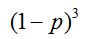

B.

C.

D.

正确答案：C你错选为A

解释： 这一题一开始考虑的太复杂 其实很简单 只需要考虑不能从1楼到3楼的情况即可. 然后用全概率公式加起来 第一种情况就是 一楼的电梯任何情况都可以(不管好坏) 然后二楼的电梯坏掉

第二种是 一楼的电梯全坏 但是二楼的正常的情况 （不用考虑坏的情况是因为包含在之前的第一种里面了）

因此加起来就是 

$1*(1 - p) + c_{2}^{2}(1-p)^2 * p$ 

$= 1 - p + (1 - 2p + p^2) * p$

$ = 1 - p + p - 2p^2 + p^3$

$= 1 - 2p^2 + p^3$

$=1 - p^2(2 - p)$

= C

---

概率为1的事件与任意事件相互独立，正确与否？

A. √

B. ×

概率为0的事件与任意事件相互独立，正确与否？

A. √

B. ×

正确答案： 都是对的

解释：考虑事件之间是否独立 其实只需要判断是否符合公式P(AB) = P(A) * P(B) 对于上面两个例子都能证明出来

考虑P(A) = 1 P(B)随意. 因为A为1 也就是S，而也就说明了B是在A里面的 A和B的交集肯定是B 那么P(AB) = B 而刚好P(A) = 1 * P(B) 就是为P(B) 所以AB是独立的

而P(A) = 0的时候. 容易知道AB的交集为0 所以P(AB) = 0.  而P(A) = 0. 所以不管B的概率多少 P(A) * P(B) = 0 = P(AB) 符合独立

---

## 随机变量及其分布

### 概念

#### 随机变量

随机变量X是用来映射为某一件事件

例如把硬币抛掷3次 样本空间S={正正正，正正反，正反正，正反反，反正正，反正反，反反正，反反反}.

假设随机事件A为"正面出现了一次" 那么A=｛正反反，反正反，反反正｝

此时 事件A可以表示成X = 1

随机变量分为**离散型随机变量**和**连续型随机变量**

#### 离散型随机变量

当随机变量X的取值是有限个或者可数个的时候，那么X就是**离散型随机变量**

例如 正数集合｛1，2，3，4.....｝ 虽然说正数很多 多到像是无限一样. 但是还是可以数的到.. 因此这个集合是离散型随机变量

而区间[0,1] 虽然只是0到1. 但是因为是区间. 其中的实数的是无限的 数不完的.

例如随便一个0.142321432423423423..... （随便按键盘所得的一个小数）

##### 概率分布律

会是像图中这样的表格

X是指随机变量可能取得的值（有限） P代表得到该值的概率

**每个概率P必定>=0 所有$P_i$加起来为1**

##### 0-1分布

当X的概率分布律为这样的时候 也就是随机变量只能取0和1的时候 **称X服从参数p的0-1分布\两点分布 记作X~0-1(p) / X~B(1,p)**    （p是随机变量1的概率）

0-1分布也叫1重贝努利试验

##### 二项分布

当要进行多次0-1分布的试验的时候，这时候也叫做n重贝努利试验 或者说 若X的概率分布律为

$P(X = k) = C_{n}^{k}p^{k}(1 - p)^{n - k}, k = 0,1,...n$ 的时候. **其中n>=1,0 < p < 1, 就称X服从参数为n,p的二项分布 记为X~B(n,p)**  

所以0-1分布是最简单的二项分布

##### 泊松分布

当X的概率分布律符合

$P(X = k) = \frac{\lambda^{k}e^{-\lambda}}{k!}, k = 0,1,2,...$的时候

**其中$\lambda>0$，就称X服从参数为$\lambda$的泊松分布记为X~$\pi(\lambda)$或…X~P($\lambda$)**

当n很大的时候 而p很小的时候 （n > 10 p < 0.1）二项分布和泊松分布近似

$\lambda = np$

##### 几何分布

若X的概率分布律为

$P(X = k) = p(1 - p)^{k - 1}, k = 1,2,3,4....$

**其中0 < p < 1，称X服从参数为p的几何分布 记为X~Geom(p)**

几何分布就是在重复多次的贝努利试验中，当试验进行到某个结果终于出现的时候. 问到此时次数的概率分布律. 

例子: 一枚骰子，直到丢出6的时候结束. X表示第x次丢出6 此时随机变量X就符合几何分布.

丢出6的概率很明显是$\frac{1}{6}$  而不是6的概率就是$1 - \frac{1}{6} = \frac{5}{6}$

那么假设X = 3 表示当丢第3次的时候才出6

那么很明显前两次都不是6 到了第3次才是6  概率P也很明显是 $(\frac{5}{6})^2 * \frac{1}{6}$ 

#### 分布函数

对于离散型随机变量的概率分布律，当随机变量的个数，也就是那个可数集数量很多的时候. 使用概率分布图表示随机变量和概率的关系的时候就会变的很麻烦. 因此就有了分布函数.

**对于随机变量X，任意实数x. 称F(x) = P(X <= x)为X的概率分布函数，简称分布函数**

或者是 $F_X(x) = P(X <= x)$

根据定义可知. F（x）表示的是变量x之前的概率和 也就是$(-\infty,x]$的概率

由于是右闭区间，也就是F(x)是包含着x的. 在离散型随机变量中 某一点是有概率的（连续性的时候单点概率都为0）.  

因此若想要表达出概率$P(a < X <= b)$ 使用F(b) - F(a)即可

若想表达出概率$P(a <= X <= b)$ 则需要使用F(b) - F(a - 0).

这个 -0的意思 就是说比a这个位置少一点点.. 因此就不包含a了

因此$P(a <= X < b)$的概率也很容易想出 是F(b - 0) - F(a - 0).

##### 分布函数的性质

(1) $0 <= F(x) <= 1$

(2) F(x) 单调不减 可能会变多 也可能会不变 但一定不会变少

因为对于x1<x2 有0<=P(x1 < X <= x2) = F(x2) - F(x1)

(3)F($-\infty$) = 0, F(+$\infty$) = 1

(4)F(x)是右连续函数，即F(x + 0) = F(x)  **跟F(x - 0) 不一样**

#### 连续型随机变量

连续型随机变量，也就是说明函数是连续的. 跟离散型随机变量不同. 因为他的随机变量是不可数或不可列

**而连续型随机变量的分布函数里多了一个概率密度函数的概念**

对于随机变量X的分布函数F(x),若存在非负的函数f(x), 使得对于任意实数x有：

$F(x) = \int_{-\infty}^{x} f(t)dt$

则称X为连续型随机变量，其中f(x)为X的概率密度函数

##### 概率密度的性质

(1) f(x) >= 0

(2) $\int_{-\infty}^{+\infty}f(x)dx = 1$ 因为F($+\infty$) = 1

(3)  $P(x1 < X <= x2) = \int_{x1}^{x2}f(t)dt$$

因为在连续型函数里单点的概率为0 也就是任意的随机变量a P(X = a) = 0

所以在连续型随机变量中, 闭区间和开区间是一样的 所以会有

$P(x1 < X <= x2) = P(x1 < X < x2)$等等

(4) $F^{'}(x) = f(x)$

##### 均匀分布

当X的概率密度函数为 $f(x) =  \frac{1}{b - a}$ x$\in$ (a,b)  || $f(x) = 0$ otherwise(其他)

**并且a < b 就称X服从(a,b)上的均匀分布 记为X~U(a,b) or X~Unif(a,b)**

**均匀分布具有等可能性**

随机变量X在(a,b)中的子区间的概率只跟其区间的长度有关

即对于 a<k<k + l<b

$P(k < X < k + l) = \int_{k}^{k + l}\frac{1}{b - a}dt = \frac{l}{b - a}$

只跟l有关 也就是k到k+l这个区间 在a和b区间上的长度

##### 指数分布

若X的概率密度函数为 

$f(x) = \lambda e^{-\lambda x} $  $(x > 0)$

$f(x) = 0$  $(x <= 0)$

**并且$\lambda > 0$ 就称X服从参数为$\lambda$的指数分布 记为X~E($\lambda$) 或 X~Exp($\lambda$)**

而指数分布的分布函数可以通过上面的概率密度函数积分可得

$F(x) = 1 - e^{-\lambda x}$  (x > 0)

$F(x) = 0$  (x <= 0)

**指数分布具有无记忆性**

对于$t_0>0,t>0$

$P(X > t_0 + t | X > t_0) = \frac{P(X > t_0 + t, X > t_0)}{P(X > t_0)} = \frac{P(X > t_0 + t)}{P(X > t_0)} = \frac{1 - F(t_0 + t)}{1 - F(t_0)} = \frac{e^{-\lambda (t_0 + t)}}{e^{-\lambda t_0}} = e^{-\lambda t} = P(X > t)$

因为1 - F(t) = P(X > t) = $e^{-\lambda t}$ 跟上面最后化简是一样的. 所以即使是在条件概率下，概率只跟t有关 也就是无记忆性

例子：  设X服从参数为3的指数分布  $P(X < 3 | X > 2) = 1 - e^{-3}$正确吗

$P(X < 3 | X > 2) = \frac{P(2 < X < 3)}{P(X > 2)} = \frac{F(3) - F(2)}{1 - F(2)} = \frac{1 - e^{-9} - (1 - e^{-6})} {1 - (1 - e^{-6})} = \frac{e^{-6} - e^{-9}}{e^{-6}} = \frac{e^{-6}(1 - e^{-3})}{e^{-6}} = 1 - e^{-3}$

##### 正态分布

若X的概率密度函数为

$f(x) = \frac{1}{\sqrt{2\pi}\sigma}e^{-\frac{(x-\mu)^2}{2\sigma^2}}$  $-\infty < x < +\infty$

**其中 $-\infty < \mu < \infty, \sigma > 0$ 就称X服从参数为$\mu,\sigma$的正态分布（高斯分布）记为X~N($\mu,\sigma^2)$**

并且$\mu$参数影响对称轴位置 而$\sigma$参数影响函数形状 越大的时候越矮越胖 越小的时候越高越瘦

由于正态分布的概率密度过于复杂，正常计算不出来. 因此转成称标准正态分布参数（0，1）

通过标准正态分布函数表 $\Phi(x)$ 得出值 [http://en.wikipedia.org/wiki/Standard_normal_table](表) 

根据该证明可证明出公式 $F_x(a) = P(X <= a) = P(\frac{X - \mu}{\sigma} <= \frac{a - \mu}{\sigma}) = \Phi(\frac{a - \mu}{\sigma})$

例题：设随机变量X~N(1, 4), 则P(X<0)的值为

A.0.8413

B.0.6915

C.0.3085

D.0.1587

可知$\mu = 1 \sigma = 2 (因为题目中的4是\sigma^2得的) a = 0$

要计算P(X < 0) = F(0) = $\frac{X - \mu}{\sigma} < \frac{a - \mu}{\sigma} = \Phi(\frac{0 - 1}{2}) = \Phi(-0.5) = 1 - \Phi(0.5)$ (因为对称)

查表可知结果为0.30854 所以答案是C

#### 随机变量函数的分布

已知随机变量X的分布，Y = g(x). 函数g(.) 已知 求Y的分布 问题

这种问题有多种解法 拿一个题目做例子

设随机变量X的概率密度函数为

求$Y = X^2$的概率密度函数

解法一：通过X的概率密度函数可以知道 P(0 < x < 4) = 1. 根据x的范围g(x)函数 计算出Y的范围为P(0 < Y < 16) = 1

所以当 $ Y \notin (0,16) ， f_Y(y) = 0$ 

当$ Y \in (0,16)$ 时候 可以把Y转化称X的形式计算分布函数，然后求导即是概率密度函数

$F_Y(y) = P(Y <= y) = P(X^2 <= y) = P(-\sqrt{y} <= X <= \sqrt{y})$

因为X的范围是0,4. 所以上述式子可以转换成 $P(0 <= X <= \sqrt{y})$

使用X的概率密度公式计算

$\int_{0}^{\sqrt{y}} \frac{t}{8}dt = \frac{x^2}{16}|_{0}^{\sqrt{y}} = \frac{y}{16} - 0 = \frac{y}{16}$

$f_Y(y) = F_Y^{'}(y) = \frac{1}{16}$ 

所以Y在(0,16)的概率密度为$\frac{1}{16}$ 其他范围时概率密度为0

解法二： 回到上一个方法的这一步骤

$F_Y(y) = P(Y <= y) = P(X^2 <= y) = P(-\sqrt{y} <= X <= \sqrt{y})$

因X的范围可知 $P(X < -\sqrt{y}) = 0$  

$(-\sqrt{y} <= X <= \sqrt{y})$ 加上 $(X < -\sqrt{y})$ 这个范围  等价于 $X <= \sqrt{y}$  不难看出

于是乎上面的式子可以继续等于 $= F_X(\sqrt{y})$ 

$f_Y(y) = F_X^{'}(\sqrt{y}) = f_X(\sqrt{y})*\frac{1}{2\sqrt{y}} = \frac{\sqrt{y}}{8} * \frac{1}{2\sqrt{y}} = \frac{1}{16}$

当随机变量X和与Y的函数g(x)符合一定条件的时候 还可以通过公式计算Y的概率密度函数

**当随机变量$X~f_X(x)j, -\infty < x < +\infty, Y = g(X), g'(x) > 0 || g'(x) < 0 （是单调递增还是单调帝剑）$ 则Y具有概率密度为**

$(\alpha和\beta)$是Y的范围

h是g的反函数 也就是(h(y) = x) == ( y = g(x) )

$h^{'}(y)$ 需要带绝对值是因为单调递减的时候是一个负数 但是概率密度函数是要f(x)>=0的

而当随机变量X是正态分布的时候，还有另一种公式可计算

**当随机变量X~N($\mu,\sigma^2)$**,则有Y = aX + b  ==  Y~N($a\mu + b, a^2*\sigma^2)$

**关于第一个公式例题 请看错题5**

举一个关于公式2的题目做例子

设随机变量X~N(1, 4), 则2X-1~N(1, 15).

A. √

B. ×

根据题目可知随机变量X的参数 $\mu = 1，\sigma = 2$

因为Y = 2X - 1

所以a = 2 b = -1

通过公式可计算出Y的$\mu = 2 * 1 - 1 = 1,\sigma = 2^2 * 2^2 = 16$

所以应该是Y~N(1,16)  答案为B

### 错题

---

若随机变量X的取值为{…,-2, -1, 0, 1, 2, …},   则X是离散型随机变量. 

A.√

B.×

正确答案：√

解释：首先X的取值是离散的，其次我们要验证其分布是不是满足离散型随机变量分布律所要求的条件

首先每个值均在[0, 1]之间，其次我们求和

注意指数函数的泰勒展开(在原点): $e^x=1+x+(1/2!)x^2+...(1/n!)x^n+..$  因为正负对称，所以下面我们简化写

所以$e^{-1}+...(1/k!)e^-1+...=e^{-1}*(1+1+1/2!+...1/k!+...)=e^{-1}*e^1=1$，所以分布符合条件，综上X是随机变量

---

设随机变量X的分布函数 则 

A.√

B.×

正确答案：√

解释：因为分布函数F（x）= P（X <= x）..  所以P（2 < X <= 3）会是等于F（3） - F（2） （因为不需要2所以不需要F（2 - 0）） 然后把3和2代到分布函数所对应的式子进行计算得到$\frac{3 - 1}{3} - \frac{2 - 1}{3} = \frac{1}{3}$

---

设随机变量X的概率密度函数为F(x)是X的分布函数，则以下结果正确的是

- A.F(1.5)=0
- B.F(2.5)=0.25
- C.F(2.5)-F(0.5)=0.5
- D.F(2.8)=0.9

正确答案：D 你错选为A

解释：该题当初做的时候想着把每个范围的f(x)积分回去F(x). 但是因为该函数不是连续的，所以并不能直接求原来的F(x)并代入计算当作结果.. （分段积分） 

根据公式 $F（x）=  \int_{-\infty}^{x} f(t)dx$

只需要求出不同段的积分加起来即可.. ABC不详细计算 结果都是错的

D： $F(x) = P(X <= 2.8) = \int_{-\infty}^{2.8} f(t)dx = \int_{-\infty}^{0} f(x)dx + \int_{0}^{1} f(x)dx + \int_{1}^{2} f(x)dx + \int_{2}^{2.8} f(x)dx$

根据题目给出的范围可知 第1和第3部分都是为0 然后计算第2和第4部分

$\int_{0}^{1} f(x)dx = \int_{0}^{1} x dx = \frac{1}{2}x^2 |_0^1 = \frac{1}{2} - 0 = \frac{1}{2}$

$\int_{2}^{2.8} f(x)dx = \int_{2}^{2.8} 0.5dx = 0.5x|_2^{2.8} = 0.5*2.8 - 0.5*2 = 0.4$

然后加起来$\frac{1}{2} + 0.4 = 0.9$ 得出答案

---

设随机变量X~N(1, 4), 则P(X=1)=0.5.

- A. √
- B. ×

正确答案：B你错选为A

解释：连续型随机变量在单点处概率为0 

---

设随机变量X的概率密度函数为则 Y～U(0,1).

- A. √
- B. ×

解释：首先根据X的范围 计算出Y的范围.

由于$Y = e^{-X}$  (g(x) < 0) 单调递减.  所以当x > 0的时候 到了$+\infty$的时候Y的值为极限0 而x <= 0 同样道理Y的值会是1

所以Y的范围是(0,1)

使用上面的**公式1** 需要知道$h(y) , h^{'}(y)$

因为是反函数 并且 $Y = e^{-X}$

因为$Y = e^{-X} , lnY = -X$

所以$h(y) = -lnY$

求导得知$h^{'}(y) = -\frac{1}{y}$

使用公式 $f_Y(y) = f_X(h(y)) * |h^{'}(y)| = e^{-1 * -lny} * -\frac{1}{y} = e^{lny} * -\frac{1}{y} = y * \frac{1}{y} = 1 , y \in (0,1)$

而  $f_Y(y) = 0$  $y \in otherwise$

当$f_Y(y)$ 为1的时候 范围刚好是(0,1)  符合U均匀分布的概率密度函数$\frac{1}{b - a} = \frac{1}{1 - 0} = 1$ 

而在其他范围为0

所以随机变量Y~U(0,1)  题目答案为A

---

袋中有*a*个白球，*b*个黑球，从袋中任意取出*r*个球（不放回），则此*r*个球中白球的个数*X* 服从

A.二项分布

B.两点分布

C.超几何分布

D.几何分布

正确答案：C你错选为A

解释：二项分布（包含两点分布）是用在放回抽样的情况下的. 而不放回应该用在超几何分布. 考虑一下任意取r个球不放回. 在取出第一个球后，取第二个球的概率就已经发生变化. 这跟二项分布的概念和公式已经不符合了.  几何分布的话，其实给我的感觉更像是特殊点的二项分布(x)

---

A. √

B. ×

正确答案：B你错选为A

解释：之所以是错的是因为忽略了分布函数的一个性质 单调递增. 如果有x1 < x2, 那么必定会有$f(x1) < f(x2)$  根据函数很容易知道 当负无穷到0的时候 是递增的 并且当x为0的时候 取值为1. 而当0到正无穷的时候是递减的 这时候就不符合分布函数的条件了. 因此如果题目改成$X \in (-\infty,0]$的话是正确的

---

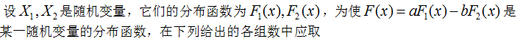

A. a=3/5, b=-2/5

B. a=b=2/3

C. a=1/2, b=-3/2

D. a=-1/2, b=3/2

正确答案：A你错选为B

解释：这题需要运用分布函数的范围性质解答. 可知$F_1(x) \ \  F_2(x)$都是在[0,1]之间 那么自然就能得到$aF_1(x) \ \ -bF_2(x)$ 的范围 把他们的范围等式相加就能得到F(x)的取值范围为

$-b <= aF_1(x) - bF_2(x) <= a$  

在这题，因为是选择题的关系 根据a>=-b的性质已经能得出答案. 但如果换成填空题之类的 应该运用分布函数的另外一条性质 $F(+\infty) = 1$   由这条性质可以知道$F_1(x) = 1\ \ F_2(x) = 1$  并且新分布函数F(x)也有该性质.

那么就会变成 $lim_{x->+\infty} aF_1(x) - bF_2(x) = a - b = 1$

那么就能得出答案是A了

---

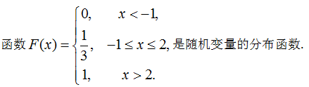

A. √

B. ×

正确答案：B你错选为A

解释：根据范围和取值可以画出图像 因为x=2的时候 不符合分布函数右连续的性质 所以不是分布函数.

而一直以来不懂连续是什么 因此在这一题搞了很久. 因此顺便在这里总结一下相关的知识

说某个点右连续的意思就是 该点的右边部分. 他们的取值 向"这个点"的趋势(也就是该点的右边部分向左边) 并且该点能够取值(如果该点不能取值也不能算连续

如图 x=2的右边部分 都是等于1 （其实连续的条件并不一定要一直等于） 那么就说明右边部分是趋向x=2这个位置的. 但是问题在于当x=2的时候 他是不能取1的（空心） 那么就说明x=2 （x>2) 的时候不连续

另： 

左连续是需要 某个点的左边部分取值趋向这个点的取值（并且该点能取值）

右连续就是要 某个点的右边部分取值趋向这个点的取值（并且该点能取值）

---

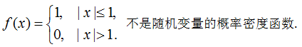

A. √

B. ×

正确答案：A你错选为B

解释：根据范围可知当x为 $-1 <= x <= 1$ 的时候才有概率密度 其他情况为0 那么对这个范围积分

$\int_{-1}^{1}1dx = 2$   因为不满足概率密度的其中一个性质 对$\int_{-\infty}^{+\infty}f(x) dx = 1$  因此这不属于概率密度函数

---

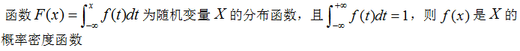

A. √

B. ×

正确答案：B你错选为A

解释： 该题错是错在于 没有给出f(t)的范围. 如果f(t) < 0的话 那么他就不是X的概率密度函数了 必须满足所有条件才是

---

**!!!!!**  X~N(1, 2)，F(x)是X的分布函数，则F(X)服从U[0,1]

A. √

B. ×

正确答案：A你没选择任何选项

解释：这题比较麻烦 处理了很久才解决.. 题目的问法还是第一次见. 的确是随机变量分布. 但是被他直接将一随机变量直接代入一个新的分布函数中，被弄的很混乱. 该题需要用到高数中反函数的性质.  下面是解题步骤

首先题目问F(X)的分布

那么说明这个F(X)就相当于平时正常随机变量函数分布中的Z

设 Z = F(X) 

然后用分布函数法

$F_Z(z) = P(Z <= z) = P(F(X) <= z)$

注意上面的分布函数F(X)中的X 是大写 也就是题目中的正态分布 而不是平时见的小x

此时要继续变换下去. 需要用反函数的性质. 把X变成因变量

$==>  P(X <= F^{-1}(z))$   从上面等式变换出这样是根据反函数性质

函数$y = f(x)$的反函数就是 $x = f^{-1}(y)$

那么回到上面刚变换出来的等式. 继续计算下去

$==> F_{X}(F^{-1}(z)) = z$

该等式的计算结果会是z 至于为什么会是z 又涉及到反函数的定义

> 如果对于值域f(D)中的每一个y，在D中有且只有一个x使得f(y)=x，则按此对应法则得到了一个定义在f(D)上的函数，并把该函数称为函数y=f(x)的**反函数**

由于原函数和反函数的x,y是一一对应的

所以反函数$F^{-1}(z)$ 把自变量z代入进去 得出一个结果x以后

再把该结果x代入回原函数 也就是分布函数F里 自然会得回结果z

计算到这里该题就没有困惑了. 得出Z的分布函数$F_Z(z) = z$  对其求导可知Z的概率密度函数为1

因为Z的范围是0到1 （因为Z=F(X)  X是正态分布 值域自然是0到1)  加上概率密度为1

所以Z是属于在[0,1]的均匀分布！

---

## 多维随机变量及其分布

### 概念

#### 二元随机变量

当Ｘ和Ｙ是定义在样本空间Ｓ上的随机变量，由它们构成的向量（Ｘ，Ｙ）叫做二维随机变量

####　二元离散型随机变量

当Ｘ，Ｙ随机变量是有限对/可列无限对 则(X,Y)是二元离散型随机变量

##### 二元离散型随机变量分布律

###### 联合概率分布律

设(X,Y)所有可能取值为$(x_i,y_i)$ 并且$P(X = x_i, Y = y_i) = P_{ij}$ i,j = 1,2....

这些取值和概率组合成二元离散型随机变量(X,Y)的联合概率分布律

**性质**

1. 每个$P_{ij}$都是大于0
2. 所有$P_{ij}$加起来等于1
3. 求某个区域的概率等于把那个范围的$P_{ij}$加起来
4. $P(X,Y)$可以通过乘法公式算出来 即$P(X,Y) = P(X) * P(Y | X)$

###### 边际分布律

X或者Y的边际分布律就是某$x_i$或$y_i$的概率 而某$x_i$或$y_i$的概率等于所有$x_i$或$y_i$的事件加起来 也就是

$P(X = x_i) = P(X = x_i, \bigcup_{j = 1}^{\infty}(Y = y_j)) = \sum_{j = 1}^{\infty}P_{ij} = P_{i.} $ (注意当求x的时候 y位置有个圆点 反之亦然)

$P(Y = y_j) = P(\bigcup_{i = 1}^{\infty}(X = x_i), Y = y_j) = \sum_{i = 1}^{\infty}P_{ij} = P_{.j}$

可以通过联合分布律求出边际分布律

某$x_i$的概率等于$x_i$的那一行的概率相加

而$y_i$是某一列的概率相加

他们每个概率叫做边际概率.

不同联合分布律 它们的边际分布律可能相同. 但是相同的边际分布律 它们的联合分布律不一定相同

也就是 边际分布律不能推出联合分布律 而联合分布律可以推出边际分布律

###### 条件分布律

条件分布律就是在某$x_i或y_i$条件下, $y_j或x_j$ j=0,1...的分布律

以$Y = y_j$为条件的x分布律 通过公式计算

$P(X = x_i | Y = Y_j) = \frac{P(X = x_i, Y = y_j)}{P(Y = y_j)} = \frac{P_{ij}}{P_{.j}}$  i = 0,1,2,3.....

拿下面例题说明

已知（*X*,*Y*）的联合分布律为:

则*P*(*Y* ≤0|*X*=0)等于

A.1/3

B.1/6

C.7/12

D.7/18

首先计算P(X = 0)的概率, 很明显是把X=0的一行概率加起来等于12/18

然后计算当X=0时 Y<=0的概率. 是3/18 + 4/18 = 7/18

相除得到答案C 7/12

#### 二元随机变量分布函数

##### 联合分布函数

$F(x,y) = P(X <= x  \bigcup  Y <= y)$

**性质**

1.F(x,y)关于x,y单调不减

2.$F(-\infty,y) = F(x,-\infty) = F(-\infty,-\infty) = 0$

3.F(x,y)关于x,y右连续 即极限等于自己

4.$P(x_1<X<=x_2, y_1<Y<=Y_2) = F(x_2,y_2) - F(x_2,y_1) - F(x_1,y_2) + F(x_1,y_1)$

##### 边际分布函数

$F_X(x) = F(x,+\infty)$

$F_Y(y) = F(+\infty,y)$

拿F(x)举例 因为$F(x) = F(x,+\infty) = P(X <= x,Y <= +\infty)$

因为Y是覆盖正无穷之前. 相当于之前联合分布律表上某x的一整列. 所以就等于边际

##### 条件分布函数

若P(Y = y) > 0, 则在Y = y条件下,  X的条件分布函数为:

$F_{X|Y}(x|y) = P(X <= x | Y = y) = \frac{P(X <= x, Y = y)}{P(Y = y)}$

这个定义只满足Y是离散型随机变量. 因为连续型随机变量的话, 单点概率为0 那么就不能正确计算了.

如果是连续型随机变量. 需要用某一区间范围表示概率 若P(Y = y) = 0, 那么对于某一$t>0, P(y < Y <= y + t) > 0$.所以定义可以变成

$F_{X|Y}(x|y) = lim_{t->0^+} \frac{P(X <= x, y < Y <= y + t)}{P(y < Y <= y + t)}$

$F_{X|Y}(x|y) = P(X <= x | Y = y)$

#### 二元连续型随机变量

##### 二元连续型随机变量 联合概率密度函数

对于非负函数f(x,y), 对任意x,y有 $F(x,y) = \int_{-\infty}^{x}\int_{-\infty}^{y}f(u,v)dudv$

**称(X,Y)为二元连续型随机变量 并把f(x,y)称为二元随机变量(X,Y)的联合概率密度函数**

**跟一元的概率密度性质一样**

f(x,y) >= 0

$\int_{-\infty}^{+\infty}\int_{-\infty}^{+\infty}f(x,y)dxdy = 1$

**这个知识点重点在于如何进行二重积分**

##### 二元连续型随机变量 边际概率密度函数

之前的学习可知边际分布函数为$F_X(x) = F(x,+\infty)$

因为连续型随机变量的性质 分布函数可以写成一个非负函数的形式 也就是概率密度函数 再积分

所以对于x和y的边际概率密度函数, 使用联合概率密度函数f(x,y) 对其中一个随机变量从负无穷到正无穷积分即可得到

也就是有以下公式

$f_X(x) = \int_{-\infty}^{+\infty}f(x,y)dy$

$f_Y(y) = \int_{-\infty}^{+\infty}f(x,y)dx$

证明： $F_X(x) = F(x,+\infty) = P(X <= x,Y < +\infty) = \int_{-\infty}^{x}[\int_{-\infty}^{+\infty}f(u,y)dy]du = \int_{-\infty}^{x}f_X(u)du$

##### 二元连续型随机变量 条件概率密度函数

若对于固定的y, $f_Y(y) > 0$ 且$f_Y(y)$连续  **在Y = y的条件下 X的条件概率密度函数为**

$f_{X|Y}(x|y) = \frac{f(x,y)}{f(y)}$

例题：

 

通过第一句话可知X是服从均匀分布 直接计算出X的概率密度 在0到1范围$f_X(x)$是1. 因为Y在X=x(0<x<1)时候，Y在(x,1)上随机取值 （意思是这个也是均匀分布）. 那么计算出这个条件概率的概率密度函数为$f_{Y|X}(y|x) = \frac{1}{1 - x}$ $x < y < 1$ 

根据公式/乘法公式 计算出$f(x,y) = f_{X}(x) * f_{Y|X}(y|x) = \frac{1}{1 - x}$  然后对x积分正无穷得到$f_Y(y)$

因为x的范围是0到1 但是因为x还受限于y 所以积分实际有效范围为0到y

$\frac{1}{1-x}$ 积分回去为$-ln(1-x)$ 代入0到y 结果是 $f_Y(y) = -ln(1 - y) \ \  0 < y < 1$ **并在其他范围内为0** 

首先根据给出的条件 x,y在某个范围内的概率密度函数是常数. 根据这个条件和最大为1的性质计算出常数是多少

$\int_{-\infty}^{+\infty}dx\int_{-\infty}^{+\infty}f(x,y)dy = 1$

根据画图可知积分范围

所以 $\int_{0}^{1}dx\int_{-x}^{x}kdy = 1 = k\int_{0}^{1}2x\ dx = 1$   所以在|y| < x < 1内 f(x,y) = 1

因为要求$f_{X|Y}(x|y)$ 根据公式 现在知道了f(x,y)  还需要求f(y)  根据范围积分即得

$f_Y(y) = \int_{|y|}^{1}1dx = 1 - |y|$

因此$f_{X|Y}(x|y) = \frac{1}{1 - |y|}$

因为要求P(X > 2/3 | Y = 1/2)  如果只是求P(X > 2/3)的话  只需要知道f(x) 然后积分2/3-正无穷即可知道. 但是题目要求的是在Y=1/2的条件下. 因此需要用对应的条件概率密度来求. 把Y=1/2代入

$f_{X|Y}(x|\frac{1}{2}) = \frac{1}{1 - |\frac{1}{2}|} = 2 \ \ \ \  \frac{1}{2}<x<1$

积分求出答案

$P(X > \frac{2}{3} | Y = \frac{1}{2}) = f_{X|Y}(x > \frac{2}{3} | y = \frac{1}{2}) = \int_{\frac{2}{3}}^{1}2\ dx = 2 - \frac{4}{3}  = \frac{2}{3}$

##### 二元均匀分布

若随机变量x,y的概率密度在平面上一个有界区域D内是常数，并且其他地方取值为0. 那么就说随机变量x,y在D上服从均匀分布

$f(x,y) = \frac{1}{A} \ (x,y) \in D$

$f(x,y) = 0 \ \ otherwise$

其中A是区域D的面积. 可以通过画图看出来

**二元均匀分布的条件概率还是服从均匀分布**

##### 二元正态分布

若概率密度为

$f(x,y) = \frac{1}{2\pi\sigma_1\sigma_2\sqrt{1 - p^2}} * e^{\frac{-1}{2(1 - p^2)}[\frac{(x - \mu_1)^2}{\sigma_1^2} - 2p\frac{(x-\mu_1)(y - \mu_2)}{\sigma_1\sigma_2} + \frac{(y - \mu_2)^2}{\sigma_2^2}]}$

其中$\mu_1 \mu_2 \sigma_1 \sigma_2 大于0$  $-1 < p < 1$

称(X,Y)为服从以上5个参数的二元正态分布

记为(X,Y) ~ N$(\mu_1,\mu_2,\sigma_1^2,\sigma_2^2,p)$

他们的边际概率密度X,Y 分别是上面参数1,3 2,4组成的正态分布

$f_X(x) = \frac{1}{\sqrt{2\pi}\sigma_1}e^{-\frac{(x-\mu_1)^2}{2\sigma_1^2}}$  $-\infty < x < +\infty$

$f_Y(y) = \frac{1}{\sqrt{2\pi}\sigma_2}e^{-\frac{(y-\mu_2)^2}{2\sigma_2^2}}$  $-\infty < y < +\infty$

参数p是指X和Y的相关性 在后面会学到.

例题：

若(*X*,*Y*)服从二元正态分布，(*X*,*Y*)~*N*(1,0,1,1,0)，则以下结果错误的是

A.*X*~*N*(1,1)

B.*P*(*X*>1)=0.5

C.*X*~*N*(0,1)

D.*Y~ N*(0,1)

A选项 X的边际概率函数可以根据二元正态分布参数得出 二元正态分布参数的第1、3个参数就是X边际概率函数的$\mu,\sigma^2$ 所以A是对的

B选项 知道X的分布函数以后，只需要用以前一元正态分布求概率的方法计算即可. 根据公式P(X <= 1) = F(1) = P($\frac{X - \mu}{\sigma} <= \frac{a - u}{\sigma}$) = $\Phi(0)$

P(X > 1) = 1 - $\Phi(0)$ = 0.5

C选项和A选项冲突 所以C是错误的

D选项根据题目条件的第2、4参数得出Y~N(0,1). 对的

#### 随机变量的独立性

之前有这么一个概念，叫做事件独立性. 把A与B两个事件的独立性定义为P(AB) = P(A) * P(B). 对于随机变量也有独立性这一性质. 

设F(x,y)是二元随机变量(X,Y)的分布函数，$F_X(x)$是X的边际分布函数, $F_Y(y)$是Y的边际分布函数. 如果有$P(X <= x,Y <= y) = P(X <= x) * P(Y <= y)$

也就是 $F(x,y) = F_X(x) * F_Y(y)$

称随机变量X,Y**相互独立**

##### 离散型随机变量独立性

对于**一切**的i,j都成立$P_{ij} = P_{i.} * P_{.j}$ 即$P(X = x_i,Y = y_j) = P(X = x_i) * P(Y = y_j)$ 

**注意： 是一切的i,j 即使某些取值在分布律中概率为0也要考虑上**

##### 连续型随机变量独立性

用密度函数判断. 对于在平面的点**几乎处处**成立

如果在概率密度函数**不为0的范围**内 **一切**x,y符合 $f(x,y) = f_X(x)*f_Y(y)$

说明X和Y相互独立.

**注意：如果问有一点(x,y)能使$f_X(x)*f_Y(y) != f(x,y)$ 这个条件并不能确定X和Y一定不独立 因为没有说明x,y的范围**

###### 二元正态分布独立性

对于X与Y的独立性的充要条件是参数p为0

#### n元随机变量

n元随机变量性质类似于二元随机变量.

#### 二元随机变量函数的分布

##### 二元离散型随机变量函数的分布

若二元离散型随机变量(X,Y) 具有概率分$P(X = x_i,Y = y_i) = P_{ij}$ , i,j = 1,2....

设U = g(X,Y)  求U的分布律，设V = v(X,Y) 求(U,V)的分布律

解决这种问题，先根据X,Y的范围求出U的范围. 再根据关系函数g() 找出$(U = u_i) = {(X,Y) \in D}$  从而知道U的取值的概率 得出分布律

对于(U,V) 同样找出U,V的范围. 然后根据$u_i,v_j$的取值和对应的X,Y取值得出分布律

例题

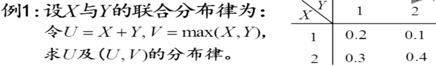

由于X和Y的取值都是1和2，U = X + Y. 所以很明显 U的范围为(2,3,4)，接下来计算当U为2,3,4的可能性

P(U = 2) = P(X = 1,Y = 1) = 0.2

P(U = 3) = P(X = 1,Y = 2) + P(X = 2,Y = 1) = 0.1 + 0.3 = 0.4

P(U = 4) = P(X = 2,Y = 2) = 0.4

所以U的分布律就明了了

V = max(X,Y) 所以V的取值也很容易就得出是(1,2) 同样计算对应取值的概率

P(V = 1) = P(X = 1,Y = 1) = 0.2

P(V = 2) = P(X = 1,Y = 2) + P(X = 2,Y = 1) + P(X = 2,Y = 2) = 0.1 + 0.3 + 0.4 = 0.8

V的分布律也就这样得出来了

求(U,V) 不需要用到U,V的分布律 只需要用到它们的取值即可 同样求出(U,V)的可能取值

P(U = 2,V = 1) = P(X = 1,Y = 1) = 0.2

P(U = 2,V = 2) = 0  (没有这种可能)

P(U = 3,V = 1) = 0

P(U = 3,V = 2) = P(X = 1,Y = 2) + P(X = 2,Y = 1) = 0.1 + 0.3 = 0.4

P(U = 4,V = 1) = 0

P(U = 4,V = 2) = P(X = 2,Y = 2) = 0.4

这样(U,V)的分布律就得出来了

##### 二元连续性随机变量函数分布

设二元连续性随机变量(X,Y) Z是X,Y的函数 Z=g(X,Y)

想要求出Z的概率分布或者密度函数，方法跟一元连续性随机变量的方法相似

先求出Z的分布函数再求导得到密度函数

类似的

$F_Z(z) = P(Z <= z) = P(g(X,Y) <= z) = {\int\int}_{g(x,y) <= z} f(x,y)dx dy$

**2018/10/3更**

**使用分布函数法的时候一定要讨论z的范围  例如求Z=g(X,Y)的概率密度函数时，会转换出P(g(X,Y) <= z) 然后使用X,Y的概率密度积分求出分布函数  这时候因为要用g(X,Y) <= z 这个关系来得出积分范围积分. 根据z的取值不同 有可能不可积、可积、积分为1的情况. 例如z < 0 , a < z < b , z > a   (a,b为常量 具体看g(X,Y))**

例题

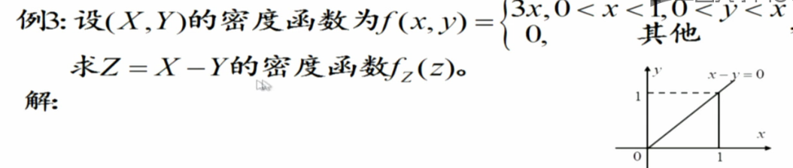

首先知道范围$0 < x < 1$  $0 < y < x$ 

因为X>Y 所以Z作为X-Y是不可能会为负数的 所以

当z < 0的时候 Z的概率密度函数$\int_{Z}(z) = 0$

当0 < z < 1时 把g函数带入计算积分求出分布函数$F_{Z}(z)$ 然后求导求出概率密度函数

$F_{Z}(z) = P(Z <= z) = P(X - Y <= z) = \int\int_{x - y <= z}3x\ dxdy$

X - Y = z的函数应该为图中的绿线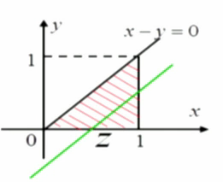

因为是 <= z 所以范围应该是绿线上面部分  要对上面红色部分积分  但由于该面积比较难积分 所以可以用逆事件的性质进行计算. 通过1 - 右边的三角形  （因为(X,Y)的面积就是这个红色大三角形 所以用1减）

而右边三角的积分下上限很明显 X是z到1  Y是从0到x-z  （因为那条绿线是 X-Y <= z）

那么回到上面的公式计算中

$F_{Z}(z) = \int_{z}^{1}dx\int_{0}^{x - z}3xdy = \int_{z}^{1} 3xy|_{0}^{x-z}dx = \int_{z}^{1}3x^2-3xz dx = x^3 - \frac{3}{2}x^2z|_{z}^{1} = 1 - \frac{3}{2}z - (z^3 - \frac{3}{2}z^3) = 1 - \frac{3}{2}z + \frac{1}{2}z^3$

还需要求上面值的逆事件 也就是 $F_{Z}(z) = 1 - (1 - \frac{3}{2}z + \frac{1}{2}z^3) = \frac{3}{2}z - \frac{1}{2}z^3$

对上面结果求导即可得出 $\frac{3}{2} - \frac{3}{2}z^2$ （当 0 < z < 1）

##### Z = X + Y分布

设(X,Y)的概率密度为$f(x,y)$ Z = X + Y

Z的分布函数

$F_{Z}(z) = P(Z <= z) = \int\int_{x + y <= z}f(x,y) dxdy$

= $\int_{-\infty}^{+\infty}[\int_{-\infty}^{z - y}f(x,y)dx]dy$

= $\int_{-\infty}^{+\infty}[\int_{-\infty}^{z}f(u-y,y)du]dy$   设u=x+y  把x变成u-y 并且把上限改成对应u的 因为x+y=z  x+y=u 所以上限变成z

= $\int_{-\infty}^{z}[\int_{-\infty}^{+\infty}f(u-y,y)dy]du$  把里外的积分互换

= $\int_{-\infty}^{z}f_{Z}(u)du$  因此得到了关于Z的概率密度函数

**所以关于Z=X+Y的概率密度有以下公式**

$\int_{Z}(z) = \int_{-\infty}^{+\infty}f(x,z - x)dx$

$\int_{Z}(z) = \int_{-\infty}^{+\infty}f(z - y,y)dy$

###### 卷积公式

当X和Y相互独立的时候 有以下公式 叫做**卷积公式**

$f_{Z}(z) = \int_{-\infty}^{+\infty}f_{X}(z - y)f_{Y}(y)dy = \int_{-\infty}^{+\infty}f_{X}(x)f_{Y}(z-x)dx $

因为相互独立所以有乘法公式 使得

$f_{X}(z - y) * f_{Y}(y) = f_{XY}(z-y,y)$

反之同理

###### Z = X + Y时的二元正态分布 **重要！**

设 **X,Y相互独立** X~N$(\mu_1,\sigma_1^2)$   Y~N$(\mu_2,\sigma_2^2)$

那么Z = X + Y ~N$(\mu_1+\mu_2,\sigma_1^2 + \sigma_2^2)$

**对于N个独立的正态变量的线性组合仍和服从正态分布**

设Z = $c_0 + c_1X_1 + c_2X_2 + c_3X_3$

那么Z服从~N$(c0+c1*\mu_1 + c2*\mu_2 + c3*\mu_3,c_1^2*\sigma_1^2 + c_2^2*\sigma_2^2+c_3^2*\sigma_3^2)$

c均为常数

也就是Z = X+Y   X和Y前面都有个常数 只不过为1 所以平时直接相加

例题

设X~N(1, 1)，Y与X独立同分布，令Z=2X-Y，则Z服从的分布为

A.N(1,1)

B.N(1,3)

C.N(1,5)

D.N(3,5)

因为不是Z=X+Y 所以不能简单的直接相加得到Z的分布

根据Z=2X-Y可知c1 = 2 , c2 = -1

根据公式可知Z的$\mu = c1 * \mu_1 + c2*\mu_2 = 2 * 1 + (-1*1) = 1$

Z的$\sigma = c_1^2*\sigma_1^2 + c_2^2*\sigma_2^2 = 4*1 + (-1)^2*1 = 5$

所以Z~N(1,5) 选C

---

对于连续性的Z = X + Y 来一道均匀分布的例题

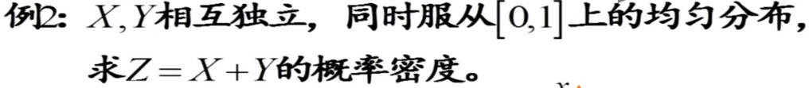

一种是可以用一元随机变量函数的方法计算 也就是求分布函数再求导得出概率密度 这种方法计算比较复杂 于是用第二种方法 通过上面刚学的卷积公式直接计算出概率密度

$f_{Z}(z) = \int_{-\infty}^{+\infty}f_{X}(x)f_{Y}(z - x)dx$

首先可知X,Y的范围为[0,1] 所以Z的范围是[0,2]

如果想要概率密度函数有值(不为0) 那么很明显x要符合 x>=0 和 z-x>=0

而X,Y的范围是0到1  所以上面的x范围具体是 $0<=x<=1$  && $0<=z-x<=1$ **|=|**  $z-1 <=x<=z$

那么就要考虑z的取值了

如果z<0 **很明显概率密度函数为0**

当z>0的时候 根据x的范围画出函数图像为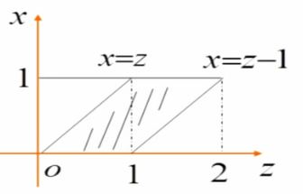

那么当0<=z<=1的时候 使用卷积公式积分 对x积分 下限是0上限是z

$f_{Z}(z) = \int_{0}^{z}1*1dx = x|_{0}^{z} = z $   

 当0<= z <=1的时候 **概率密度为z**

当1<=z<=2的时候 对x积分 下限为z-1 上限为1

$f_{Z}(z) = \int_{z-1}^{1}1*1dx = x|_{z-1}^{1} = 1 - (z - 1) = 2 - z$   

当1<=z<=2 **概率密度为2-z**

###### 关于离散型随机变量的独立和分布（类X+Y=Z）

1. X1,X2.....Xn独立且均服从B(1,p) 那么X1+X2+..+Xn~B(n,p)

2. X~B(n1,p), Y~B(n2,p) 两者独立 那么X+Y ~B(n1+n2,p)
3. X~$\pi(\lambda_1)$, Y~$\pi(\lambda_2)$, 两者独立 则X+Y~$\pi(\lambda_1 + \lambda_2)$

###### 离散型变量和连续性变量相加（X+Y=Z）

只需要把离散型每种取值代入，然后得到的连续型计算积分即可得到Z的概率密度

例题

设X~B(1, 0.3)，Y~N(0,1)，X与Y相互独立，则P(X+Y<0.5)的值为

A.

B.

C.

D.

根据题目可知X是离散型随机变量 Y是连续型随机变量 XY相互独立 Z=X+Y

因为X只有两种取值 分别为 P(X = 0) = 0.7  和 P(X = 1) = 0.3

所以可以把Z的概率 当成全概率公式计算

$F_{Z}(0.5) = P(Z <= z) = P(X+Y<0.5) = P(X=0, X+Y <0.5) + P(X = 1, X+Y<0.5)$. 用乘法公式 换算成

$P(X=0, X+Y <0.5) + P(X = 1, X+Y<0.5)$ 

$= P(X = 0) * P(X+Y<0.5 | X = 0) + P(X = 1) * P(X + Y <0.5|X = 1) $

= $0.7*P(Y<0.5) + 0.3*P(Y < -0.5)$

= $0.7*\Phi(0.5) + 0.3*(1 - \Phi(0.5))$

= $0.3 + 0.4\Phi(0.5)$

答案为D

##### Z = Max(X,Y) 和 Z = Min(X,Y)

###### Z = max(X,Y)

设X,Y两个相互独立 分布函数分别为$F_{X}(x), F_{Y}(y)$

$F_{max}(z) = P(max(X,Y) <= z) = P(X <=z, Y <= z)$

因为M是X,Y中的最大值. 其中最大值<=z 那么另外一个数也肯定是<=z

所以P(max(X,Y) <= z) 等价 P(x <= z, y <= z)

因为独立 所以$F_{max}(z) = P(X <= z)P(Y <= z) = F_{X}(z) * F_{Y}(z)$

###### Z = min(X,Y)

设X,Y两个相互独立 分布函数分别为$F_{X}(x), F_{Y}(y)$

$F_{min}(z) = P(min(X,Y) <= z)$

虽然X,Y中最小的小于等于z 但是另外一者不一定小于等于z 可能大于 所以就不能用上面max的方法计算

考虑一下 如果min(X,Y) > z  其中最小的数都大于z，那么另外一个数也必定会大于z

所以使用逆事件就能求出min(X,Y)的分布函数

回到上面等式

= $1 - P(min(X,Y) > z)$

= $1 - P(X > z, Y > z) $

= $1 - P(X > z)P(Y > z)$

= $1 - (1 - P(X <= z))(1 - P(Y <= z))$

= $1 - (1 - F_{x}(z))(1 - F_{y}(z))$

###### n个相互独立的随机变量的最大值和最小值

$F_{max}(z) = F_{X_1}(z)F_{X_2}(z)...F_{X_n}(z)$  如果他们每个随机变量都是独立同分布 那么直接等于 $F_{max}(z) = (F(z))^n)$

$F_{min}(z) = 1 - [1 - F_{X_1}(z)][1 - F_{X_2}(z)]...[1 - F_{X_n}(z)]$ 同样的 如上会等于 $F_{min}(z) = 1 - [1 - F(z)]^n$

至于他们的概率密度函数 用分布函数求导即可得到

### 错题

设*X*与*Y*是同分布的随机变量，P(X=1)=0.3, P(X=2)=0.7, P(X=2,Y=2)=0.6，则P(X=1,Y=2)的值为

A.0.21

B.0.3

C.0.4

D.0.1

正确答案：D 没有选择正确答案

解释：这题重点弄明白**同分布**的概念 根据老师的解释

同分布是指X，Y服从相同的**分布律**.  即这里P(Y=1)=0.3 P(Y=2)=0.7   注(根据题目可知X的分布律X=1,2)

一般情况下，同分布的随机变量取值不一定相同 (除非有另外的附加条件，比如一些相关性条件等等)。比如尽管X, Y服从相同的分布，但X<=1的时候Y不一定有Y<=1，只能说P(X<=1)=P(Y<=1)。

若知道Y的分布律后 即可简单计算出P(X=1,Y=2)为0.1

----

设(X,Y)的联合概率密度为则P(X=Y)的值为

A.0

B.0.5

C.1

D.前三个都不对

正确答案：A 你选了C

解释：P(X=Y)时, 很明显这是一个单点. 连续型随机变量单点概率为0 而不应该积分计算.

---

已知(X,Y)的概率密度在单位圆内是一个常数，圆外为零，则这个常数为

A.1

B.0.5

C.

D.

正确答案：C 你选了D

解释：这题还是不太明白. 根据老师的解释. 该题不需要积分求解 根据几何概型的定义. 如果固定区域上的概率密度是一个常数，区域外密度为0，那么区域上的概率密度就是该区域测度的倒数，具体到本题里就是面积值的倒数。 

---

设(X,Y)的概率密度为则Y的边际概率密度计算公式为

A.fdfd

B.

C.

D.

正确答案：C你错选为A

解释：因为要求$f_Y(y)$ 所以需要对X积分 这时候就要用到x的范围了. 所以x的范围是解题的关键. 因为x要同时满足两个条件，所以不是仅仅0到1这么简单. y的范围开方可知 x还需要满足 $\sqrt{y} < x$  因为x的范围应该是

$\sqrt{y} < x < 1$

---

设(X,Y)的概率密度为X的边际概率密度为

Y的边际概率密度为则以下结果正确的是

A.

B.

C.

D.

正确答案：C你错选为A

解释：跟上题一样 A选项错在x的范围不对 x的范围要符合两个要求 计算可知x的范围是 $\sqrt{y}<x<1$

C选项 因为确认了y是0.25 代入可知范围是0.5 < x < 1

---

设二元随机变量(X,Y)的概率密度为f(x,y),则条件概率密度是x,y的二元函数.

A.

B.

正确答案：A你错选为B

解释：因为条件概率密度函数中跟x和y有关（即使表达式里只有y或x 但是范围中若有另一者 那也有关）. 如果y确定的话 那就会是一元函数

---

(*X*,*Y*)在区域*D*={(*x*,*y*):0<*x*<*y*<2}内均匀分布，则*P*(*X*+*Y*>2)的值为

A.1

B.0.75

C.0.5

D.0.25

正确答案：C

解释：画图即可知道 x+y<=2的范围刚好是一个底高为2的三角形，而整个图形为2*2的正方形 占了一半所以为0.5

---

(*X*,*Y*)在区域*D*={(*x*,*y*):0<*x*<*y*<2}内均匀分布，则在*D*内的概率密度值*f*(*x*,*y*)为

A.0

B.0.5

C.1

D.2

正确答案：B你没选择任何选项

解释：二元均匀分布的概率密度函数公式为 1/A (x,y属于某个范围D) 这个A为D的面积. 在这个题目中, 0<x<y<2的图形为 阴影面积为2*2/2 = 2 所以概率密度为1/2

---

若(X1,Y1)~N(1,0,1,1,0), (X2,Y2)~N(1,0,1,1,0,5), 则以下结果正确的是

A. X1与Y1分布相同

B. （X1,Y1）与（X2,Y2）分布相同

C. X1与X2分布相同，但Y1与Y2分布不同

D. X1与X2分布相同， Y1与Y2分布也相同

正确答案：D你错选为A 

解释：根据题目条件可知 X1~N(1,1) Y1~N(0,1) 所以A错误  B选项 虽然两者前4个参数一样，但因为p参数不一样所以不相同 错误. C选项 同样可知X2~N(1,1) Y2~N(0,1) 对比刚刚的X1,Y1 所以知道X1与X2相同分布 Y1和Y2也是相同分布 答案为D

---

设二元连续型随机变量(*X*,*Y*)的概率密度为f(x,y)，若平面上存在一点，使，则随机变量*X*与*Y*一定不独立.

A. √

B. ×

正确答案：B你错选为A

**类题** 设随机变量(*X, Y)*的分布函数为F(x,y)，若对平面的某一点， 有, 则随机变量*X*与*Y*不独立.

A. √

B. ×

正确答案：A你选对了

解释：**此解释为第一题** 之所以f(x0,y0) 不等于 $f_X(x_0) f_Y(y_0)$ 但不一定不独立. 因为$x_0和y_0$的取值如果在概率密度为0的面积上 也就是那个otherwise范围上. 那么就会不相等. 但是这并不意味着不独立. 而如果用分布函数F. 因为F是表示一段范围的概率. 

换种说法. 用F表示也就是独立性的换一种写法. 等同于 $P(X <= x, Y <= y) = P(X <= x) * P(Y <= y)$ 如果不符合这个 那肯定不相互独立

---

若(X,Y)的联合概率密度为设Z=X-Y， F(z)是Z的分布函数，则F(0.5) 的值为

A.0.125

B.0.25

C.0.75

D.0.875

正确答案：C你没选择任何选项

解释：跟上面例子相似 直接根据公式计算即可

$F_{Z}(z) = P(Z <= z) = P(X - Y <= z) = 1 - \int_{z}^{1}dx\int_{0}^{x-z}2dy = 1 -  \int_{z}^{1} 2x-2zdx = 1 - (x^2 - 2xz)|_{z}^{1} = 1 - (1 - 2z - (z^2 - 2z^2)) = 2z - z^2 = 1 - 0.25 = 0.75$

---

设X与Y相互独立，均服从U(0,1)，则P(max{X, Y}≥0.5)为

A.1/2

B.P(X>0.5)P(Y>0.5)

C.P(X>0.5)

D.1-P(X<0.5)P(Y<0.5)

正确答案：D

解释：D答案很容易算出 解释一下B选项 因为max(X,Y)>=0.5 说的是X,Y的最大值>=0.5 但是除了最大值另外一个不一定会大于. 所以不能选B

---

设G表示抛物线$y=x^2$及直线$y=x$所包围的区域，(X,Y)服从G上的均匀分布，求联合概率密度.

解释：第一次碰到这种题目，之前见过的都是给定特殊条件的均匀分布，例如什么X,Y独立 然后知道X是某范围的均匀分布，Y在X一定条件下也服从均匀分布（条件概率）. 然后通过公式求出联合概率密度. 但是像这一题，并不像上面所说的那样. 因此请教了下老师. 其实只需要根据二元均匀分布的公式即可求出

$f(x,y) = \frac{1}{S_G}，\ \ (x,y)\ \in\ G$

$S_G$就是那块范围的面积. 而因为这个范围是通过曲线包围而成. 并不好直接算出面积. 因此通过二重积分求出面积 画出图像以后就很容易知道上下限了

$f(x,y) = \int_{0}^{1}\int_{x^2}^{x}c\ dydx = 1$ 

求出C为6  所以面积是1/6

$f(x,y) = 6$ 在(x,y)在G范围里 其他范围为0

---

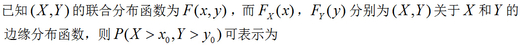

A.

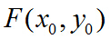

B.

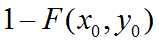

C.

D.

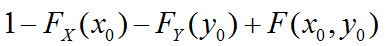

正确答案：D你错选为B

解释：这道题目想的太快和简单了. 误当成跟一维随机变量一样直接一减即可. 事实上二维并不能这样. 他$P(X > x_0,Y > y_0)$的实际范围应该是这样  这道题算是有点新题的味道，以前并没有碰到过直接用边际分布函数求概率. 因为边际分布函数的某一随机变量是正无穷. 所以蓝色的部分代表着$F(x_0,+\infty)$ 黄色代表$F(+\infty,y0)$ 他们都减掉$F(x_0,y_0)这一部分 所以才补上

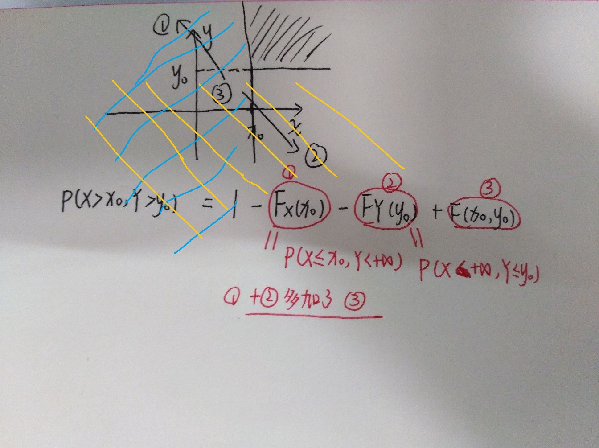

---

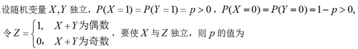

A.1/3

B.1/4

C.1/2

D.2/3

正确答案：C你没选择任何选项

解释：利用随机变量之间独立的性质 或 所有事件概率之和为1的性质 两种方法

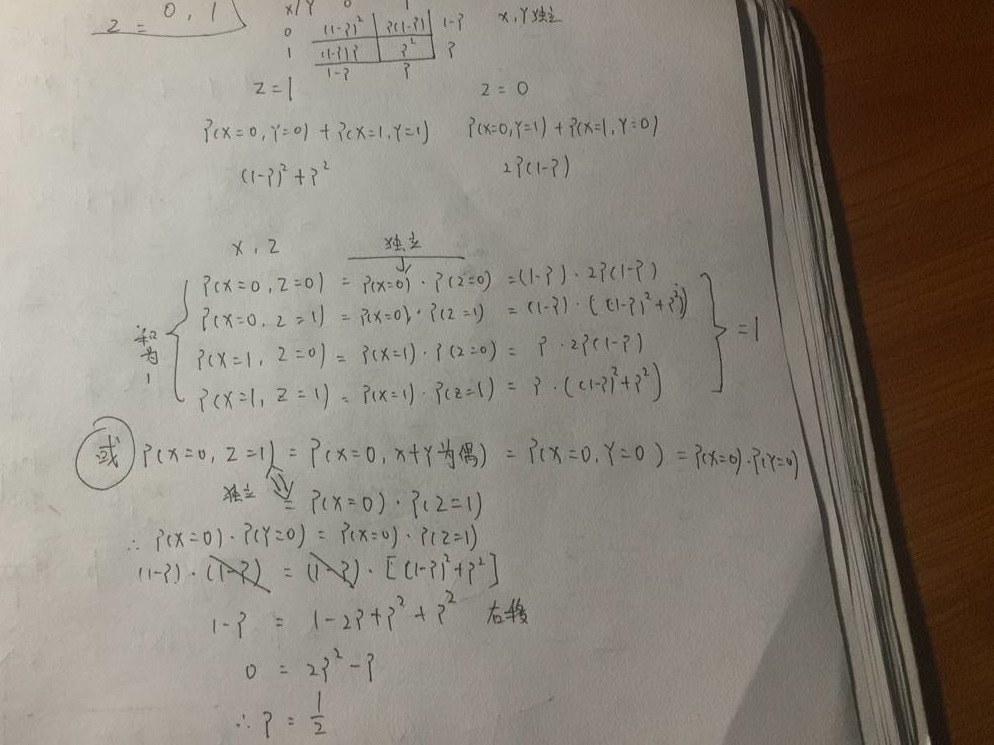

---

设随机变量*X*, *Y*独立同分布，其分布列为：*P*(*X*=-1)=1/2，*P*(*X*=1)=1/2，则下列式子中

正确的是

A. X=Y
B.P(X=Y )=0

C.P(X=Y )=1/2

D.P(X=Y )=1

正确答案：C你选对了

解释：对于答案A 想要让随机变量X,Y完全相等，除了同分布以外. 还需要当随机变量X取某个值的概率跟 随机变量Y取该值的时候 概率相等. 也就是自变量相等的时候，函数值也要相等才能算随机变量相等.

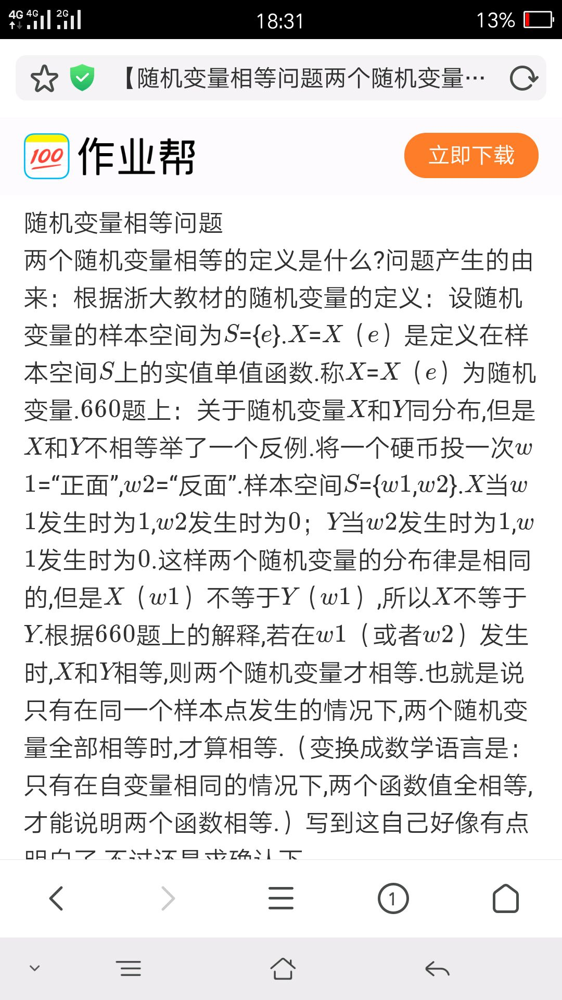

---

设随机变量*X*, *Y*独立同分布, *X*~*U*[0,1], 则下列随机变量中服从均匀分布的是

A.(X, Y)

B. X+Y

C. $x^2$

D.X-Y

正确答案：A你错选为B

解释： 求出Z = X + Y的概率密度就可以知道他不是属于均匀分布. 而(X,Y)是属于的

我的计算过程（分布函数法）：

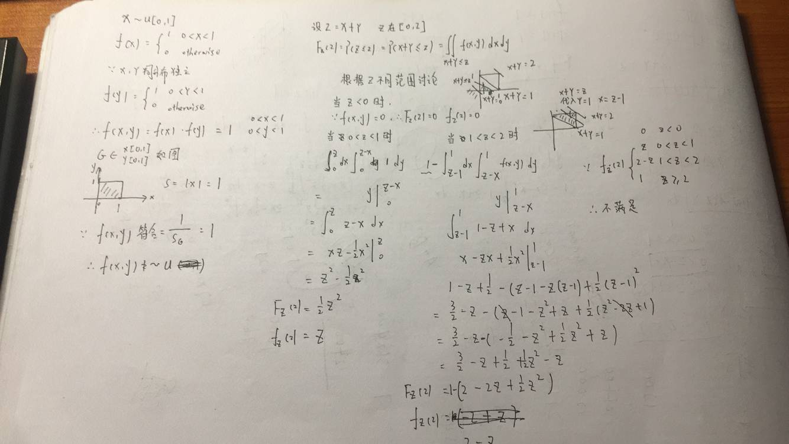

大佬使用卷积公式的计算过程：

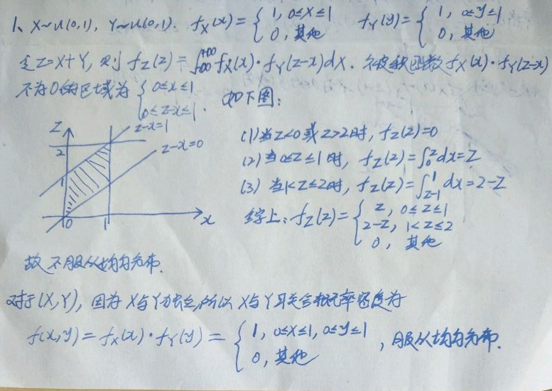

---

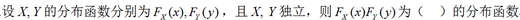

A.(X, Y)

Bmin(X, Y)

C.max(X,Y)

D.X+Y

正确答案：A你错选为C

解释：这题主要在A和C不知道选哪个. A很明显是符合的 那么下面分析下C

Z=max(X,Y)

F(Z) = P(Z <= z) = P(max(X,Y) <= z) = P(X <= z, Y <= z) = P(X <= z) * P(Y <= z)

这里继续下去会转换成$F_X(z) * F_Y(z)$  C选项错就错在题目给出的是$F_X(x), F_Y(y)$ 里面的是x和y而不是z 因此不符合.

---

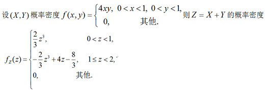

A. √

B. ×

正确答案：A你错选为B

解释： 这题计算量超恐怖.. 计算了多次还是算不出来 使用卷积公式计算量比使用分布函数少很多

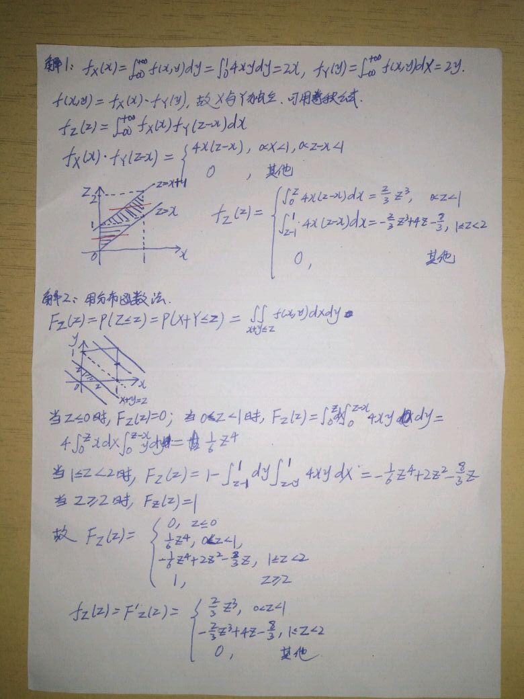

---

## 随机变量的数字特征

### 概念

#### 数学期望

**数学期望反应的是随机变量平均取值的大小**

##### 离散型随机变量的数学期望

设离散型随机变量X的分布律为：$P(X = x_k) = p_k , k = 1,2...$ 如果级数$\sum_{k = 1}^{+\infty}x_kp_k$ **绝对收敛**， 则称级数$\sum_{k = 1}^{+\infty}x_kp_k$的值为随机变量X的**数学期望**，记为$E(X)$ 即

$E(X) = \sum_{k = 1}^{+\infty}x_kp_k$

##### 连续性随机变量的数学期望

设连续型随机变量X的概率密度函数为$f(x)$，若积分$\int_{-\infty}^{+\infty}x f(x)dx$ **绝对收敛**  （即$\int_{-\infty}^{+\infty}|x|f(x)dx < +\infty$），则称积分$\int_{-\infty}^{+\infty}xf(x)dx$的值为随机变量X的数学期望，即

$E(X) = \int_{-\infty}^{+\infty} xf(x) dx$

##### 随机变量函数的数学期望

随机变量函数的数学期望可以用两种方法求出来

设随机变量X的概率分布律已知 Y=g(X) 求Y的数学期望

1 通过关系函数g(x) 和X的概率分布律 求出随机变量Y的概率分布律 然后根据Y的概率分布律求出Y的数学期望E(Y)

2 直接通过X的概率分布律计算Y的数学期望. 用计算X数学期望的方法 通过Y与X的函数 把x换成对应的y即可计算出数学期望E(Y)

例题

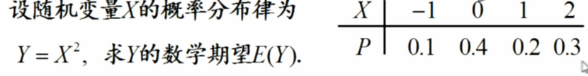

首先方法1  根据g(x) = Y = X^2  根据X的范围 可以知道Y的取值为 0，1，4 并且各自的概率为0.4，0.3，0.3 然后用之前离散型的公式 $E(Y) = 0 * 0.4 + 1 * 0.3 + 4 * 0.3 = 1.5$

而方法2 不需要求Y相关的内容. 由于知道Y与X的关系式 直接根据X的分布律求数学期望 如下式子

$E(Y) = (-1)^2 * 0.1 + 0^2 * 0.4 + 1^2 * 0.2 + 2^2 * 0.3 = 1.5$

因此有定理1

如果Y是随机变量X的函数 Y = g(X) , X是离散型随机变量, 并且知道他的分布律为$P(X = x_k) = p_k$  并且**$\sum_{k = 1}^{\infty}g(x_k)p_k$ 绝对收敛**  那么

$E(Y) = E[g(X)] = \sum_{k = 1}^{\infty}g(x_k)p_k$

如果X是连续型随机变量的时候，也是同理的. 知道X的概率密度为f(x)  Y = g(x)

保证$\int_{-\infty}^{+\infty}g(x)f(x)$ **绝对收敛** 那么

$E(Y) = E(g(X)) = \int_{-\infty}^{+\infty} g(x) f(x) dx$

**以上是对一元随机变量函数有用  对于二元随机变量函数有定理2**

设Z是随机变量X和Y的函数  Z = h(X,Y)

**当随机变量(X,Y) 是 离散型随机变量的时候**

得知他们的分布律$P(X = x_i, Y = y_j) = p_{ij} , i,j = 1,2...$

根据X,Y的取值 求出Z的取值 并乘上X,Y的概率即可

即$E(Z) = E[h(X,Y)] = \sum_{i = i}^{+\infty}\sum_{j = 1}^{+\infty}h(x_i,y_j)*p_{ij}$

**当随机变量(X,Y)是 连续型随机变量的时候是类似的**

设随机变量(X,Y)的概率密度为f(x,y)

有 $E(Z) = E(h(X,Y)) = \int_{-\infty}^{+\infty}\int_{-\infty}^{+\infty}h(x,y)f(x,y)dxdy$

根据之前学习的 联合概率密度求边际概率密度的性质可以很容易推广出下面两个

$E(X) = \int_{-\infty}^{+\infty}\int_{-\infty}^{+\infty}xf(x,y)dxdy$

$E(Y) = \int_{-\infty}^{+\infty}\int_{-\infty}^{+\infty}yf(x,y)dxdy$

因为用联合概率密度对x或者y积分一次负无穷到正无穷即可得到相应的$f(y)$或者$f(x)$

然后由于上面的一元连续型随机变量的数学期望公式可知道

对x\*f(x) 或者 y\*f(x) 积分负无穷到正无穷即可得到X或Y的数学期望

**因此这个推广的意义是 如果知道联合概率密度, 那么不需要求边际概率密度也可以求出X或者Y的数学期望**

##### 数学期望的性质

1. 设c是常数，则有E(c) = c  
2. 设X是一个随机变量，c是常数，那么有E(cX) = cE(X) 
3. 设X,Y 是两个随机变量，则有E(X+Y) = E(X) + E(Y)
4. 上面3个可以推广成E(aX+Y+c) = aE(X) + E(Y) + c
5. 当X,Y 是相互独立的两个随机变量 则有 E(XY) = E(X)E(Y) 同样可以推广n个相互独立的随机变量

证明 以连续型随机变量为例子

1. c是常数 P(X = c) = 1, E(c) = E(X) = c*1 = c
2. E(cX) = $\int_{-\infty}^{+\infty}cxf_X(x)dxdy = c\int_{-\infty}^{+\infty}xf_X(x)dxdy = cE(X)$
3. E(X+Y) = $\int_{-\infty}^{+\infty}\int_{-\infty}^{+\infty}(X+Y)f(x,y)dxdy = \int_{-\infty}^{+\infty}\int_{-\infty}^{+\infty}Xf(x,y)dxdy + \int_{-\infty}^{+\infty}\int_{-\infty}^{+\infty}Y(fx,y)dxdy = E(X) + E(Y)$
4. E(XY) = $\int_{-\infty}^{+\infty}\int_{-\infty}^{+\infty}XY f(x,y)dxdy = \int_{-\infty}^{+\infty}Xf(x)dx\int_{-\infty}^{+\infty}Yf(y)dy = E(X)E(Y)$

##### 常用分布的数学期望

1. X~B(1,p)  $E(X) = p$
2. X~B(n,p) $E(X) = np$
3. X~P($\lambda​$)    $E(X) = \lambda​$
4. X~G(p)  $E(X) = 1 / p$
5. X~U(a,b) $E(X) = (a+b) / 2$
6. X~E($\lambda$)   $E(X) = 1 / \lambda$
7. X~N($\mu,\sigma^2$)  $E(X) = \mu$ 

#### 方差

方差就是用来表示与数学期望的平均偏移程度. 或者说 方差刻划了随机变量的取值对于其数学期望的离散程度 

##### 方差定义

 设X是一个随机比那里，若$E[(X-E(X))^2]$ 存在，则成$E[(X-E(X))^2]$是X的方差 记作D

$D(X) = E[X-E(X)]^2$   注意 上面的写法是为了好看易懂 这里的写法是正式的公式 这里的平方是对(X-E(X))平方 然后取该平方后的数学期望

**X的标准差或均方差**  $\sigma_X = \sqrt{D(X)$

如果D(X)较小 则X的取值比较集中

如果D(X)较大 则X的取值比较分散

##### 离散型随机变量的方差

$D(X) = \sum_{i = 1}^{+\infty}[x_i-E(X)]^2 * p_i$

##### 连续型随机变量的方差

$D(X) = \int_{-\infty}^{+\infty}[x-E(x)]^2 * f(x) dx$

##### 计算方法的简化公式

$D(X) = E(X^2) - [E(X)]^2$

##### 方差的性质

1. 设C是常数 则D(C) = 0
2. 若C是常数 则D(CX) = C^2 * D(X);
3. $D(X+Y) = D(X) + D(Y) + 2E{ [X-E(X)] * [Y-E(Y)]}$
4. 如果X与Y独立 那么D(X+Y) = D(X) + D(Y)
5. **注意 上面那条只能是知道独立后 才能得知D(X+Y)=D(X)+D(Y). 反过来是不能推出两者独立**
6. 如果X与Y独立 $D(XY) = D(X)*D(Y) + D(X)*[E(Y)]^2+D(Y)*[E(X)]^2$
7. D(X) = 0 推出 P(X=C)=1 反过来也可以推回去  且C=E(X)

##### 常用分布的方差

1. X~B(1,p)  $D(X) = p(1-p)$
2. X~B(n,p) $D(X) = np(1-p)$
3. X~P($\lambda$)    $D(X) = \lambda$
4. X~G(p)  $D(X) = (1-p) / p^2$
5. X~U(a,b) $D(X) = (b - a)^2 / 12$
6. X~E($\lambda$)   $D(X) = 1 / \lambda^2$
7. X~N($\mu,\sigma^2$)  $D(X) = \sigma^2$ 

#### 协方差

协方差是用来反应两个随机变量之间的关系的

在方差的性质3中$D(X+Y) = D(X) + D(Y) + 2E{ [X-E(X)] * [Y-E(Y)]}$

如果X与Y独立 那么D(X + Y) = D(X) + D(Y)

也就是$2E{ [X-E(X)] * [Y-E(Y)]} = 0$

反过来说 如果$2E{ [X-E(X)] * [Y-E(Y)]} != 0$  那就能够说明X与Y一定不独立

##### 协方差的定义

如果**$E{ [X-E(X)] * [Y-E(Y)]}$**存在， 称它为随机变量X,Y的协方差 记为Cov(X,Y)

$Cov(X,Y) = E{ [X-E(X)] * [Y-E(Y)]}$

同时回到方差性质3

$D(X +/- Y) = D(X) + D(Y) + / - 2Cov(X,Y)$

如果Cov(X,Y) > 0时 称X与Y正相关

如果Cov(X,Y) < 0时 称X与Y负相关

如果Cov(X,Y) = 0 X与Y不相关

##### 协方差的性质

1. Cov(X,Y) = Cov(Y,X)  Cov(X,a) = 0
2. D(X) = Cov(X,X)
3. Cov(aX,bY) = ab * Cov(X,Y)
4. Cov(X1+X2,Y) = Cov(X1,Y) + Cov(X2,Y)
5. 如果X与Y独立 Cov(X,Y) = 0  反过来是推不出X与Y独立

**协方差计算便捷公式**

Cov(X,Y) = E(XY) - E(X)E(Y)

#### 相关系数

##### 相关系数的定义

若Cov(X,Y) 存在 D(X) > 0, D(Y) > 0

称 $\rho_{XY} = \frac{Cov(X,Y)}{\sqrt(D(X)D(Y)}$ 为随机变量X和Y的相关系数

##### 相关系数的性质

1. |$\rho$| <= 1
2. |$\rho$| = 1  相互推出 存在常数a,b 使P(Y = a + bX) = 1
3. 当$\rho$ = 1  b>0
4. 当$\rho$ = -1 b<0

**相关系数**是表示两个随机变量之间线性相关程度的一个数字特征（无量纲）

**协方差**也是表示两个随机变量之间线性相关程度的一个数字特征（有量纲）

|$\rho$| 的值越接近于1 说明X与Y的线性相关程度越好

|$\rho$| 的值越接近于0 说明X与Y的线性相关程度越弱

当等于0的时候 说明X与Y不相关 ，X与Y之间无线性关系

**而如果X与Y独立 是说明X与Y无任何关系**  不相关是被包含在独立里

**而对于二维正态分布 $\rho$代表着相关系数 当它为0的时候说明不相关，当X与Y独立 是能互推出 X与Y不相关 也就是独立与不相关等价**

#### 原点矩、中心矩

##### 原点矩的定义

若$E(X^k) (k=1,2,...)$ 存在 则称$E(X^k)$ 为X的**k**阶原点矩 记为$a_k = E(X^k)$

##### 中心矩的定义

若$E(X-E(X))^k (k=1,2,...)$存在 则称$E(X-E(X))^k$为X的**k**阶中心矩 记为$\beta_k=E(X-E(X))^k$ 

根据定义可以知道 数学期望E(X)就是一阶原点矩 而 方差D(X)是二阶中心矩

##### 混合原点矩的定义

若$E(X^kY^l)$ (k,l=1,2...)存在 则称$E(X^kY^l)$为X和Y的**k+l**阶混合原点矩 记为$a_{k,l}=E(X^kY^l)$

##### 混合中心矩的定义

若$E\{[X-E(X)]^k[Y-E(Y)]^l\}$ (k,l=1,2,...) 则称$E\{[X-E(X)]^k[Y-E(Y)]^l\}$为X与Y的**k+l**阶混合中心矩 记为$\beta_{k,l} = E\{[X-E(X)]^k[Y-E(Y)]^l\}$ 

很明显 协方差就是1+1阶混合中心矩

#### 依概率收敛

在之前关于频率有这么一个定义. 把na记为事件A发生的次数 na/n为事件A出现的频率 当实验次数n充分大. 频率的值稳定于事件A的概率p

这里面的稳定于 并不是指$lim_{n->+\infty} \frac{na}{n} = p$

稳定于p是从可能性上讲的.

也就是 存在一个$\varepsilon>0$ 当n越来越大 $P(|\frac{na}{n} - p| <= \varepsilon) = 1$  其中的意思也就是 频率越来越接近概率p

##### 依概率收敛的定义

 对于一随机变量序列Y1,Y2,Y3....Yn. c是一常数 存在$\varepsilon > 0$ 有

$lim_{n->+\infty}P(|Y_n-c|>=\varepsilon) = 0$   反过来小于的时候会是1

这时候称随机变量序列Yn依概率收敛于c

写为 $Y_n\stackrel{p}{\longrightarrow}c 、\ \  当n->+\infty$

  

例题

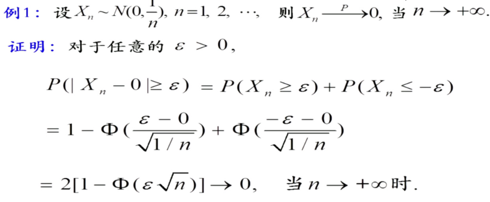

##### 依概率收敛的性质

对于依概率收敛 还有以下性质

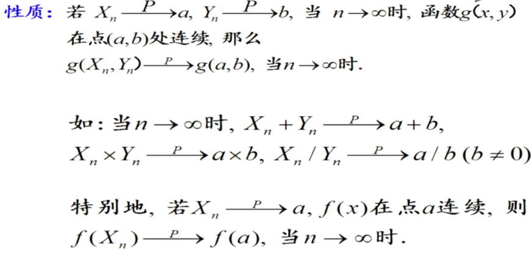

对于该性质 我用下面的题目解释：

设随机变量序列，已知时，依概率收敛到1，则当时，依概率收敛到e.

A. √

B. ×

根据题目已知$X_n\stackrel{P}{\longrightarrow}1$   而$e^{X_n}$在1上是连续的.

所以$e^{X_n}\stackrel{P}{\longrightarrow}e^{1} = e$

#### 切比雪夫不等式

设随机变量X具有数学期望E(X) = u，方差D(X) =  $\sigma^2$ 对于任意$\varepsilon>0$ 都有

$P(|X-\mu|>=\varepsilon) <= \frac{\sigma^2}{\varepsilon^2}$

通过1- 容易得出

$P(|X-\mu|<\varepsilon) >= 1 - \frac{\sigma^2}{\varepsilon^2}$

**切比雪夫不等式并不需要知道函数的分布 只需要知道数学期望和方差就能知道X与他的均值的偏差小于大于$\varepsilon$的下界和上界**

#### 大数定律

##### 贝努利(伯努利)大数定律

把na记为n重贝努利试验中事件A发生的次数.  并且记事件A在每次试验的发生概率p

对于任意$\varepsilon>0$ 有

$lim_{n->+\infty}P(|\frac{n_a}{n} - p| >= \varepsilon) = 0$

也就是 na/n 依概率收敛于p

**贝努利大数定律是 大量重复独立试验中事件出现的频率的极限值来确定概率的理论依据**

验证了之前 频率的稳定值是概率

##### 切比雪夫大数定律

X1,X2,....Xn为**相互独立**的随机变量，具有相同的数学期望$\mu$和方差$\sigma^2$

那么有 $\frac{1}{n}\sum_{i=1}^n X_i\stackrel{p}{\longrightarrow}\mu  \ \ 当n趋向正无穷$

**这里的随机变量同样并没有提及分布的要求**

证明

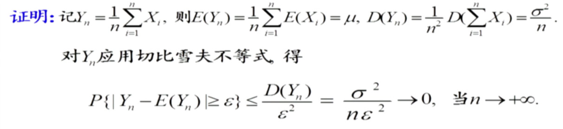

**注意方差那里的计算 注意方差性质 常数提出来的时候要平方（多次坑在这个地方）**

##### 辛钦大数定律

如果方差存在 可以推出 数学期望一定存在  但是 数学期望存在 并不能推出方差一定存在 (例如一个椭圆)

之前的大数定律都需要方差存在. 而 当随机变量服从**相同分布**的时候 就不需要这一要求 这就是辛钦大数定律

 

X1,X2,....Xn 为**独立同分布**的随机变量 且 **数学期望存在** 记为$\mu$ 那么

$\frac{1}{n}\sum_{n=1}^{n}X_i\stackrel{P}{\longrightarrow}\mu$

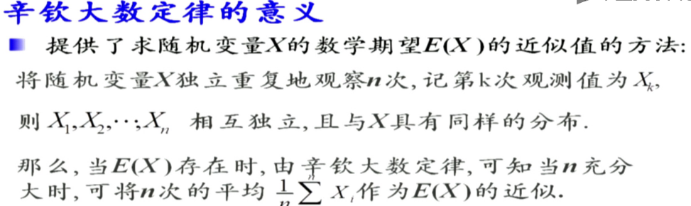

#### 中心极限定理

设随机变量X1,X2,...Xn **相互独立且同分布**

$E(X_i) = \mu $

$D(X_i) = \sigma^2$ i = 1,2,...

对于充分大的n

$\sum_{i = 1}^{n} X_i \sim N(n\mu,n\sigma^2)$

##### 推论 德莫夫拉普拉斯中心极限定理

对于二项分布B(n,p). 当n充分大的时候 也可以近似成正态分布

有

$n_A \sim N(np,np(1-p))$   这里面的np和np(1-p) 就是二项分布的数学期望和方差的公式

---

### 错题

设随机变量X的分布律为,  则X没有数学期望。

A. √

B. ×

正确答案：A你没选择任何选项

解释：引用老师的回复： *在这里离散型随机变量的情形，只有求期望所对应的级数绝对收敛时期望才存在*

*本题里EX 是(-1)^k/k（k从1到无穷求和），这个交错级数条件收敛，但其各项绝对值求和为1+1/2+1/3+...发散，所以无期望。*

*实际上，条件收敛的级数通过各项重排可以收敛到任意实数，如果没有绝对收敛的条件约束可能导致结果不唯一*

---

设X的概率密度为则

A. √

B. ×

正确答案：B你错选为A

解释：根据范围计算出结果为$\frac{4}{3}$并没有问题. 但是数学期望并不需要按范围写出来. 最后只需要$E(X) = \frac{4}{3}$即可 也就是不需要那个otherwise

---

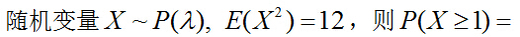

A. $e^{-3}$

B.$1 - e^{-3}$

C.$1-4e^{-3}$

D.$1-2e^{-3}$

正确答案：B你错选为C

解释：根据随机变量函数的数学期望求法即可. 然后展开$E(X^2)$ 计算出$\lambda​$ 即可计算概率

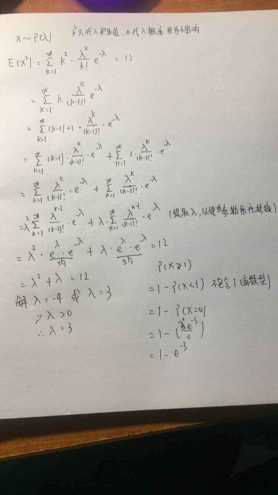

---

把红、黄、白3个小球随机地放入两个杯子中，若设*X*为有小球的杯子数，则*D*(*X*)= 

A.3/16

B.13/4

C.3/4

D.1

正确答案：A你没选择任何选项

解释：这题一开始思路用错了. 想着使用分成两个01分布计算方差. 事实上并不可以这样用. 因为两个杯子之间是有联系的. 不独立那就不能用那个思路做. 正确应该直接考虑一个杯子的概率和两个杯子的概率.  然后直接计算方差

$P(X = 1) = \frac{2}{2*2*2} = \frac{1}{4}$   (分母 因为每个球有两种方法 3个球那就有2\*2\*2种方法) (分子 因为有两种 3个球都在一个杯的情况 都在1号杯或者都在2号杯)

$P(X=2) = 1 - \frac{1}{4}$  无疑，因为X只能取1，2

然后通过公式计算方差. 首先计算$x^2$的数学期望 然后计算x的数学期望的平方 然后相减

$E(x^2) = 1^2 * \frac{1}{4} + 2^2 * \frac{3}{4} = \frac{13}{4}$

$E(x) = 1 * \frac{1}{4} + 2 * \frac{3}{4} = \frac{7}{4}$   平方后即为$\frac{49}{16}$

相减得出结果为$\frac{3}{16}$

---

已知随机变量X, Y的方差D(X)=4,，D(Y)=9，协方差Cov(X,Y)=2，则D(2X-Y)=

A.25

B.13

C.17

D.21

正确答案：C你错选为D

解释：这题错误的原因在意协方差计算错误 应该计算Cov(2X,Y) 却计算了Cov(X,Y)

D(2X-Y) = D(2X) + D(-Y) -2Cov(2X,Y)  (这里一开始做的时候当成Cov(X,Y) 应该跟着D(2X,Y)变化)

= $2^2*D(X) + (-1)^2*D(Y) - 2*2Cov(X,Y)$

= $4*4 + 9 - 4*2$

= 17

---

若随机变量相关系数存在，则其可能的最大值为

A.1

B.2

C.0.5

D.0.8

正确答案：A你没选择任何选项

解释：这条题看完之后完全懵逼 不知道怎么做. 后来看别人的答案解析才发现原来是用到了相关系数的性质

$1<=$|$\rho$|

因此相关系数的最大值为1

---

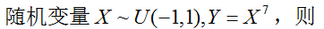

A.X与Y不相关，不独立

B.X与Y相关，不独立

C.X与Y不相关，独立

D.X与Y相关，独立

正确答案：B你没选择任何选项

解释：这题错误的原因是 还没完全理解随机变量函数的数学期望求法 计算了X,Y的数学期望以后 就不知道接下来怎么算了. 因为不知道f(x,y)的概率密度函数. 一直以为E(XY)需要f(x,y)才能算. 实际上并不需要. 继续再把XY当成X的函数分布计算.

因为f(x) = 1/2

$E(X) = \int_{-1}^{1}x *  \frac{1}{2} dx$ = 0

$E(Y) = \int_{-1}^{1} x^7 * \frac{1}{2}dx = 0$

因为想要判断相关性 需要计算协方差Cov = E(XY) - E(X)E(Y)

一开始就是卡在E(XY)上了.. 其实只需要把 Z = XY = X^7 * X   g(x) = x^7 * x

$E(XY) = \int_{-1}^{1} g(x) * f(x) dx$

$=\int_{-1}^{1}x * x^7 * \frac{1}{2}$

$=\frac{2}{18} = \frac{1}{9} != 0$   因为协方差不为0  所以是相关的.  而如果独立的话 是能推出不相关的 所以这肯定不独立了 选B

---

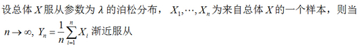

A.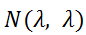

B.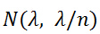

C.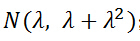

D.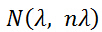

正确答案：B你错选为A

解释：这题之所以错选A是因为忽略了方差的其中一个性质 $D(aX) = a^{2}D(X)$  a为常数

方差Yn的计算应该是这样

$D(Y_n) = D(\frac{1}{n}X_1) + D(\frac{1}{n}X_2) + D(\frac{1}{n}X_3) + ....$   把里面的常数$\frac{1}{n}$提到最外面 就会变成

= $\frac{1}{n^2} (D(X_1) + D(X_2) + D(X_3) + ....)$  括号内所有方差相加等于 $n\lambda$ 

= $\frac{1}{n^2} * n\lambda$

= $\frac{1}{n}\lambda$

所以选B

---

设随机变量X与Y的协方差Cov(X,Y)=0.5, D(X)=1, D(Y)=2, 则Cov(2X,X-Y)的值为

A.0

B.1

C.2

D.3

正确答案：B你错选为D

解释：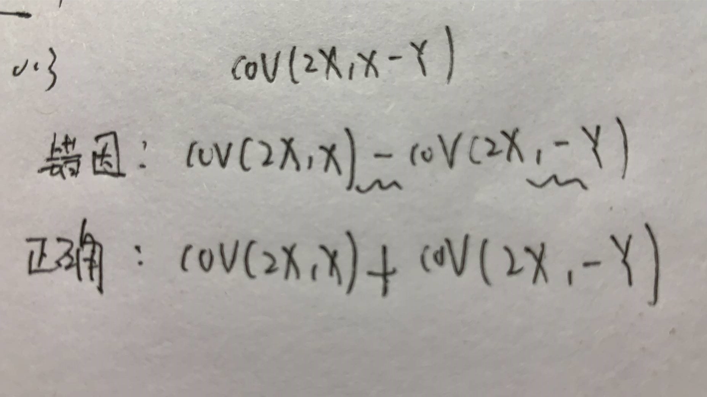

---

小张要购买某种商品，已知该商品的单价是c元，但购买的数量X是随机变量，则总价Y与X的相关系数为

A.0

B.0.5

C.-1

D.1

正确答案：D你错选为A

解释：这题其实根据常识就知道总价和买的数量是有相关的. 还是线性正相关. 因此相关系数无疑是1. 但是当时记公式Y=a+bX 把这里的b记成常数. 题目中的关系明显是Y=aX. 当时以为没有后面的b就当成不相关了.  当然这题也可以通过计算的方法得出答案. 根据下图

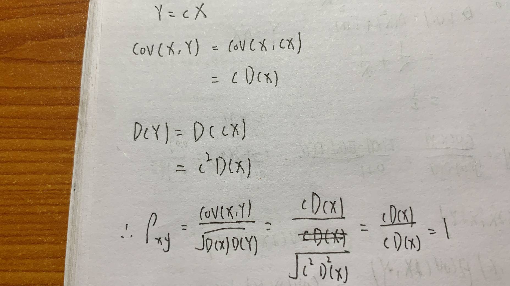

---

设X与Y同分布，P(X=0)=P(X=1)=0.5, 则X与Y相互独立的充分必要条件是不相关. 

A. √

B. ×

正确答案：A你错选为B

解释： 这题根据不相关的性质推出P(X=1,Y=1)后, 貌似用边际概率的性质就能算出整个分布列的..? 并不需要太多证明. 一开始看了看浙大助教的证明. 自己跟着写了写，写到一半才突然发现这个问题

---

设随机变量X的概率密度为对X独立重复观察162次，设观察到的值小于1/3的次数为Y，则P(Y>22)的近似值为

A.Φ(1)

B.Φ(－1)

C.Φ(－2)

D.前三个都不对

正确答案：B你选对了

解释：这题做的时候一开始只想到第一种中心极限定理的计算方法. 也就是直接算0到1/3的数学期望和方差. 其实这样算是错的.. 这样算是算了162次0到1/3范围的总和算术平均值. 正确的做法应该是把小于1/3这个事件当称二项分布. 先通过概率密度函数算出小于1/3的概率 当成1. 然后其他情况也就是0了. 然后通过定律2 把162个01分布相加当作正态分布. 计算过程如图

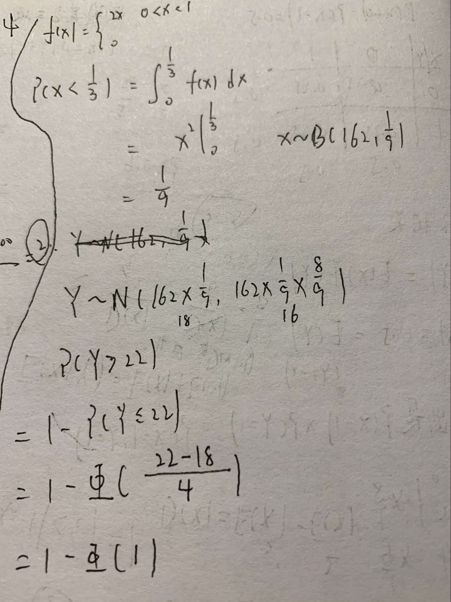

---

设相互独立同服从均值为2的指数分布，则的近似值为

A.Φ(1)

B.Φ(2)

C.Φ(－2)

D.前三个都不对

正确答案：B你选对了

解释：这题一开始看题是把题目给的2当作指数分布参数$\lambda$了 其实并不是. **均值**其实是数学期望的意思. 因此可以知道方差是4 因为指数分布的方差是数学期望的平方. 知道数学期望和平方以后. 直接求出近似正态分布. 按照标准正态分布求出选项B

---

设进入某公众服务中心的顾客每人接受服务时间X（单位：分钟）服从参数为1/6(E(X)=6)的指数分布，随机观察*n*个人的服务时间，结果记为，假设每人的服务时间是相互独立的.  则当*n*→∞时，这*n*个人的平均服务时间

A.依概率收敛到1/36

B.不依概率收敛到1/6

C.依概率收敛到1/6

D.不依概率收敛到6

正确答案：B你错选为D

解释：

---

设进入某公众服务中心的顾客每人接受服务时间X（单位：分钟）服从参数为1/6（E(X)=6）的指数分布，随机观察*100*个人的服务时间，结果记为，设, 假设每人的服务时间是相互独立的. 利用切比雪夫不等式，可得的下界为16/25.

A. √

B. ×

正确答案：A你错选为B

解释：这题其实只是计算错误... 自己计算出来答案为9/25. 后来发现并没有进行1-.. 这题做的时候问题在于方差的计算. 因此记录一下

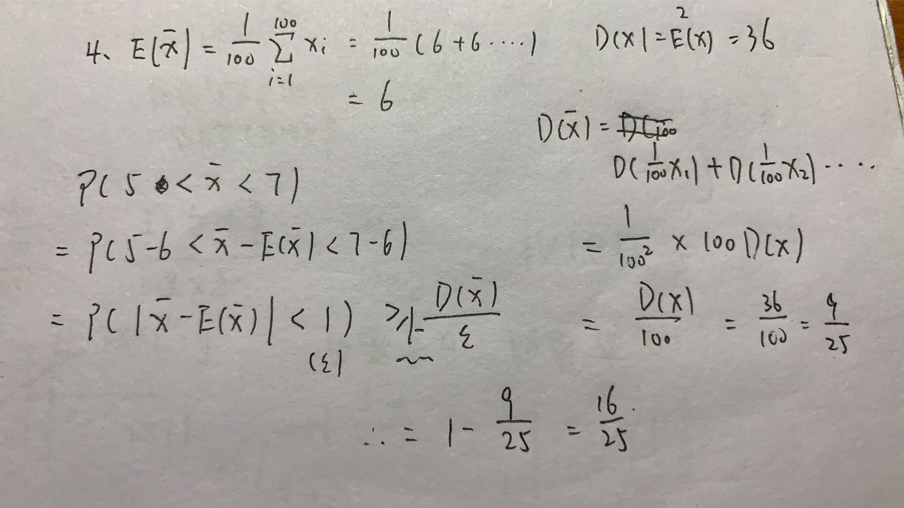

---

设相互独立，服从相同的分布，, 表示中取值小于2的个数，则根据大数定律，当时，依概率收敛到0.5.

A. √

B. ×

正确答案：B你选对了

解释：

---

## 数理统计的基本概念

### 概念

#### 总体与样本

##### 总体

总体：研究对象的全体

个体：总体中的成员

总体的容量：总体中包含的个体数

有限总体：容量有限的总体

无限总体：容量无限的总体

对于总体，有一项或者多向数量指标. 而对于它的个体的这些指标的取值会满足一定的概率分布. 因此这些数量指标是随机变量.

**因此总体可以用随机变量X和它的分布来描述**

##### 样本

按照规则在总体中抽取一部分个体，这些个体就是样本

样本容量就是抽出的个体数目

抽样就是指抽取样本的过程.

对于容量为n的样本，用随机变量$X_1,....,X_n$表示

###### 简单随机样本

**如果$X_1,....X_n$ 是相互独立的 并且与总体X同分布, 则称其为简单随机样本**

现阶段所说的样本都是简单随机样本

对于样本$X_1,X_2,X_3...X_n$的每一次观察之($x_1,x_2,x_3...x_n$) 称为样本值或者样本的一次实现

**观察值其实就是指x的取值范围内能取的值. 错题中有一道考这个知识点**

由于样本的独立性和同分布性质，当知道总体的分布函数F(X)的时候，即可得出样本的分布

只需要把每个样本的分布函数乘积即可得出

---

#### χ2分布，*t*分布和*F*分布

 

##### $\chi^2$分布

卡方分布是由正态分布派生出来的.

###### 卡方分布的定义

设$X_1,X_2,....X_n$ 相互独立. 并且他们都服从标准正态分布. 那么他们的平方的和就服从**自由度为n的卡方分布** 记作

$Y = \sum_{i = 1}^{n}X_i^2$ 

卡方分布的概率密度函数

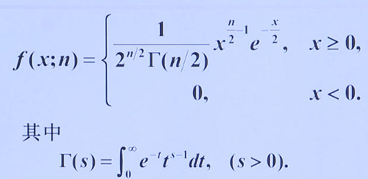

###### 卡方分布的性质

1. $X \sim \chi^2(n)$ E(X) = n, D(X) = 2n
2. $X \sim \chi^2(n) $  $Y \sim \chi^2(m)$   **X与Y独立** 则$X+Y \sim \chi^2(n+m)$

###### 卡方分布的上侧$\alpha$分位数

设$0 < \alpha < 1$

如果有这么一个值 当X大于等于这个值的概率为$\alpha$的时候, 则称这个值为上侧分位数或临界值

记作 $P(X >= \chi_{\alpha}^2(x)) = \alpha$  如图

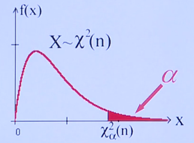

这个分位数的值可以通过积分得出. 但由于概率密度函数太复杂, 该值一般通过查找获得.

##### t分布

###### t分布的定义

设**X,Y相互独立** 并且X是标准正态分布,  Y是自由度为n的卡方分布

那么这样的随机变量T 服从自由度为n的t分布

$T = \frac{X}{\sqrt{Y / n}}$

t分布的概率密度函数

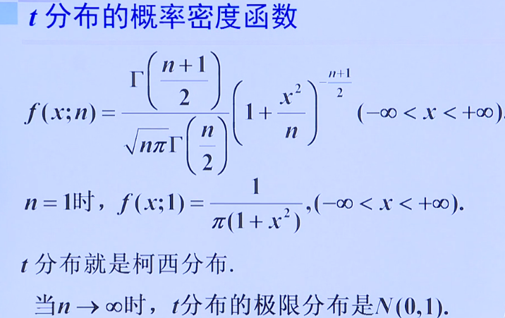

注意 柯西分布没有数学期望和方差

当自由度趋向无穷，t分布为标准正态分布

###### t分布的上侧$\alpha$分位数

对于$\alpha$分位数的定义 跟卡方分布的分位数定义类似

是t分布因为是一个**对称分布**，所以会有性质 $t_{1-a}(n) = -t_a(n)$

对于分位数 同样是可以通过查表获得

##### F分布

###### F分布的定义

设X,Y**相互独立** 并且他们分别服从自由度为n1,n2的卡方分布..

那么对于随机变量F

$F = \frac{X / n_1}{Y / n_2} = \frac{n2*X}{n1*Y}$  记为 $F \sim (n1,n2)$

对于随机变量F**求倒**后还是F分布  $\frac{1}{F} = \frac{Y / n2}{X / n1} \sim F(n2,n1)$

F的概率密度函数

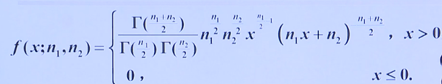

###### F分布的上侧$\alpha$分位数

定义同样类似于卡方分布和t分布.

同样是通过查表取值. 但是有一些在表中查不了. 那么就需要用F的性质求出来

$F_{1-a}(n_1,n_2) = \frac{1}{F_a(n_2,n_1)}$

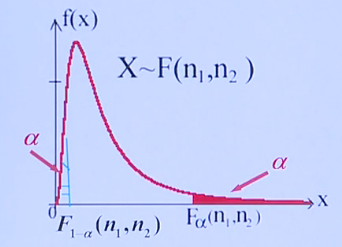

例如

$F_{0.05}(9,12) = 2.8$

$F_{0.95}(12,9) = \frac{1}{F_{0.05(9,12)}} = \frac{1}{2.8}$

##### t分布和F分布的关系

对于随机变量X服从自由度为n的t分布

那么有$X^2 \sim F(1,n)$

---

#### 统计量及抽样分布

##### 统计量

统计量是样本的函数，用来对样本值加攻的

###### 统计量的定义

设$X_1,X_2,...X_n$为总体X的容量为n的样本 **T（X1,X2,..,Xn)**是定义在样本空间上, **不含未知参数的连续函数**

统计量是随机变量. 把样本值x1,x2...xn代入到统计量里能算出一个值T(x1,x2,...xn)

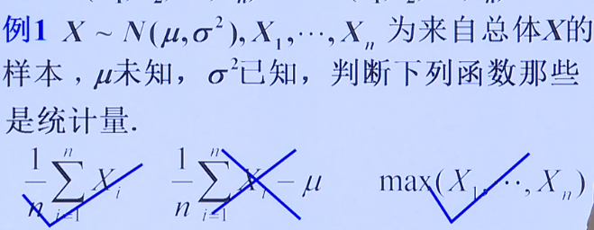

第二个里面有未知参数 因此不是统计量

###### 常用统计量

样本均值:  $\overline{X} = \frac{1}{n} \sum_{i = 1}^n X_i$

当总体均值E(X)=$\mu$是未知的时候，可以**用样本均值去估计总体均值**

样本方差: $S^2 = \frac{1}{n - 1} \sum_{i = 1}^{n}(X_i - \overline{X})^2$ 

可以化简成$\frac{1}{n-1}(\sum_{i = 1}^{n}X_i^2 - n\overline{X}^2)$ 

样本标准差就是样本方差开平方根

**用样本方差估计总体方差，用样本标准差估计总体标准差**

 

样本k阶原点矩

$A_k = \frac{1}{n}\sum_{i = 1}^{n} X_i^k$  k从1开始

样本均值就是样本1阶原点矩

同理，**当总体的k阶原点矩未知的时候，可以用样本k阶原点矩估计**

样本k阶中心矩

$B_k = \frac{1}{n}\sum_{i = 1}^{n}(X_i - \overline{X})^k$ 

**同理估计对应的总体k阶中心矩**

对于二阶中心矩 用$S^{*2}$表示 因为他也是用来估计总体方差 区别在于他是除以n

##### 抽样分布

###### 单个正态总体统计量的分布

**样本均值的分布**

设X1,X2,...Xn为总体$N(\mu,\sigma^2)$的一个样本

由于$\overline{X}$ 是由n个独立的正态变量的线性组合. 所以$\overline{X}$也是服从正态分布.

计算可知$\overline{X} \sim N(\mu,\frac{\sigma^2}{n})$

可以推广得出

$\frac{\sqrt{n}(\overline{X} - \mu)}{\sigma} \sim N(0,1)$

对上面式子平方 得出卡方分布

$\frac{n(\overline{X} - \mu)^2}{\sigma^2} \sim \chi^2(1)$

**样本方差的分布**

设X1,X2,...Xn为总体$N(\mu,\sigma^2)$的一个样本

有样本方差$S^2$   会有以下性质

1. 样本方差$S^2$与样本均值$\overline{X}$相互独立
2. $\frac{(n-1)S^2}{\sigma^2} \sim \chi^2(n-1)$

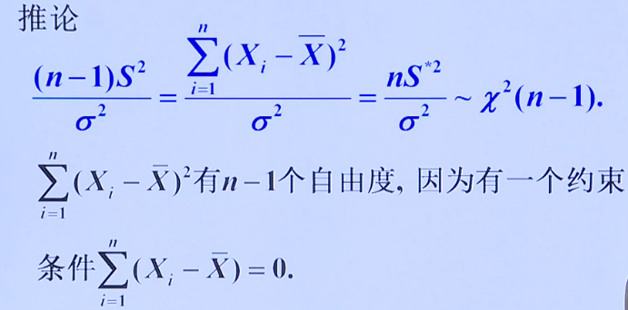

解释一下为什么会是n-1自由度

因为有条件$\sum_{i=1}^{n}(X_i - \overline{X}) = 0$ 

假设n为4 那么前面3个随机变量是相互独立的

$X_1 - \overline{X}$, $X_2 - \overline{X}$, $X_3 - \overline{X}$

但是第4项$X_4 - \overline{X}$ 是受前面3项影响的. 换句话说, 大概就是知道前面3项, 就能得出第4项. 因此他们不是相互独立 是有关系的.

 

同样在条件设X1,X2,...Xn为总体$N(\mu,\sigma^2)$的一个样本下

在知道样本均值, 样本方差下 有

$\frac{\sqrt{n}(\overline{X} - \mu)}{S} \sim t(n-1)$

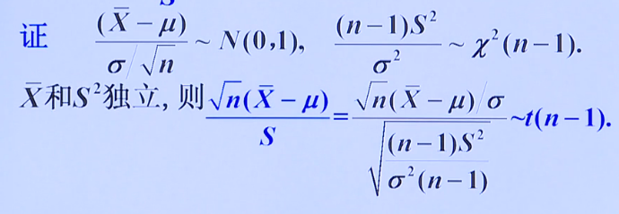

**抽样均值和抽样方差的数学期望和方差**

对于任意分布来说

$E(\overline{X}) = E(X)$

$D(\overline{X}) = \frac{D(X)}{n}$

$E(S^2) = D(X)$

如果总体是服从正态分布的话

$D(S^2) = \frac{2\sigma^4}{n-1}$

###### 两个正态总体统计量的分布

设X1,X2,...Xn1和Y1,Y2,...Yn2分别是来自总体$N(\mu_1,\sigma_1^2)$和$N(\mu_2,\sigma_2^2)$  **X与Y相互独立**

样本均值分别为$\overline{X},\overline{Y}$

样本方差分别为$S_1^2,S_2^2$   则有

$\frac{S_1^2 / \sigma_1^2}{S_2^2 / \sigma_2^2} \sim F(n_1 - 1,n_2 - 1)$

当$\sigma_1^2 = \sigma_2^2$ 的时候

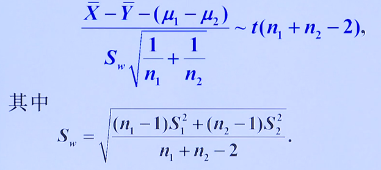

---

### 错题

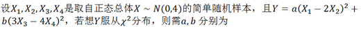

A.1/20，1/100

B.1/10，1/50

C.1，1

D.1/2，1/5

正确答案：A你没选择任何选项

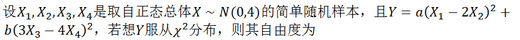

A.4

B.10

C.30

D.2

正确答案：D你没选择任何选项

解释：对于这题. 一开始的想法是打算把平方拆开计算. 计算后会发现两边只剩下一个$x^2$  因此得出a=b=4

但是正确的做法应该是括号平方内的内容当作一个整体，计算这个整体的正态分布情况.

计算可知

$X_1-2X_2 \sim N(0,4 + (-2)^2 * 4) = N(0,20)$

$3X_3 - 4X_4 \sim N(0,3^2 * 4 + (-4)^2 * 4) = N(0,100)$

由于卡方分布是由多个标准正态分布的平方相加得出. 因此要计算他们两个各自的标准正态分布

$Y_1 = \frac{(X_1-2X_2) - E(X_1-2X_2)}{\sqrt{D(X_1-2X_2)}} = \frac{(X_1-2X_2)}{\sqrt{20}}$

$Y_2 = \frac{(3X_3-4X_4) - E(3X_3-4X_4)}{\sqrt{D(3X_3-4X_)}} = \frac{(3X_3-4X_4)}{10}$

然后对Y1和Y2平方相加. 就可以得出卡方分布

对上面式子平方. 再把分母提出来 就可以知道a=$\frac{1}{20}$ b = $\frac{1}{100}​$

第2题是在第1题的基础上问卡方分布的自由度. 根据上题的计算很容易知道这是两个标准正态分布的平方相加得出的卡方分布. 因此自由度为2

2018.11.6 Update

这题在计算上要注意一个地方.

**正态分布之间需要相互独立才能进行线性组合(指加减) 而即使是相互独立的正态分布之间 进行乘法和除法之后 却不一定是正态分布**

所以这一题一开始想着开平方的想法就是错的. 因为拆开来以后他们不一定是正态分布. 就更不要说标准正态还有卡方分布了.

**再进一步，假设即使开方后的是正态分布**  

平方后的随机变量，因为他最初就不是标准正态的 因此需要化成正态分布才能谈卡方分布. 那么怎么对他化成标准正态的形式呢? (因为他现在是平方的形式) 所以是化简不了的. 

因此正确做法把平方里面的内容当成一项

---

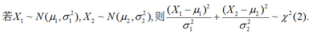

A. √

B. ×

正确答案：B你错选为A

解释：这道题目一开始是想到条件缺了X1,X2相互独立的. 因为卡方分布的相加需要都是相互独立的.

但是后来我又觉得是对的. 因为是觉得**两个正态分布在标准化后是相互独立的** 

但是 **并非如此!!**  

其实一想, 也只是把X1,X2转化为标准正态的形式而已. 随便哪个正态分布不能化? 事实上他们就是不一定独立.

直观上看, 题目没有给出条件, 就说明X1,X2不一定独立了 

---

A.

B.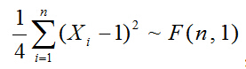

C.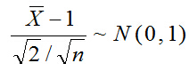

D.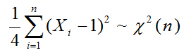

正确答案：D你没选择任何选项

解释：这条题目卡了很久. 经过了很多次的看书和视频终于解决了. 

重点要注意的地方是：**要注意总体X的数学期望和抽样均值的数学期望** 在这一题中,这两者是相同的. 但是如果不注意理解错选项所使用的公式就会做错了. 下面一个个选项来分析

首先根据题目给出的条件, 可以得出抽样均值的分布是$\overline{X} \sim (1,\frac{4}{n})$ 因此知道抽样均值是服从正态分布 并且知道其数学期望和方差

A. A选项看到1 第一反应为数学期望. 而前面是$\overline{X}$ 因此此时的1为 抽样均值的数学期望.  看分布$2 / \sqrt{n}$  因此发现是抽样均值的方差的开根号. 因此可以想起, 这是把抽样均值的正态分布化简成标准正态分布.

因此$\frac{\overline{X}-1}{2 / \sqrt{n}} \sim N(0,1)$  同时得出C选项是错的

B和D选项. 这里要注意的是 选项中是$X_i 而不是\overline{X}$  这里就需要注意 这个1是指什么了. 先讲一下最初的错误想法 当初一直认为这个选项用的是这个公式

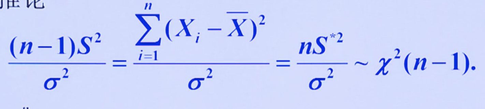

要注意这里公式是用$X_i - \overline{X}$  这里是求出抽样方差 并且根据抽样方差的性质 得出组合是服从自由度为n-1的卡方分布. 当初一直认为选项D是错的 应该是n-1而不是n 事实上并不是这样.

正确的是 这里的1是总体X的数学期望. 而选项的公式是计算总体X的标准正态分布 $\frac{X_i - \mu}{\sigma}$  然后平方得到自由度为1的卡方分布$\frac{(X_i - 1)^2}{\sigma^2} \sim x^2(1)$ . 然后选项中还有一个累加. 其实就是把n个这样的卡方分布相加起来. 由于他们是简单随机抽样, 所以都是相互独立. 因此n个这样的卡方分布加起来 变成服从自由度为n的卡方分布

而选项B的话, 想要得出F分布. 首先得得到t分布. 然后再平方才能得到F(1,n)分布

---

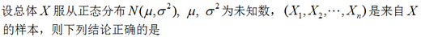

A.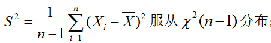

B.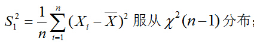

C.

D.

正确答案：C你没选择任何选项

解释: A选项的公式得出抽样方差$S^2$ 而B选项中是要求$X_1$的方差. 由于样本跟总体X是同分布独立. 因此其实就是求总体的方差. 因此肯定不会用抽样均值的数学期望去算. 回到选项A 虽然根据现在的课程都没有教这个抽样方差的分布. 但是知道关于抽样方差的一个公式才会得出卡方分布 而这个公式是$\frac{(n-1)S^2}{\sigma^2}$  得这样才会服从卡方分布. 

对于选项C,D 看到公式其中有一个减抽样均值的数学期望. 马上想到是抽样方差的公式. $\frac{(n-1)S^2}{\sigma^2}$  然后对于抽样方差S 是由$\frac{1}{n - 1}\sum_{i=1}^{n}(X_i - \overline{X})^2$  因此可以知道(n-1)被约掉. 根据公式是得到自由度为n-1的卡方分布. 

---

设总体X的概率密度为从总体抽取容量为4的样本，则样本观测值为0.124，0.863，1.739，1.598是不可能的。 

A. √

B. ×

正确答案：B你错选为A

解释：注意样本观测值的概念. 其实是指样本Xi的取值是否在总体X的范围内. 如果不在的话,那就说明这个观测值是不可能的. 题目中4个取值都是在0<x<2内 因此是可以取值的

---

设全校学生成绩X的分布律为P(X=3)=0.2，P(X=4)=0.7，P(X=5)=0.1，总体均值为3.9，采用放回抽样，观察到的成绩一个是3,另一个是4，因此样本均值观测值为3.5，则.

A.

B.

正确答案：A你错选为B

解释：这题其实是对的. 但是做的时候少考虑了排序问题. 应该是0.2 * 0.7 + 0.7 * 0.2 = 0.28 

---

设总体是总体X的简单随机样本，是样本均值，则等于

A.

B.

C.

D.

正确答案：D你没选择任何选项

解释：这题做的时候一直在纠结$\mu$的值. 想知道$\mu$的值然后构造标准正态分布再查表计算. 事实上并不需要求值. 因为我忽略了正态分布转标准正态分布的公式 

$P(\frac{X - \mu}{\sigma} <= \frac{a - \mu}{\sigma}) = \Phi(\frac{a - \mu}{\sigma})$

做这题的时候，我总想求出$\mu$ 然后用$1-\mu / \sigma$ 得出查表值. 但是并不需要. 根据上面的公式, 事实上等式右边的值就是查表值. 对于题目中要求的事件, 补上方差的开方即可得出查表值.过程如下图

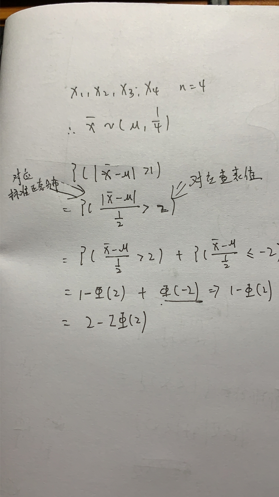

---

从总体中抽取容量为3的样本, 则样本均值的概率等于1.

A. √

B. ×

正确答案：A你错选为B

解释：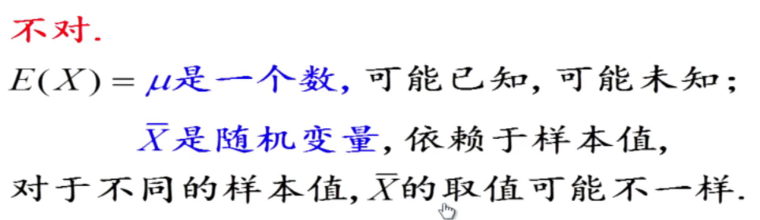

---

 

## 参数估计

### 点估计

---

### 错题

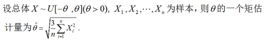

A. √

B. ×

正确答案：A你没选择任何选项

解释： 这条题目一开始当成是用最大似然估计法来求. 但是并不知道怎么求$X_n$的值 于是就不会做了.. 后来发现这条题目原来是求矩估计. 那么就很简单了

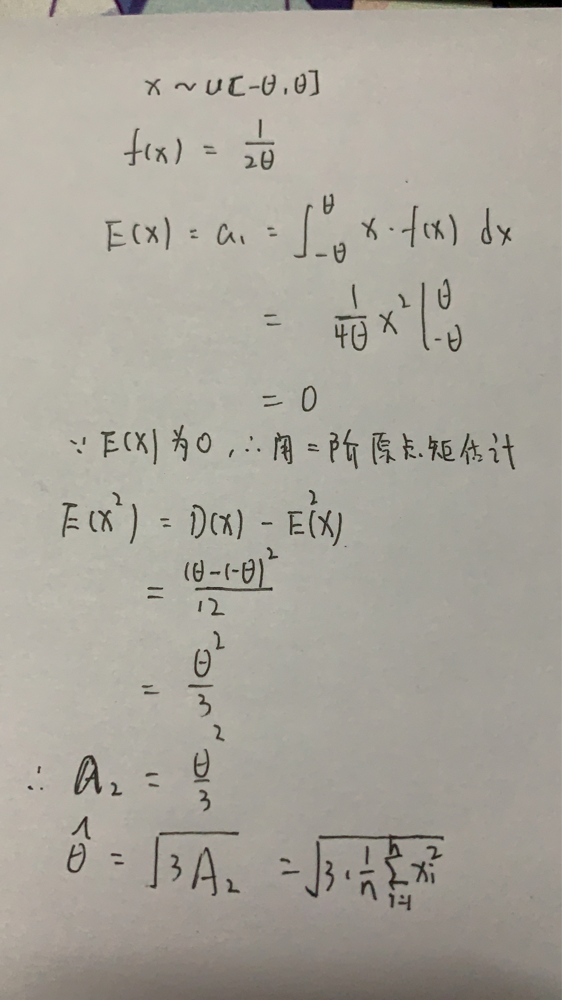

---

设总体未知. 是总体X的样本，则以下哪个不是的矩估计量

A.

B.

C.

D.

正确答案：B你错选为D

解释：做的时候觉得D不是矩估计量是因为觉得没满足公式. 但后来发现其实是对的. 只是把原来的中心矩的公式把平方拆了出来. 而B是错的. 因为B并不是矩. 不满足原点矩或者中心矩的公式

---

设总体均未知. 是总体X的样本，则以下哪个是的矩估计量

A.

B.

C.

D.

正确答案：D你错选为C

解释：A并不是矩 而B,C 其中应该是减去样本均差 而不是总体均差

D 是因为$\sigma^2$的矩估计量有多个 这是看用什么矩来估计. 一开始觉得D不会是因为没考虑到这点 例如

$E(X^2) = D(X) + E(X)^2$

$= \sigma^2 + \mu^2$

所以 $\sigma^2 = a_2 - \mu^2$

矩估计为$A_2 - \overline{X}^2$  这是用原点矩来估计的

另外也可以直接用D(X) 也就是中心矩估计

$D(X) = \sigma^2$

$=B_2 = \sigma^2$

矩估计为$B_2$

---

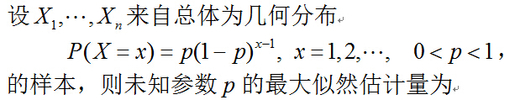

A.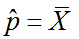

B.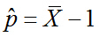

C.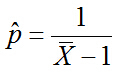

D.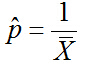

正确答案：D你没选择任何选项

解释：都是计算错误的锅 这题需要不停的转换

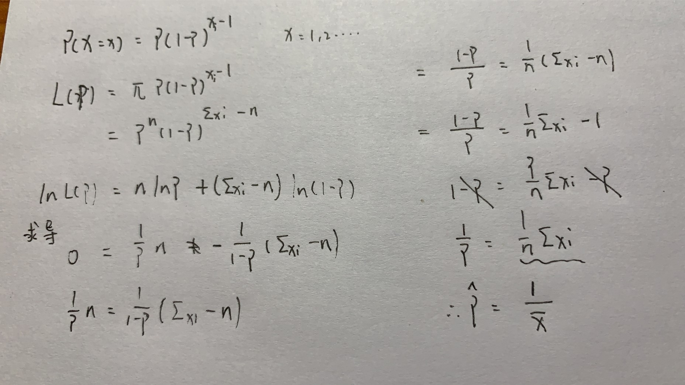

---

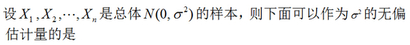

A.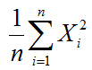

B.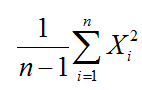

C.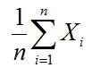

D.

正确答案：A你错选为B

解释：这题选A是因为题目给出了总体均值. 因此前面是乘$\frac{1}{n}$  通过计算也可以知道A是对的 B是错的

一开始是觉得B是样本方差的公式. 并且在学习的过程中提到样本方差就是$\sigma^2$的无偏估计量

但是这题因为是已知总体均值. 若是总体均值不知道 那么B选项就是对的了

---

设总体未知. 是总体X的样本，则的极大似然估计量为

A.

B.

C.

D.

正确答案：C你错选为B

解释：该题于上一题同理. 已知总体均值，因此应该使用公式$\frac{1}{n}\sum_{i=1}^{n}(X_i^2 - \mu)^2$

---

总体X取1、3、5的概率各为1/3，总体均值μ＝3，采用放回抽样取容量为2的样本，则等于

A.1

B.0

C.1/2

D.1/3

正确答案：D你错选为B

解释：做的时候对样本均值的计算记错了. 把样本均值的计算当成跟总体均值计算一样了. 其实只要把两个数X1,X2加起来然后除以2即可得到样本均值

而想要样本均值跟总体均值一样，那么有3种情况(1,5) (5,1) (3,3) 计算他们出现的概率 加起来等于1/3

---

设总体均未知.  是总体X的样本， 样本均值是μ的无偏估计量，若测得样本均值观测值为，则以下结果正确的是

A.

B.

C.

D.

正确答案：C你错选为A

解释： 由于题目给出的样本均值 只是其中的一份样本的样本均值. 而无偏性的定义是指样本均值的数学期望，也就是所有样本均值的算术平均值，这样才等于总体均值$\mu$ 因此A不一定 是错的 与此同时对于D 也是不一定 所以是错的 C就很明显了 连续型随机变量单点概率为0

----

设总体X的均值为μ，是总体X的样本，当且仅当成立，有是μ的无偏估计。

A. √

B. ×

正确答案：A你错选为B

解释：这道题目后来发现是有一个命题的 关于无偏性 如图，这题后来做的时候是对常数和求和提取错误了

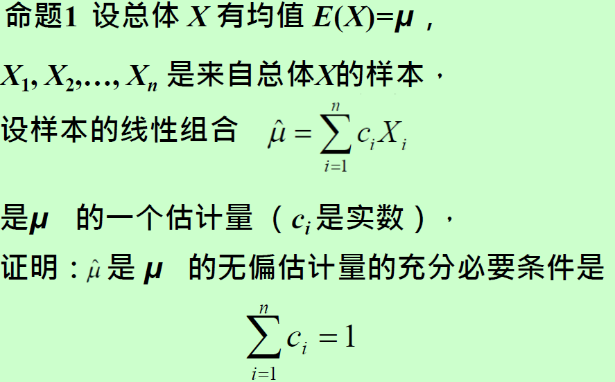

---

总体X取1、3、5的概率各为1/3，总体均值μ＝3，采用放回抽样取容量为2的样本，则样本均值是μ的无偏估计量.

A. √

B. ×

正确答案：A你错选为B

解释：这道题目 只需要把样本均值的取值和对应取值的概率算出来. 然后当成离散型随机变量算数学期望，最后结果跟$\mu=3$对应 因此是对的

---

有两个独立总体均未知. 和分别是来自X和Y的独立样本,，分别是样本方差。为常数，则是的无偏估计，在这些无偏估计中，当取何值时最有效。

A.1

B.

C.1/2

D.

正确答案：D你没选择任何选项

解释：这题由于选项中混入了未知数. 因此要解这道题，正确的方法就应该要用到了高数求最大值的知识

以下做法具有普遍性

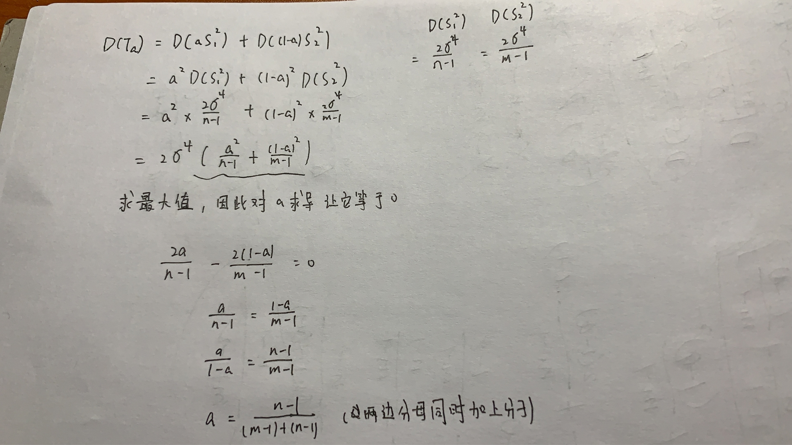

---

A.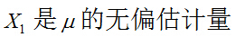

B.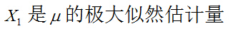

C.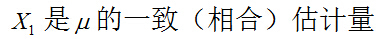

D.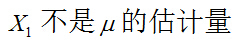

错选D 正确A

解释：

---

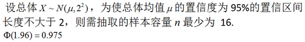

A. √

B. ×

错选B 正确A

解释：这到题目当初计算错误了. 其实这个只需要代入公式并解出方程即可知道n的最小值

首先要知道这个是已知方差$\sigma^2$求未知$\mu$

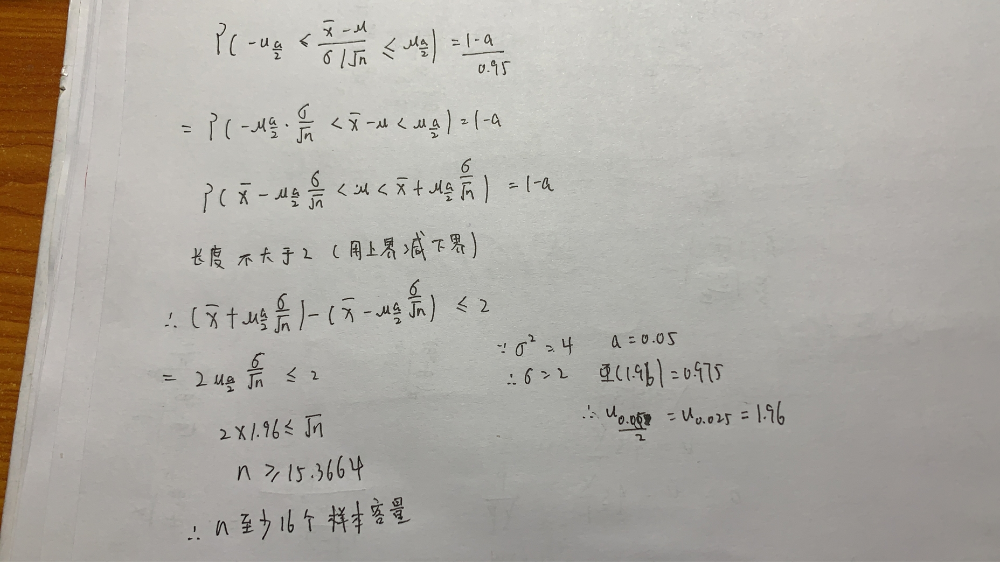

---

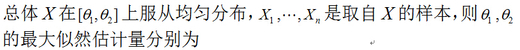

A.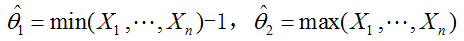 

B.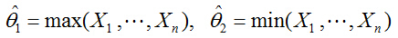 

C.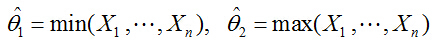 

D.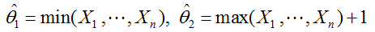 

正确答案：C你错选为B

解释：这题应该是当时做的时候想反了 其实做法是懂的 应该是把均匀分布a,b弄反了 下面详细说下做法

先把那两个参数当成a,b

因此可知概率密度函数和似然函数为 $f(x) = \frac{1}{b - a}$  $L(a,b) = \frac{1}{(b-a)^n}$

 可知似然函数跟b单调递减 跟a单调递增

因此想要让似然函数最大 那就是说  要让b最小 a最大

但是题目也可知范围 a < b

所有样本Xi在a到b的范围中取

因此b要最小 但是他不可能小过所有样本值Xi里最大的那个

a要最大 他也不可能大过所有样本值里最小的那个

因此可知b的估计量为 max(x1,x2...xn)

a的估计量为 min(x1,x2...xn)

---

