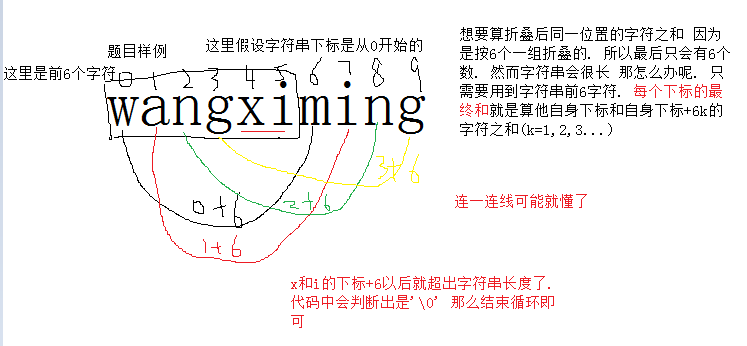

# 第十届蓝桥杯校内赛部分题目讲解


**因为我也不知道自己提交的代码是否正确与题目答案**

**以下内容仅供参考 欢迎讨论**


## 第四题 打水问题

---

### 问题描述

　　N个人要打水，有M个水龙头，第i个人打水所需时间为Ti，请安排一个合理的方案使得所有人的等待时间之和尽量小。


### 输入格式

　　第一行两个正整数N M 接下来一行N个正整数Ti。
 　　N,M<=1000，Ti<=1000


### 输出格式

　　最小的等待时间之和。（不需要输出具体的安排方案）


### 样例输入

7 3
3 6 1 4 2 5 7


### 样例输出

11


### *提示

一种最佳打水方案是，将N个人按照Ti从小到大的顺序依次分配到M个龙头打水。  　　
例如样例中，Ti从小到大排序为1，2，3，4，5，6，7，将他们依次分配到3个龙头，则去龙头一打水的为1，4，7；去龙头二打水的为2,5；去第三个龙头打水的为3,6。  　　
第一个龙头打水的人总等待时间 = 0 + 1 + (1 + 4) = 6  　　
第二个龙头打水的人总等待时间 = 0 + 2 = 2  　　
第三个龙头打水的人总等待时间 = 0 + 3 = 3  　　
所以总的等待时间 = 6 + 2 + 3 = 11


### 题解

**这题只需要把所有人的打水时间排序，然后每个人依次分到每个水龙头. 接着计算时间即可 用一个数组存每个人的打数时间+等待时间. 把所有人的时间加起来即是总时间**


**下面是无聊写的一大段分析 有兴趣就看 有可能会有说错的地方 有问题请提**

根据题目给出第提示可以发现一个规律. 把所有人的打水时间进行一次排序后. 把排序后的每个人按顺序分配给每个水龙头. *(这里顺序分配的意思就是 例如有5个人a,b,c,d,e 2个水龙头A,B 并假设5人排序后顺序还是a,b,c,d,e. 那么顺序分配的意思就是 第一个人到A 第二个人到B 接着第三个人又回到A 一个循环直到所有人分配好)*

测试发现这样得出的答案是最小等待时间.


不考虑提示. 如果想要M个水龙头 N个人打水等待时间最小. 首先想一下最大时间是怎样算的. 

假设 4个人a,b,c,d 打水时间分别为10000,2,3,9999  **有1个水龙头**

想要算最大时间. 首先已经知道要把所有人放在一个水龙头上. 那么接下来还要怎么做呢. 很明显是把打水时间越长的放越前面. 这样后面的人就要等的越久了.

a d c b 这样的打水顺序

d c b都要等a 于是这里的时间为 T += 10000 * 3

c b 又要等d   	T += 9999 * 2

b 等c  		T+= 3

T = 50001

得出想要算最大时间 需要把打水时间越久的人放在越前. 算最小时间于是就是反过来. 因此需要用到的排序

重新整理下 算最小时间 可知顺序为 b c d a

c d a等b	T += 2 * 3

d a 等c 	T += 3 * 2

a等d	T += 9999

T = 10011


接下来考虑多个水龙头的情况

如果有多个水龙头的话. 根据前面只有一个水龙头的例子应该可以想出. 打水时间长的人 应该尽量分散到不同到水龙头. 

假设还是上面的假设 只是换成两个水龙头

如果要求最小 毫无疑问你最想做的应该就是把9999和10000分开 以成下面这样(竖着看)

水龙头A   		水龙头B

	b(2)			     a(10000)
	
	c(3)
	
	d(9999)

这样的时间T会是

水龙头A = 2*2 + 3 = 7

水龙头B = 0

T = 7

但是好像还不是最优 因为水龙头A有3人 b后面有两人 因此b的时间要算上两倍 而水龙头B上只有1人.

尝试让每个水龙头的人数均匀起来 把c分配到水龙头B

水龙头A   		水龙头B

	b(2)			     c(3)
	
	d(9999)		     a(10000)

此时的时间T为

水龙头A = 2

水龙头B = 3

T = 5


### Code

```cpp
#include <stdio.h>
#include <algorithm>
using namespace std;
int read()
{
    char ch = getchar();
    int f = 1;
    int x = 0;
    while(ch < '0' || ch > '9'){if(ch == '-')f = 0;ch = getchar();}
    while(ch >= '0' && ch <= '9'){x = x * 10 + ch - '0';ch = getchar();}
    return f?x:x*-1;
}
int a[1001];
int b[1001];
int main()  
{  
    int n = read(),m = read();

    for(int i = 0;i < n;i ++)
    {
        a[i] = read();
    }
    
    sort(a,a + n);
    for(int i = 0;i < m;i ++)
    {
        b[i] = a[i];
    }
    for(int i = m;i < n;i ++)
    {
        b[i] = a[i] + b[i - m];
    }

    int sum = 0;
    for(int i = 0;i < n;i ++)
    {
        sum += b[i];
    }

    printf("%d",sum);

    return 0;  
}
```


---


## 第5题 密码发生器

---

### 问题描述

在对银行账户等重要权限设置密码的时候，我们常常遇到这样的烦恼：如果为了好记用生日吧，容易被破解，不安全；如果设置不好记的密码，又担心自己也会忘记；如果写在纸上，担心纸张被别人发现或弄丢了...

这个程序的任务就是把一串拼音字母转换为6位数字（密码）。

我们可以使用任何好记的拼音串(比如名字，王喜明，就写：wangximing)作为输入，程序输出6位数字。

变换的过程如下：

第一步. 把字符串6个一组折叠起来，比如wangximing则变为：

wangxi

ming

第二步. 把所有垂直在同一个位置的字符的ascii码值相加，得出6个数字，如上面的例子，则得出：

228 202 220 206 120 105

第三步. 再把每个数字“缩位”处理：就是把每个位的数字相加，得出的数字如果不是一位数字，就再缩位，直到变成一位数字为止。例如: 228 => 2+2+8=12 => 1+2=3

上面的数字缩位后变为：344836, 这就是程序最终的输出结果！


### 输入描述

要求程序从键盘输入数据，输入格式为：第一行是一个整数n（0<n<100），表示下边有多少输入行，接下来是n行字符串，就是等待变换的字符串。


### 输出描述

输出格式为：n行变换后的6位密码。


### 样例输入

3

zhangfeng

wangximing

jiujingfazi


### 样例输出

772243

344836

297332


### 题解

对于这条题目 题意应该很容易明白. 对于大家来说可能难在代码的实现. 其实实现也是很简单的. 下面一步步讲题目的操作实现


1. “把字符串6个一组折叠起来” 其实这一步可以忽略的. 题目是处理多个字符串. 这里就当做只处理一个了. 首先读入字符串 题目告知字符串是由拼音字母组成 因此不用担心有空格问题. 直接用scanf读字符串即可.
2. 对于第二步. 相信大部分人卡在第一步上了，总想着怎样把字符串6个6个的折起来. 又或者弄了多个字符串数组. 其实并不用. 要算第二步，其实只需要算字符串的前6个下标. 啥意思呢. 看看下图
3. 根据上面的方法算出6个数字. 第三步是对每个数字进行缩位处理. 这个嘛 就更加简单了. 可以不断对这个数对10取模和除以10. 得出每一位的数. 然后求出每一位的数字之和就是缩位结果. 
4. 对于答案的输出. 不需要考虑拼接 只需要把每个数的缩位结果依次输出即可.


### Code

```cpp
#include <stdio.h>
using namespace std;
int read()
{
	char ch = getchar();
	int f = 1;
	int x = 0;
	while(ch < '0' || ch > '9'){if(ch == '-')f = 0;ch = getchar();}
	while(ch >= '0' && ch <= '9'){x = x * 10 + ch - '0';ch = getchar();}
	return f?x:x*-1;
}
int main()
{
	int n = read();
	for(int l = 0;l < n;l ++)
	{
		string s;
		cin >> s;
		int num[6] = {};
		for(int i = 0;i < 6;i ++)
		{
			int count = 0;
			for(int j = i;j < s.size();j += 6)
			{
				count += s[j];
			}
			num[i] = count;
		}
		
		for(int i = 0;i < 6;i ++)
		{
			int t = num[i];
			while(t / 10 != 0)
			{
				int count = 0;
				int temp = t;
				while(temp > 0)
				{
					count += temp % 10;
					temp /= 10;
				}
				t = count;
			}
			num[i] = t;
			printf("%d",num[i]);
		}
		printf("\n");
	}
	
	return 0;
}
```


	


