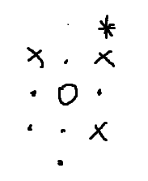
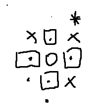
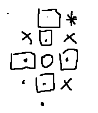
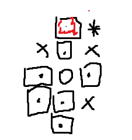
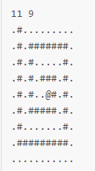

# 队列（queue）


## 队列是什么

队列是一种特殊的线性表. 是一种先进先出的数据结构. 它只允许表的前端进行删除操作, 对表的后端进行插入操作.  把队列想象成生活中的排队即可. 例如在商场最后结账的时候, 服务员在前面进行结账操作. 顾客从后面走进去 (相当于从后端插入) 走到进去服务员那里结账完以后离开(相当于从前端删除)  如果有多个顾客在排队, 那么新加入的顾客就排在他们后面 直到轮到他才离开（后进后出）


## 队列的使用


#### 队列的定义

在c++的STL中有队列相关的头文件, 使用了以后就能直接定义一个队列了. 当然这个头文件不仅仅只有queue 还有很多 这个以后再说..

```c+
#include <queue> 
```


~~除了直接使用头文件, 也可以自己使用数组模拟一个队列出来. 据说性能会比stl更好（ 而且毕竟手写能够自己对需求进行改变. 但现在不对手写的进行说明 有兴趣可以去搜相关的资料~~


那么写了头文件后怎么定义一个队列呢 语句是这样的

```c++
queue<type> name

//定义一个int类型的队列 后面会拿这个当例子使用
queue<int> q
```

type 是类型的意思 可以替换成你想指定的类型 例如int double等  而name就是名字 这个就看个人喜欢了


**使用stl现成的队列, 队列会带有多种方法. 例如插入删除等 下面介绍每种的使用方法**


#### 队列的插入

插入, 正确的说法应该是入列 通过使用队列中的push方法 通过变量名加圆点(.) 调用方法

```c++
q.push(1); // 把元素1 放进队列中
q.push(2); // 如上
q.push(3); // same
```


#### 队列的删除

出列使用的方法是pop 这个方法不需要任何参数 使用该方法后将自动返回队列中最前面的元素

```c++
q.pop(); // 队列中最前面的元素1已经被删除掉了
```


#### 访问队列第一个元素

front方法能让我们直接得到队列中第一个元素

```c++
int temp = q.front(); // temp变量被赋值成2 因为上面的pop操作已经把最先1删除掉了
```


#### 访问队列最后一个元素

back方法能让我们获得队列中最后一个元素

```c++
temp = q.back(); // temp变量将被赋值成3
```


#### 获得队列元素个数

size方法将返回队列中的元素个数

```c++
int count = q.size(); // count变量将会是2
```


#### 判断队列是否为空

empty方法是用来告知队列是否为空 如果队列是空的时候 将返回true 反之则false

```c++
if(!q.empty()) // 因为队列不为空 所以将会输出123
{
    printf("123");
}
```


size和empty这两个方法 通常用在循环条件上. 当队列元素数量为0 / 队列是空(两者等价)的时候 跳出循环.


# 广度优先搜索（bfs）


## bfs是什么

bfs是一种图的搜索算法.  是一种盲目搜寻的方法. 换句话说就是暴力. 通过不断的展开直到搜索完整张图.


## bfs的使用

bfs一般都会通过队列实现, 为什么要用到队列. 就关乎到队列的先进先出这个特点了.


#### bfs是怎么跑的

拿走迷宫作为例子, 一个人在迷宫中只能上下左右的行走, 如果是障碍则不能通过 如图



圈圈就是起点 点是可以走的道路 X代表路障 *代表目的地

那么从起点开始进行bfs 第一轮进行搜索就是碰到圈圈上下左右的点  （假设顺序是从上右下左）

那么最先碰到的是上方的点 并把上面的点记录 放进队列中


然后继续右，下，左 发现是可以走的路 **以此** 放进队列中



接下来 因为队列中所存放的都是可以走的路嘛  拿出队列中的第一个元素 （因为是要最先放进的） 搜索这个点的上下左右  会发现 左右是障碍走不了 下是起点 已经走过了不能再走 那就只能走上了. 并把上方的点放进队列中



在这个操作以后, 接着把队列中的元素出列 他们会是之前原点所插入的"右下左"  都进行搜索后会发现图变成这样了 （突然多了红色只是为了方便下文说明 并没有对他什么特别操作）




接下来 队列出列的元素就是红色标记的点了. 搜索后就会发现目的地  到达终点 直接break跳出循环 bfs结束


#### bfs使用例子

拿P1683举例 把数据和整个迷宫读入后. 通过遍历找出起点@的位置



容易发现 起点的坐标为（4，6）（下标从0开始计算） 把起点送进队列中

```c++
#include <stdio.h>
#include <queue>
using namespace std;
struct node
{
    int x,y;
};
int main()
{
    int n,m;
    char s[20][21] = {}; // 之所以开21是因为要考虑最后的'\0'
    scanf("%d %d",&n,&m); //读入迷宫大小
    
    for(int i = 0;i < m;i ++) // 把迷宫读入数组
    {
		scanf("%s",s[i]);
    }
    int x,y; // 用来记录起点的坐标
    for(int i = 0;i < m;i ++)
    {
        for(int j = 0;j < n;j ++)
        {
            if(s[i][j] == '@')
            {
                x = i,y = j;
                break;
            }
        }
    }
    queue<node> q; // 定义一个以结构体node为类型的队列
    node a = {x,y};
    q.push(a); // 把起点放进队列中
    
// 请勿直接复制使用 已删除main函数后大括号 因为后续还有代码
```

之所以要弄一个结构体node 是因为要保存bfs每一步的所在的位置 (也厄可以使用pair)  但是结构体都学过 pair以后再讲


接下来就是bfs算法的具体代码 一直循环进行直到整个迷宫探索结束

```c++
int dx[4] = {-1,0,0,1};
int dy[4] = {0,-1,1,0}; // 代表走上左右下的时候坐标的变化
int count = 1; // 用这个变量记录走过的砖块数量
int visited[20][21] = {}; // 需要一个数组记录走过的路线避免重复走而死循环了 因为想想, 如果从某个点搜索 向上走了以后, 走到的那个点再向下走 这不就是一个死循环了吗
visited[x][y] = 1; // 把起点记录下
while(q.size()) // 用empty也可以
{
    node t = q.front(); // 把队列中第一个元素拿出来(刚开始的时候也就是起点)
    q.pop();
   	
    for(int i = 0;i < 4;i ++)
    {
        int nx = t.x + dx[i];
        int ny = t.y + dy[i]; // 算出该点的上下左右的新坐标
        
        // 前面4个条件是防止越界 第5个条件是要求只有没走过的路才能进入条件 第6个条件是 所走的地点不能是障碍
        if(nx >= 0 && nx < m && ny >= 0 && ny < n && visited[nx][ny] == 0 && s[nx][ny] != '#')
        {
            visited[nx][ny] = 1; // 记录为已经走过了
            count ++; // 增加走过的砖块个数
            node a = {nx,ny}; // 新建新的元素 放进队列中
            q.push(a);
        }
    }
}
printf("%d",count);

return 0;
}
// 先把前半段代码复制过去 再复制这段过去即可运行了
```

